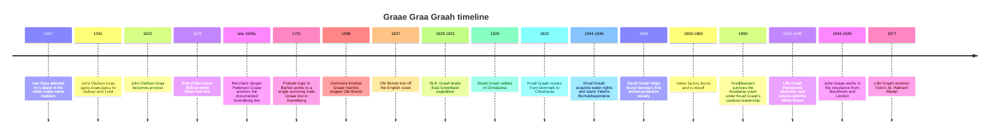

# Graae Graa Graah Family Stories for a Family History Page

## Executive summary

I reviewed the two classic printed family histories that are most useful for this surname cluster — **Imm. Barfod’s 1882 _Stamtavle over den Svenborgske Familie Graae_** and the **1914 _Graaeske Slægtebog_** — alongside modern Danish and Norwegian reference works from **Lex**, **Store norske leksikon**, **Norsk biografisk leksikon**, and **lokalhistoriewiki.no**. I also treated your uploaded family memo as a lead-finder rather than authority. The result is a fairly clear pattern: the **best-documented, most webpage-ready stories** cluster around the **late seventeenth-century Svendborg line**, the **nineteenth-century Aalborg/Thisted-to-Christiania migration**, and a handful of later Danish and Norwegian figures carrying the surname. The **medieval noble** and **castle/royal-expulsion** material remains much weaker and, in some cases, clearly legendary. citeturn12view0turn12view1turn29view1turn30view0turn30view1turn31view0turn31view1turn35view0turn39view0 fileciteturn0file1

The strongest “colourful and verifiable” stories are these: the **lost signet and disputed noble descent**; the **Skårup priest dynasty** that looks tempting but probably is **not** the proven origin of the Svendborg merchants; the **Ystad burgomaster tradition**; the now-debunked story that a **Graa noble founded Gråmanstorp**; the emergence of a **single documented Svendborg male line** from merchant **Jørgen Pedersen Graae**; a **shipwreck off the English coast** in the early nineteenth century; **David Graah’s** role in founding **Norway’s first animal-protection society**; **Knud Graah’s** import of British textile technology into Christiania; the **Christmas 1859 fire** and immediate rebuilding of Vøien; Graah’s **cautious banking leadership** through the **Kristiania crash of 1899**; **Lille Graah’s** journey from **Ravensbrück survivor** to iconic **NRK voice**; **W.A. Graah’s** East Greenland expedition; and **Jutta Graae’s** central role in the Danish resistance. citeturn13view3turn13view4turn14view2turn14view3turn37view3turn37view2turn40view0turn31view1turn32view0turn31view0turn29view1turn35view0

On the specific anecdote you mentioned — **expulsion from Denmark by a king, followed by the Brahe family taking over the family’s castle in western Denmark** — I did **not** find corroboration in the standard printed family histories or the official biographical/reference material reviewed here. At present, I would class that story as **legend pending a documentary lead**, not as something to narrate as fact. citeturn12view0turn12view1turn14view2

## How to read the evidence

In the report below, I use four reliability labels. **Certain** means the event is strongly supported by official or scholarly modern reference works and, in some cases, by named contemporary publications or source witnesses. **Probable** means the story is preserved in a serious digitised family history or a local-history synthesis, but I did not inspect the underlying original register myself in this pass. **Uncertain** means there is a named candidate or tradition, but the sources themselves say it cannot be proved. **Legend** means I found a family or antiquarian tradition but no convincing documentary support in the material reviewed. That matters especially here, because both the 1882 and 1914 family books openly distinguish between what they can prove and what is merely told in the family. citeturn12view0turn14view2turn14view3

A second caution is genealogical scope. The surname forms **Graa**, **Graae**, and **Graah** are demonstrably part of the Danish/Norwegian record set reviewed here. Some later bearers, such as **W.A. Graah** and **Jutta Graae**, are certainly real and historically important, but the **direct biological link** from them to the **Svendborg** or **Knud Graah** lines is **not established in the sources I reviewed**. For a family-history page, they are still usable — but only if you say plainly whether they are **firmly in-line**, **probably collateral**, or **surname-only / as-yet-unconnected**. citeturn12view0turn31view1turn29view1turn35view0

## Comparison table of the strongest stories

The table below compresses the dossier that follows. It is a guide to what is safest to put high on the page, and what should be kept in a “family legends and unresolved leads” area. The full citations and conflicts sit in the story dossiers immediately after this table. citeturn12view0turn12view1turn31view1turn31view0turn29view1turn35view0

| Story | Main date range | Main location | Dominant source type | Reliability |
|---|---|---|---|---|
| Lost signet and disputed noble descent | remembered in the nineteenth century; claims reach back to medieval Denmark | Svendborg / Copenhagen family memory | digitised family history | Legend |
| Skårup priest dynasty as a possible origin | 1591–1670 | Skårup and Tved, Funen | digitised family histories citing clerical literature | Probable for the priest line; uncertain as ancestry |
| Ystad burgomaster tradition | seventeenth century, discussed in 1914 | Ystad, Scania | digitised family history | Uncertain |
| Gråmanstorp founder myth debunked | medieval claim, debunked in 1914 | Scania | digitised family history with place-name discussion | Probable |
| The documented Svendborg line from Jørgen Pedersen Graae | late seventeenth to early eighteenth century | Svendborg | digitised family history using church books and probate | Probable |
| Shipwreck off the English coast | 1837 | English coast / Svendborg line | digitised family history | Probable |
| David Graah and Norway’s first animal-protection society | 1826–1887, especially 1859 | Christiania | official modern reference work | Certain |
| Knud Graah imports British textile technology | 1844–1846 | Christiania / Akerselva / Manchester | NBL and local history | Certain |
| Christmas fire and rapid rebuilding at Vøien | 1859–1860 | Christiania | NBL and local history | Certain |
| Cautious banking through the Kristiania crash | 1881–1899 | Christiania | NBL | Certain |
| Lille Graah from Ravensbrück to NRK | 1942–1977 | Grini, Ravensbrück, Oslo | NBL | Certain |
| W.A. Graah’s East Greenland expedition | 1828–1831 | Greenland / Copenhagen | Lex and Graah’s own published expedition book | Certain for event; uncertain for lineal connection |
| Jutta Graae in the Danish resistance | 1940–1945 | Copenhagen, Stockholm, London | Lex / Rigsarkivet-linked history | Certain for event; uncertain for lineal connection |

A requested but still unresolved lead belongs just outside the table: the **royal expulsion / Brahe takeover of a castle in western Denmark** remains **legend only** in the present evidence base. citeturn12view0turn12view1turn14view2

## Story dossier

### Noble arms, a lost signet, and a family legend of ancient status

One of the oldest surviving stories is also one of the most useful for a family-history page, precisely because it is so revealing about how families remember themselves. Barfod’s 1882 genealogy says that in the living family there was a **sagn** — a tradition — that the Svendborg Graaes descended from old nobility. He notes that Danish noble history includes several extinct arms under the name **Graa/Graae**, and he records the family memory that a signet bearing the family arms had been lost in a fire roughly half a century earlier. He even adds that an old merchant’s ledger showed impressions of the same heraldic device. But Barfod’s verdict is cautious and memorable: the noble descent is **not** likely unless real proof turns up. citeturn12view0turn13view3turn13view4

This is excellent webpage material because it is both colourful and honest. You can tell the story of a family that **remembered itself as noble**, preserved a heraldic signet, and yet met a nineteenth-century compiler willing to say, in effect, “good story, not proven”. That tension is stronger than a bland claim of noble descent, because it shows a real historical struggle between memory and evidence. citeturn12view0turn13view3turn13view4

**Dates and locations:** medieval Denmark in the legend; nineteenth-century family memory centred on Svendborg and Copenhagen. **Key persons:** Imm. Barfod; unnamed family members who preserved the signet tradition. **Genealogical connection:** concerns the **Svendborg Graae** line. **Primary/official sources and leads:** Barfod’s digitised 1882 family book on Danskernes Historie Online is the direct witness for the tradition; it also mentions the old ledger with the stamped arms. **Reliability:** **legend** for the noble descent, **probable** for the existence of the family tradition. **Suggested short quote:** “**adelig nedstammelse … ikke sandsynlig**” — “**noble descent … not likely**.” citeturn12view0turn13view4

### The Skårup priest dynasty that looks like an origin but probably is not

Barfod thought the most tempting non-noble origin lay close to home: **Skårup præstegård** near Svendborg. He notes that father and son of the name Graae served there as priests from **1591 to 1670**. The 1914 family book gives the line more fully: **Oluf Lauritzen Graa**, then **John Olufsen Graa**, then **Jens/Hans Johnsen Graa**, with John obtaining expectancy to **Skårup and Tved** in **1591** and later serving as provost. In other words, there really was a substantial **clerical Graa dynasty** in exactly the right region. citeturn13view4turn14view0

Yet Barfod explicitly refuses to make the leap. His argument is genealogical rather than romantic: if the Svendborg merchants really came from that priestly line, one would expect more continuity in the inherited male given names. Because he does not see that pattern, he calls the descent from Skårup **not likely**, even though geographically it feels plausible. This makes the Skårup line a perfect “near miss” family story: a plausible ancestral bridge that the best nineteenth-century compiler did **not** feel entitled to claim. citeturn13view0turn13view4

**Dates and locations:** 1591–1670; Skårup and Tved on Funen. **Key persons:** Oluf Lauritzen Graa; John Olufsen Graa; Jens/Hans Johnsen Graa. **Genealogical connection:** possible but **unproven** origin for the Svendborg Graae merchants. **Primary/official sources and leads:** the 1882 and 1914 family books cite clerical-history works and visitats material for these priests. **Reliability:** **probable** for the existence of the priest line, **uncertain** as the direct ancestry of the Svendborg family. **Suggested short quote:** “**præster fra 1591 til 1670**” — “**priests from 1591 to 1670**.” citeturn13view4turn14view0

### The Ystad burgomaster story and the Swedish connection that cannot yet be proved

The 1914 family book records another family tradition: that the family came from **Sweden/Scania**, and that an ancestor was a **Borgmester Niels Graae**. It goes further than mere hearsay by proposing an actual candidate, **Borgmester Niels Lauritzen (Larsen) Graae of Ystad**, dead in **1664**. The book weighs age and chronology, compares him with another possible Niels Graae, and then does something genealogically admirable: it stops short and says the assumption **cannot be proved**. citeturn14view2

For your webpage, this works beautifully if you present it as an unresolved lead. The family did not merely say “we came from Sweden”; they preserved a more specific memory of **a burgomaster named Niels Graae**, and an early twentieth-century family historian actually chased the clue into **Ystad**. That is rich enough to be interesting, but still disciplined enough to be labelled honestly as unresolved. citeturn14view2

**Dates and locations:** seventeenth century; Ystad in Scania. **Key persons:** Niels Lauritzen/Larsen Graae of Ystad; the unnamed “older” family informant cited in 1914. **Genealogical connection:** proposed ancestor for the Svendborg Graae line. **Primary/official sources and leads:** the 1914 family book discusses the Ystad candidate and the absence of decisive probate evidence. **Reliability:** **uncertain**. **Suggested short quote:** “**Antagelsen … kan ikke bevises**” — “**The assumption … cannot be proved**.” citeturn14view2

### The Gråmanstorp myth that the 1914 book explicitly kills off

A particularly nice piece of historiographical housekeeping appears in the 1914 book’s discussion of the old noble **Graa** name. It says that an earlier belief — that a member of the noble Graa family founded the Scanian village **Gråmanstorp** — is **wrong**. The author explains instead that the place-name derives from the older personal name **Grimme/Gryme**, not from the Graa family. citeturn14view3

This is worth including not because it glorifies the family, but because it shows how family history gets cleansed of attractive nonsense. A page that briefly says “Older writers tried to connect the Graa name with Gråmanstorp in Scania; the 1914 family book rejects that etymology” will read much more credibly than one that quietly repeats the myth. citeturn14view3

**Dates and locations:** medieval place-name history; Gråmanstorp in Scania. **Key persons:** the extinct noble Graa family appears only as the rejected explanation. **Genealogical connection:** this is about the wider Graa surname tradition, not a proven direct ancestor. **Primary/official sources and leads:** the 1914 family book explicitly rejects the claim and cites place-name scholarship. **Reliability:** **probable** as a debunking; the founder claim itself should be treated as **legend**. **Suggested short quote:** “**er dette urigtigt**” — “**this is incorrect**.” citeturn14view3

### The documented Svendborg line begins with a merchant, not a knight

Barfod states very plainly that the flourishing Svendborg family descends from **merchant Jørgen Pedersen Graae** and his wife **Katrine Knudsdatter**, who were living in Svendborg “for 200 years” before he wrote in 1882. This is the point at which the family becomes historically solid on the page. He also says that the church books and probate material, although not perfectly clear, do not disturb his confidence that what he has assembled about **Jørgen Pedersen Graae and his descendants** is substantially correct. citeturn12view0turn37view3

What makes this especially good as family-history material is Barfod’s inference that, after collateral lines are sorted, “there is only one male line Graae” continuing through this branch. That gives you a crisp narrative pivot: whatever the family may once have been, the **documented** story for your page begins not with a medieval castle but with a **merchant household in Svendborg**. citeturn37view3

**Dates and locations:** late seventeenth and early eighteenth century; Svendborg. **Key persons:** Jørgen Pedersen Graae; Katrine Knudsdatter; Anders Pedersen Graae as collateral kin. **Genealogical connection:** this is the **documented root** of the classic “Svendborg family Graae”. **Primary/official sources and leads:** Barfod specifies that he worked from church books and probate protocols; the digitised 1882 volume is the directly linked witness. **Reliability:** **probable** to **highly probable**. **Suggested short quote:** “**kun tale om én mandslinie Graae**” — “**only one male line Graae**.” citeturn12view0turn37view3

### A shipwreck off the English coast in the Svendborg branch

The 1882 genealogy records a compact but vivid tragedy: **Gommine Kristine Graae** married **skipper Ole Bondo** on **8 March 1836**, and he died the following year, the book noting that he was **“forulykket ved den engelske kyst”** — lost off the English coast — on **11 March 1837**. citeturn37view2

This is the kind of detail that works wonderfully in a family-history sidebar because it instantly evokes the maritime reality of Danish commercial life. It also shows how quickly a branch could be reshaped by the sea: a marriage, a child, and then a fatal disappearance within a year. The source is not a contemporary shipping list, so I would not over-embroider it, but the anecdote itself is preserve-worthy. citeturn37view2

**Dates and locations:** 1836–1837; Svendborg line, with the death “off the English coast”. **Key persons:** Gommine Kristine Graae; skipper Ole Bondo. **Genealogical connection:** direct descendant branch in the Svendborg family book. **Primary/official sources and leads:** Barfod’s 1882 genealogy gives the marriage and death note; the next archival follow-up would be maritime records and parish burial notes. **Reliability:** **probable**. **Suggested short quote:** “**forulykket ved den engelske kyst**” — “**lost off the English coast**.” citeturn37view2

### David Graah makes philanthropy part of the family story

The Norwegian branch becomes much firmer. **David Graah**, born in **1803** in Denmark and settled in **Christiania** from **1826**, is identified by Store norske leksikon as a businessman and benefactor. In **1859** he took the initiative for what SNL calls **Norway’s first animal-protection society**, originally **Foreningen mot mishandling af dyr**, and he also established a **legacy fund** for needy women and for the creation of **kindergartens**. The same article identifies him as the **brother of Knud Graah**, which places him squarely inside the nineteenth-century family cluster that moved from Denmark to Norway. citeturn40view0turn31view1

On a family page, David is useful because he broadens the tone of the story. The Graahs were not only industrialists and merchants; they also appear in the history of **animal welfare** and urban social philanthropy. It is exactly the sort of unexpected civic legacy that makes a surname page memorable. The SNL page also carries a linked **portrait from Oslo Museum / DigitaltMuseum**, so there is a ready image lead. citeturn40view0

**Dates and locations:** 1803–1887; Christiania. **Key persons:** David Graah; his brother Knud Graah. **Genealogical connection:** securely a brother in the Knud Graah family group. **Primary/official sources and leads:** SNL’s article is the main official summary; it links to the historical population register and an image record. **Reliability:** **certain**. **Suggested short quote:** “**Norges første dyrebeskyttelsesforening**” — “**Norway’s first animal-protection society**.” citeturn40view0

### Knud Graah brings British machinery to Christiania

**Knud Graah** is one of the strongest figures in the whole dossier. NBL identifies him as born in **Thisted** on **13 June 1817**, the son of **Sogneprest Knud David Graah** and **Johanne Günther**, and says he moved to **Christiania** in **1833**. Both NBL and lokalhistoriewiki describe how, in the early 1840s, he studied the textile industry in **Lancashire and Manchester**, bought waterfall rights on **Nedre Vøyen** in **1844**, returned to Britain in **1845** for machinery and skilled labour, and had **Vøiens Bomuldsspinderie** in operation in **1846**. The local-history article adds a vivid industrial detail: the earliest mill used an iron overshot wheel and even had what it calls the **first gas plant of its kind in Christiania**. citeturn31view1turn39view0

This is first-rate family-history material because it captures a real transnational leap: a Danish-born son of a priestly family crossed to Norway, then plugged directly into **British industrial technology** and helped start Norway’s modern textile economy. The local-history page also provides image leads for his **house**, **grave**, and period portrait. citeturn31view1turn39view0

**Dates and locations:** 1817–1909; Thisted, Christiania, Manchester, Akerselva/Nedre Vøyen. **Key persons:** Knud Graah; Niels O. Young; Adam Hiorth; factory manager Morris. **Genealogical connection:** central nineteenth-century ancestor in the Norwegian Graah line. **Primary/official sources and leads:** NBL biography; lokalhistoriewiki summary with image leads and links into the historical population register. **Reliability:** **certain**. **Suggested short quote:** “**en pioner blant norske industrigründere**” — “**a pioneer among Norwegian industrial founders**.” citeturn31view1turn39view0

### Christmas fire at Vøien and the astonishingly quick rebuild

The most cinematic Knud Graah episode is the fire. NBL states that the factory burned down on **Christmas Eve 1859** and that a new **four-storey** building designed by **Oluf N. Roll** was already completed in **1860**. The local-history article is even more precise, giving the fire as beginning around **23:00 on Tuesday 20 December 1859**, and says Graah did not hesitate but used the disaster as an opportunity to build larger. citeturn32view0turn39view0

For a webpage, this is almost ideal as a set-piece anecdote. It combines industrial risk, winter drama, insurance, ambition, and immediate reconstruction. It also speaks to the character trait that other sources repeat about Knud: he was cautious in finance, but bold in execution when the moment came. citeturn32view0turn39view0

**Dates and locations:** 20 December 1859 to 1860; Vøien, Christiania. **Key persons:** Knud Graah; architect Oluf N. Roll. **Genealogical connection:** same central Norwegian line. **Primary/official sources and leads:** NBL and lokalhistoriewiki are the best directly linked witnesses here; both summarise the event closely and the latter adds the exact night. **Reliability:** **certain**. **Suggested short quote:** “**julaften 1859 brant fabrikken ned til grunnen**” — “**on Christmas Eve 1859 the factory burned to the ground**.” citeturn32view0

### A cautious banker who helps survive the Kristiania crash

Knud Graah’s later life yields a subtler but still good story. NBL says he entered the board of **Christiania Bank og Kreditkasse** in **1881**, became chairman, and that his caution was one reason the bank came through the financial crisis after the **Kristiania property crash of 1899** safely. The same article portrays this caution as characteristic of his own business style as well. citeturn32view0

This is less flashy than the fire, but it is valuable because it gives the family page a second register of achievement: not only **industrial daring**, but also **institutional steadiness** in a major urban crisis. If you want a short “character” paragraph beneath Knud’s portrait, this is the one to use. citeturn32view0

**Dates and locations:** 1881–1899; Christiania. **Key persons:** Knud Graah; the leadership of Christiania Bank og Kreditkasse. **Genealogical connection:** central Norwegian ancestor. **Primary/official sources and leads:** NBL biography. **Reliability:** **certain**. **Suggested short quote:** “**banken kom seg velberget gjennom finanskrisen**” — “**the bank came safely through the financial crisis**.” citeturn32view0

### Lille Graah goes from Grini and Ravensbrück to the voice of Norwegian radio

**Lille Graah** is one of the strongest twentieth-century stories in the entire set. NBL identifies her as **Anne Knudsdatter Graah**, born in **Kristiania** on **22 January 1908**, daughter of **Knud Andreas Graah** and granddaughter of **Knud Graah**. During the German occupation she joined an illegal newspaper group, was arrested by the **Gestapo** in **1942**, sent to **Grini**, then to **Ravensbrück**, and brought home with the **White Buses** in **1945**. After the war she became one of NRK’s most recognisable voices, especially through **Ønskekonserten**, later receiving **Oslo’s St. Hallvard Medal** in **1977**. citeturn31view0

This story has all the elements of a compelling family vignette: hardship, survival, public service, and cultural afterlife. It is also unusually well sourced by an official national biographical reference. If your page needs one emotionally resonant twentieth-century portrait, Lille is probably the best choice. citeturn31view0

**Dates and locations:** 1908–2001; Kristiania/Oslo, Grini, Ravensbrück. **Key persons:** Lille Graah; Knud Andreas Graah; Knud Graah. **Genealogical connection:** securely in the Knud Graah line. **Primary/official sources and leads:** NBL biography with post-war career and wartime imprisonment; it also points to NRK history literature. **Reliability:** **certain**. **Suggested short quote:** “**de hvite bussene**” — “**the White Buses**.” citeturn31view0

### W.A. Graah and the expedition that helped end the hunt for Greenland’s lost Norse

The Danish officer **Wilhelm August Graah** is historically major enough to include even though the direct family-line link remains unproved in the material I reviewed. Lex says he was born in **Copenhagen** in **1793**, was chosen by **Frederik VI** to lead the **1828–1831** East Greenland expedition, and came to the conclusion that the Norse **Eastern Settlement** had not existed on Greenland’s east coast. Lex also stresses the wider consequence: once his conclusion became publicly known, Danish colonial authorities had to rethink the purpose of Danish colonisation in Greenland. The same page points directly to Graah’s own 1832 published expedition narrative and to a linked **1832 map** at the **Royal Danish Library**. citeturn29view1

This is one of the best “adjacent branch” stories because it is both adventurous and consequential. Graah is not merely another explorer with a surname match; he is a figure whose expedition had direct intellectual and colonial repercussions, and several Greenlandic features still bear his name. For the page, though, keep the genealogical wording cautious: “a prominent Danish Graah branch, direct link to the Svendborg/Thisted line not yet shown.” citeturn29view1

**Dates and locations:** 1828–1831; Copenhagen and East Greenland. **Key persons:** W.A. Graah; Frederik VI; the Inuit crews and companions on the expedition. **Genealogical connection:** important **surname branch**, but **direct lineal tie unproved in reviewed material**. **Primary/official sources and leads:** Graah’s own 1832 book, listed by Lex; the Royal Danish Library map linked from the Lex article. **Reliability:** **certain** for the expedition, **uncertain** for the lineal connection. **Suggested short quote:** “**Der havde aldrig været nordbobosættelser på Grønlands østkyst**” — “**There had never been Norse settlements on Greenland’s east coast**.” citeturn29view1

### Jutta Graae and the codename Storhertuginden

Another strong Danish surname story is **Jutta Graae**, whose Lex biography is written with input from **Rigsarkivet** historians. Lex says she became a key contact in Danish resistance intelligence work, handled money and microfilm, hosted important underground meetings, fled to **Sweden** in **1943**, then worked in **London** with the **SOE**. One of her codenames was **Storhertuginden** — the Grand Duchess. After the war she worked in Danish intelligence, and Lex notes that the **Stockholm archive** produced by that wartime work is today at **Rigsarkivet**. citeturn35view0

As with W.A. Graah, the event itself is certain, while the genealogical tie to your direct line remains open. Even so, Jutta deserves mention as a surname story because the archival trail is unusually good, the narrative is immediately compelling, and it gives the page a twentieth-century Danish counterpart to Lille Graah’s Norwegian wartime story. citeturn35view0

**Dates and locations:** 1940–1945, with later archival afterlife; Copenhagen, Stockholm, London. **Key persons:** Jutta Graae; Ebbe Munck; Volmer Gyth; the SOE circle. **Genealogical connection:** significant **surname branch**, but **direct lineal tie unproved in reviewed material**. **Primary/official sources and leads:** Lex article; Rigsarkivet-linked “Stockholmsarkivet” noted in the article; Jutta’s own memoir is also listed. **Reliability:** **certain** for the resistance story, **uncertain** for the lineal connection. **Suggested short quote:** “**et af hendes dæknavne var Storhertuginden**” — “**one of her aliases was the Grand Duchess**.” citeturn35view0

## Timeline

This timeline condenses the higher-confidence turning points and the best family-page set pieces from the dossier above. It mixes direct-line stories with two clearly labelled surname-branch stories, **W.A. Graah** and **Jutta Graae**, whose direct genealogical connection still needs proof. citeturn13view4turn37view3turn40view0turn31view1turn31view0turn29view1turn35view0

The best-supported chronological backbone for your direct page probably begins at **the merchant household in Svendborg**, becomes very strong with **David and Knud Graah in Christiania**, and reaches its most vivid twentieth-century form with **Lille Graah**. citeturn37view3turn40view0turn31view1turn31view0

## The royal-expulsion and Brahe-castle story

I specifically looked for support for the anecdote of **expulsion from Denmark by a king** and a subsequent **Brahe takeover of the family’s castle in western Denmark**. In the material reviewed here, the recurring family traditions are instead the **noble-descent story**, the **lost signet**, a possible link to the **Skårup priests**, and the **Ystad burgomaster** tradition. Those are the legends that the standard family books actually preserve and discuss. I did **not** find the royal-expulsion/Brahe-castle story in those core printed family narratives, nor in the official biographical/reference material consulted here. That does **not** prove the tale false, but it means I cannot responsibly move it above **legend** status at present. citeturn12view0turn12view1turn14view2turn14view3

If you want to mention it on the webpage now, the safest phrasing would be something like this: **“A later family legend speaks of expulsion by a Danish king and loss of a western-Danish castle to the Brahe family, but I have not yet found documentary support for this in the standard printed family histories or official reference works reviewed so far.”** That is honest, interesting, and leaves room for future archival discovery without overselling the claim. citeturn12view0turn14view2

The practical implication is simple. For your main narrative, I would foreground the stories that are strongest on both **colour** and **evidence** — the **lost signet**, the **merchant line in Svendborg**, the **animal-welfare founder David Graah**, the **industrial founder Knud Graah**, the **Christmas 1859 fire**, and **Lille Graah’s wartime and broadcasting life** — and place the **royal-expulsion/Brahe** story in a clearly marked **“Legends and unresolved leads”** box unless new record evidence appears. citeturn13view3turn37view3turn40view0turn31view1turn32view0turn31view0