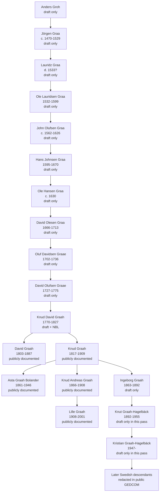
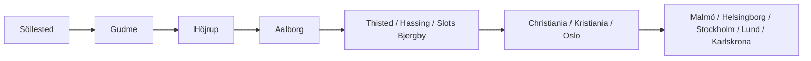

# Graah Family Genealogical and Historical Report

## Executive Summary

The attached draft is a four-page family outline sent in 2012 under the title *Anlängd*. It presents a descending line beginning with **Anders Groh** and **Jörgen Graa** in **Söllested**, continuing through **Aalborg**, **Thisted/Hassing**, **Kristiania/Oslo**, and into a later **Swedish Graah-Hagelbäck** branch. The draft is rich, but it is not proof by itself: it contains unverified early generations, a family-lore remark about *adelskap* or nobility, and at least a few clear data-quality issues, including one impossible date and one malformed place/date entry. The draft should therefore be treated as a research guide rather than a finished pedigree. fileciteturn0file0

The strongest externally corroborated portion of the tree in this research pass begins in the **nineteenth century**. Public reference sources confirm that **Knud Graah** was born in **Thisted, Denmark, on 13 June 1817**, died in **Kristiania on 27 March 1909**, was the son of **Sogneprest Knud David Graah (1770–1827)** and **Johanne Günther**, moved to Christiania in **1833**, and founded **Vøiens Bomuldsspinderi**, which entered operation in **1846**. Public sources also confirm his brother **David Graah (1803–1887)**, his granddaughter **Lille Graah (1908–2001)**, and his daughter **Asta Graah Bolander (1861–1946)**. citeturn39view0turn5view1turn6view1turn5view0turn6view2

For archival follow-up, the most relevant repositories are clear. In **Denmark**, Rigsarkivet provides digitized **parish registers**, **censuses**, **muster rolls**, **probate records**, and **property records**; in **Norway**, Digitalarkivet provides searchable **censuses**, **parish registers**, **probate and court records**, **emigration records**, **passenger lists**, and a **deaths 1951–2017** search; in **Sweden**, Riksarkivet’s search service and *specialsök* cover **kyrkoarkiv**, **folkräkningar**, **SCB births/marriages/deaths 1860–1949**, **bouppteckningar**, and regional **birth/marriage/death registers**, including the counties crucial to the Swedish Graah-Hagelbäck branch. citeturn30view1turn40view0turn40view1turn40view2turn40view3turn31view0turn31view1turn31view2turn41view0turn41view1turn41view2turn47view0turn48view0turn49view0turn49view1turn49view2turn49view3turn50view3turn51view0

**Svensk sammanfattning:** Det bifogade utkastet är en värdefull familjeöversikt, men det är inte i sig ett bevisat släktträd. Den del som bäst kan styrkas i denna omgång börjar på 1800-talet med industrimannen **Knud Graah (1817–1909)** i **Thisted/Kristiania** och hans närmaste familj. Den äldre danska linjen tillbaka till **Söllested**, **Gudme**, **Höjrup** och **Aalborg** är fortfarande huvudsakligen **utkastbaserad** och måste styrkas med danska kyrkböcker, skifte, mantal och andra originalkällor. För den svenska grenen är **Riksarkivet** och särskilt register för **Malmöhus/Kristianstad**, **SCB 1860–1949**, **folkräkningar** och **bouppteckningar** nästa steg. fileciteturn0file0 citeturn39view0turn5view1turn47view0turn48view0turn49view0turn49view1turn49view2turn49view3turn50view3turn51view0

## Source Base and Method

This report is based on two source layers. The first is the attached draft, which I treated as an internal family memorandum and not as independent proof. The second is a public-records and reference-source pass across official or quasi-official Scandinavian repositories and reference works, especially **Rigsarkivet**, **Digitalarkivet**, **Riksarkivet**, **Store norske leksikon**, and **Norsk biografisk leksikon**. fileciteturn0file0 citeturn19view3turn19view0turn46view0turn39view0turn5view0turn5view1turn6view1turn6view2

I extracted the draft into a structured inventory and built a provisional, **public-only** GEDCOM. The extraction preserves the draft’s indentation hierarchy, which appears to encode parent-child descent; however, because the draft lists many descendants without spouses and because living persons raise privacy issues, the downloadable GEDCOM should be read as a **working import file**, not a proof-standard final tree. The extracted inventory contains all draft rows; the GEDCOM omits most likely-living persons and flags relationships as provisional.

[Download the extracted draft inventory CSV](sandbox:/mnt/data/graah_draft_extraction.csv)

[Download the provisional public-only GEDCOM](sandbox:/mnt/data/graah_family_public_only.ged)

The archive search strategy was built around open-ended surname variation. The draft itself shows at least **Groh**, **Graa**, **Graae**, **Graah**, and **Graah-Hagelbäck**. In the official portals, I therefore prioritized truncation and variant searching, together with place filters such as **Aalborg**, **Thisted**, **Hassing**, **Kristiania/Oslo**, **Malmö**, and **Helsingborg**. That approach matches the search affordances of Riksarkivet, which explicitly supports `*` truncation and `?` masking for spelling variants, and Digitalarkivet, which explicitly links to variant search and truncation guidance. fileciteturn0file0 citeturn47view0turn25view0

## Findings from the Attached Draft

The draft contains **81 person entries** organized as a descending outline. It starts with **Anders Groh** and **Jörgen Graa** in **Söllested**, moves through **Gudme**, **Höjrup**, and a long **Aalborg** sequence, then branches to **Thisted/Hassing** and later to **Kristiania/Oslo** and **Sweden**. The Swedish places named in the draft include **Malmö**, **Helsingborg**, **Stockholm**, **Lund**, **Karlskrona**, **Kungälv**, **Enskede**, **Örby**, **Upplands Väsby**, and **Vallentuna**. fileciteturn0file0

The draft also provides important context about reliability. In the covering note, the sender explicitly expresses concern about whether it is suitable to publish online and mentions a possible claim that *adelskap* would follow only the male line and would be “broken” with **Knud Graah**. That is valuable as family-history context, but it is **not documentary proof of nobility**. At present, it should be classified as a family tradition requiring separate heraldic and archival verification. fileciteturn0file0

Several concrete data issues appear in the draft and should be carried forward into the working notes:

| Issue | Observation | Assessment |
|---|---|---|
| Early line before the nineteenth century | The chain from **Anders Groh/Jörgen Graa** through the early Aalborg generations is asserted without cited supporting documents in the draft. fileciteturn0file0 | **Unverified in this pass** |
| Noble-line remark | The draft mentions a concern about *adelskap* but offers no cited heraldic or legal source. fileciteturn0file0 | **Family lore until proven** |
| Name normalization | The same family appears under **Groh**, **Graa**, **Graae**, and **Graah**; the compound **Graah-Hagelbäck** appears in the Swedish branch. fileciteturn0file0 | **Expected orthographic variation** |
| Impossible date | **Johan Richter** is listed with birth date **1976-03-33**. fileciteturn0file0 | **Clerical or transcription error** |
| Malformed place/date field | **Gerda “Gurre” Hevor Elisabeth Niemeyer** is listed as “född 1928-07-29 i 1928.” fileciteturn0file0 | **Needs record-level correction** |
| City naming | **Kristiania** and **Oslo** are both used, sometimes for similar periods. fileciteturn0file0 | **Probably normal historical naming, not a real conflict** |

The most important extraction result is therefore not merely the names themselves, but the fact that the draft provides a **coherent research scaffold**. It gives enough dates, patronymics, and localities to drive a full archival campaign, especially in **Aalborg**, **Thisted/Hassing**, **Christiania/Kristiania**, and **northwestern Skåne**. fileciteturn0file0

## Reconstructed Family Line and Biographical Sketches

The evidence currently supports a layered reconstruction. The **early Danish backbone** exists in the draft; the **nineteenth- and twentieth-century Norway line** is the best externally corroborated segment; and the **modern Swedish Graah-Hagelbäck branch** is real in the draft but has not yet been externally traced person-by-person in this pass. fileciteturn0file0 citeturn39view0turn6view1turn5view0turn6view2

### Evidence Matrix for Principal Individuals

| Person | Relationship or role | Best public support | Confidence |
|---|---|---|---|
| **Anders Groh** | Earliest named root in the draft, “född i Söllested.” fileciteturn0file0 | Draft only | Low |
| **Jörgen Graa** | Draft gives ca. **1470**, **Söllested**, d. **1529**. fileciteturn0file0 | Draft only | Low |
| **David Olesen Graa** | Draft gives **1666-01-29**, d. **1713-08-09**, **Aalborg**. fileciteturn0file0 | Draft only in this pass | Low |
| **Oluf Davidsen Graae** | Draft gives **1702-01-17**, d. **1736-03-12**, **Aalborg**. fileciteturn0file0 | Draft only in this pass | Low |
| **Knud Graah / Knud David Graah** | Draft gives **1770-08-11**, d. **1827**, **SlotsBjergby**; NBL identifies the father of industrialist Knud as **Sogneprest Knud David Graah (1770–1827)**, married to **Johanne Günther**. fileciteturn0file0 citeturn39view0 | Draft + NBL alignment | Medium |
| **David Graah** | Brother of industrialist Knud; SNL identifies him as born **1803** in **Jutland/Denmark**, later merchant and benefactor in Christiania, d. **1887**. fileciteturn0file0 citeturn6view1 | High |
| **Knud Graah** | Industrialist; b. **13 Jun 1817 Thisted**, d. **27 Mar 1909 Kristiania**, moved to Christiania in **1833**, founded Vøiens Bomuldsspinderi and led it for ~60 years. citeturn39view0turn5view1 | High |
| **Asta Graah Bolander** | Daughter of Knud Graah; born **1861** in Kristiania, died **1946**; Norwegian writer. One public source also gives exact birth date **4 Feb 1861** and her 1889 marriage. citeturn6view2turn32search1 | High for identity, Medium for exact date pending primary record |
| **Knud Andreas Graah** | Named in Lille Graah’s biography as her father, **1866–1908**, with occupation at Vøiens Bomuldsspinderi. citeturn5view0 | High |
| **Lille Graah** | **Anne Knudsdatter Graah**, b. **22 Jan 1908 Kristiania**, d. **19 Jan 2001 Oslo**; journalist and Ravensbrück survivor. citeturn5view0 | High |
| **Ingeborg Graah → Knut Graah-Hagelbäck → Kristian Graah-Hagelbäck** | Maternal link from the Norwegian line into the Swedish compound-surname branch in the draft. fileciteturn0file0 | Draft only in this pass | Medium for internal consistency, Low for external proof |

### Narrative Biographical Sketches

The **early Danish segment** is internally coherent but remains unproven in this pass. In the draft, the line runs from **Anders Groh** to **Jörgen Graa** in **Söllested**, then through **Lauridz Graa**, **Ole Lauridsen Graa** in **Gudme**, **John Olufsen Graa** in **Höjrup**, **Hans Johnsen Graa**, **Ole Hansen Graa**, and then to **David Olesen Graa** and **Oluf Davidsen Graae** in **Aalborg**. The repeated movement from **Graa** to **Graae** to **Graah** is exactly the sort of orthographic drift one expects in Scandinavian records, but every one of these links still needs primary documentation. fileciteturn0file0

**Knud David Graah**, the father of industrialist Knud, is a pivotal bridge between the draft and the public record. The draft lists him as **Knud Graah**, born **1770-08-11 in Aalborg**, dead **1827 in SlotsBjergby**. NBL, however, identifies the father of industrialist **Knud Graah (1817–1909)** as **Sogneprest Knud David Graah (1770–1827)** and names his wife as **Johanne Günther**. This is not a contradiction; it is a refinement and probably the same man. It raises the confidence of the late-eighteenth-century link, but the exact Aalborg birth and Slots Bjergby death still need parish-level and clerical-archive confirmation. fileciteturn0file0 citeturn39view0

**David Graah (1803–1887)** is firmly documented in Norwegian public sources. SNL describes him as a Danish-born merchant who came to Norway in **1826**, settled in **Christiania**, helped found Norway’s first animal-protection society in **1859**, and established charitable funds for needy women and the creation of kindergartens. He is explicitly identified as the brother of **Knud Graah**. The draft’s statement that he was born in **Hassing** and died in **Kristiania** is therefore plausible but still worth checking against Danish and Norwegian records for exact places and dates. fileciteturn0file0 citeturn6view1

**Knud Graah (1817–1909)** is the best documented historical figure in the family file. NBL and SNL agree that he was born in **Thisted**, moved to **Christiania** in **1833**, traveled to **Britain** in the 1840s to study textile production, and in **1844** acquired water rights in the **Akerselva** area. His **Vøiens Bomuldsspinderi** entered operation in **1846** and became one of the leading textile enterprises in Norway; he remained associated with it until **1906** and continued as chairman until his death in **1909**. He married **Helene Marie Conradi** in **Christiania on 8 January 1857**. citeturn39view0turn5view1

**Asta Graah Bolander (1861–1946)** was one of Knud Graah’s daughters and became a writer. SNL confirms her literary identity and the span **1861–1946**. A public biographical page drawing on FamilySearch and newspaper references gives a fuller profile: exact birth date **4 February 1861** in Christiania and marriage on **21 November 1889** to **Carl Gustaf Bolander** in **Trefoldighet Church, Oslo**. The draft places her correctly as **Asta Graah Bolander, född 1861-02-04 i Kristiania**. fileciteturn0file0 citeturn6view2turn32search1

**Knud Andreas Graah (1866–1908)** appears in this research mainly through his daughter. NBL’s article on **Lille Graah** identifies him as **disponent Knud Andreas Graah**, the son of the older Knud line, and notes that he died the same year Lille was born. That is a strong anchor point for the turn-of-the-century branch. citeturn5view0

**Lille Graah (Anne Knudsdatter Graah, 1908–2001)** is another well-documented descendant. NBL identifies her as born in **Kristiania** on **22 January 1908**, daughter of **Knud Andreas Graah** and **Marie (“Mammy”) Blehr**, and later a long-serving **NRK** radio announcer and reporter. The article also confirms her wartime imprisonment and deportation to **Ravensbrück**, followed by her postwar broadcasting career and receipt of Oslo’s **St. Hallvard Medal** in **1977**. citeturn5view0

The **Swedish Graah-Hagelbäck line** in the draft appears to descend through **Ingeborg Graah (1863–1892)** to **Knut Graah-Hagelbäck (1892–1955)** and then to branches in **Helsingborg**, **Stockholm**, **Lund**, and **Karlskrona**. In this pass I have identified the right Swedish archive pathways for verifying that line, but I have **not yet externally documented each Swedish individual** one by one. For that reason, the Swedish branch is presently best classified as **internally coherent in the draft, awaiting archival confirmation**. fileciteturn0file0 citeturn47view0turn48view0turn49view0turn49view1turn49view2turn49view3turn50view3turn51view0

### Simplified Family Tree

The diagram below reproduces the draft backbone and highlights where external corroboration is strongest. The line through **Knud David Graah**, **David Graah**, **Knud Graah**, **Asta**, and **Lille** is the most secure part of the current reconstruction; the older Danish portion and the later Swedish portion remain partly draft-driven. fileciteturn0file0 citeturn39view0turn6view1turn5view0turn6view2

## Archive Roadmap and Primary-Source Targets

The Danish, Norwegian, and Swedish archive systems are all well suited to this project, but each covers a different chronological problem. **Denmark** is central for the older line and for the families in **Aalborg**, **Thisted**, **Hassing**, and **Slots Bjergby**. Rigsarkivet explains that genealogists usually begin with **parish registers** and **census records**, and that Arkivalieronline provides digitized access to the National Archives’ online records, including **parish registers**, **census lists**, **muster rolls**, **probate materials**, and **property records**. The Danish parish-register collections include material before **1814**, note a continuing color-digitization project for the pre-1814 volumes, and state that from **1892 onward** some birth-record remark fields are blurred for data-protection reasons. Danish censuses on Arkivalieronline run from **1787** to **1940**; muster rolls include central-administration material from **1706–1931**; and probate collections extend broadly to about **1919**. citeturn30view0turn30view1turn40view0turn40view1turn40view2turn40view3

**Norway** is the main arena for the nineteenth- and early twentieth-century branch. Digitalarkivet states that its census search includes transcribed censuses from **1769**, **1801**, **1815**, **1825**, **1835**, **1845**, **1855**, **1865**, **1870**, **1875**, **1885**, **1891**, **1900**, **1910**, and **1920**. Its parish-register portal provides searchable or scanned records for **births and baptisms**, **confirmations**, **marriages**, **deaths and burials**, **in- and out-migration**, and related church lists. The law-and-justice section includes **court books** and **public probate material**. Digitalarkivet also provides dedicated searches for **emigration registers**, **ship passenger lists**, and **deaths 1951–2017**. citeturn31view0turn31view1turn31view2turn41view0turn41view1turn41view2

**Sweden** is the key for the **Graah-Hagelbäck** line. Riksarkivet’s public search service states that it searches both the **Digitala forskarsalen** and the **Nationella Arkivdatabasen**. Its *specialsök* catalog is particularly useful here: it includes **Kyrkoarkiv**, **Folkräkningar**, **SCB födda, vigda, döda 1860–1949**, **Bouppteckningar**, and dedicated **birth**, **marriage**, and **death** registers. Those register pages are especially relevant because they explicitly cover **Malmöhus** and **Kristianstads** counties, which are the right record environments for **Malmö** and **Helsingborg** in the draft. The Swedish search system also supports truncation and masking for spelling variants, which is useful for **Graa/Graae/Graah** forms. citeturn47view0turn48view0turn49view0turn49view1turn49view2turn49view3turn50view3turn51view0

### Country-by-Country Target List

| Country | Records to search first | Why these matter for the Graah file | Best repository starting points |
|---|---|---|---|
| Denmark | Parish registers, censuses, probate, muster rolls, property records | Needed to prove the early line in **Söllested/Gudme/Höjrup/Aalborg** and the later **Thisted/Hassing/Slots Bjergby** generations. fileciteturn0file0 | **Rigsarkivet** genealogy guide, **Arkivalieronline** parish books, censuses, rolls, probate. citeturn30view0turn30view1turn40view0turn40view1turn40view2turn40view3 |
| Norway | Parish registers, censuses, probate, emigration, passenger lists, death search | Needed for **Christiania/Kristiania/Oslo** descendants, especially the households of **David Graah**, **Knud Graah**, **Knud Andreas Graah**, and **Lille Graah**. citeturn6view1turn39view0turn5view0 | **Digitalarkivet** censuses, parish portal, law/probate, emigration, passenger lists, deaths 1951–2017. citeturn31view0turn31view1turn31view2turn41view0turn41view1turn41view2 |
| Sweden | Kyrkoarkiv, folkräkningar, SCB 1860–1949, birth/marriage/death registers, bouppteckningar | Needed to verify the **Graah-Hagelbäck** branch in **Malmö**, **Helsingborg**, **Stockholm**, **Lund**, and **Karlskrona**. fileciteturn0file0 | **Riksarkivet** search service and *specialsök* pages for births, marriages, deaths, censuses, probate, and SCB extracts. citeturn47view0turn48view0turn49view0turn49view1turn49view2turn49view3turn50view3turn51view0 |

### Recommended Search Strings

For Denmark, start with combinations like **“Graa*”**, **“Graa?”**, **“Graah”**, **“Groh”**, and place-limited searches in **Aalborg**, **Thisted**, **Hassing**, and **Slots Bjergby**. For Norway, search **Graah** with **Christiania/Kristiania/Oslo**, and then run household-based confirmations through the census years **1865–1920** and corresponding church books. For Sweden, use **Graah-Hagelbäck**, **Graah**, and mixed wildcard forms, restricted to **Malmöhus**, **Kristianstad**, **Stockholm**, or specific parishes. Those strategies align with the Swedish and Norwegian archive portals’ own instructions on wildcard, masking, and spelling variation. citeturn47view0turn25view0turn49view0turn49view1turn51view0

## Chronology and Migration Patterns

The draft implies a long west-to-east-and-north migration pattern: **Söllested** to **Gudme**, then **Höjrup**, then a sustained **Aalborg** phase, after which the family appears in **Thisted/Hassing** and then in **Christiania/Kristiania**, with a later branch moving or marrying into **Sweden**. The documented public portion of that story is the nineteenth-century move from **Thisted, Denmark**, by **Knud Graah**, to **Christiania** in **1833**, followed by the creation of **Vøiens Bomuldsspinderi** at the Akerselva site in **1844–1846**. The Swedish Graah-Hagelbäck segment in the draft then traces later descendants through **Malmö**, **Helsingborg**, **Stockholm**, **Lund**, and **Karlskrona**. fileciteturn0file0 citeturn39view0turn5view1

### Condensed Timeline

| Date | Event | Source status |
|---|---|---|
| c. **1470** | **Jörgen Graa** born in **Söllested**. fileciteturn0file0 | Draft only |
| **1666-01-29** | **David Olesen Graa** born; later dies in **Aalborg** in **1713**. fileciteturn0file0 | Draft only |
| **1702-01-17** | **Oluf Davidsen Graae** born in **Aalborg**. fileciteturn0file0 | Draft only |
| **1770** | **Knud David Graah** generation begins; draft gives **Aalborg**, NBL confirms **1770–1827** and spouse **Johanne Günther**. fileciteturn0file0 citeturn39view0 | Medium |
| **1803** | **David Graah** born in Denmark/Jutland; later merchant in **Christiania**. fileciteturn0file0 citeturn6view1 | High |
| **1817-06-13** | **Knud Graah** born in **Thisted**. citeturn39view0turn5view1 | High |
| **1833** | **Knud Graah** moves to **Christiania**. citeturn39view0turn5view1 | High |
| **1844–1846** | Water rights acquired and **Vøiens Bomuldsspinderi** starts operations. citeturn39view0turn5view1 | High |
| **1857-01-08** | **Knud Graah** marries **Helene Marie Conradi** in Christiania. citeturn39view0 | High |
| **1861** | **Asta Graah Bolander** born in Kristiania. fileciteturn0file0 citeturn6view2turn32search1 | High |
| **1908-01-22** | **Lille Graah** born in Kristiania. citeturn5view0 | High |
| Twentieth century | Draft traces one line into **Graah-Hagelbäck** households in **Helsingborg**, **Stockholm**, **Lund**, and **Karlskrona**. fileciteturn0file0 | Draft only in this pass |

### Migration Sketch

The migration sketch below is intentionally schematic. It captures the places named in the draft and the best-documented historical move into Norway. fileciteturn0file0 citeturn39view0turn5view1

## Gaps, Conflicts, Privacy, and Next Steps

The single biggest gap is the **older Danish line**. At the moment, the path from **Anders Groh** down to at least **David Olesen Graa / Oluf Davidsen Graae** is still only as strong as the family draft. The line is plausible and specific enough to research, but it is **not yet demonstrated** through original record citations in this pass. The next priority is therefore a systematic Danish proof run, beginning with **Aalborg**, **Thisted**, **Hassing**, and **Slots Bjergby**, and working backward from the securely documented nineteenth-century line into the eighteenth-century parish and probate material. fileciteturn0file0 citeturn30view0turn30view1turn40view0turn40view1turn40view3

A second issue is **name standardization**. The draft’s shift among **Groh**, **Graa**, **Graae**, and **Graah** almost certainly reflects historical spelling practice rather than unrelated families, but it also increases the risk of false positives. Every archival search should therefore be logged with both the exact spelling used in the record and a normalized research spelling in the notes. Swedish portal guidance on masking and truncation, and Norwegian guidance on variant searching, make that feasible. fileciteturn0file0 citeturn47view0turn25view0

A third issue is the **Swedish modern branch**. Riksarkivet provides the right search infrastructure, including county-level birth, marriage, and death indexes, probate, SCB extracts, and census tools that are very well matched to **Malmöhus/Kristianstad** and the cities named in the draft. However, because that branch includes many likely-living people, this report intentionally avoids publishing a full modern pedigree in the narrative and instead provides a **public-only GEDCOM**. That is both prudent and consistent with archive-era privacy norms; Denmark’s own archive guidance, for example, notes present-day data-protection limits in parish materials from **1892 onward**. citeturn47view0turn48view0turn49view0turn49view1turn49view2turn49view3turn50view3turn51view0turn40view0

The unresolved conflicts are manageable rather than fatal. The draft’s **“Knud Graah”** becomes **“Knud David Graah”** in NBL, which likely reflects fuller naming rather than a separate person. The use of **Kristiania** and **Oslo** is historically normal for the same city across different periods. The genuinely problematic items are the malformed entries such as **1976-03-33**, which need direct record correction. fileciteturn0file0 citeturn39view0

The next archival phase should therefore proceed in this order. First, prove the **Knud Graah (1817–1909)** household end-to-end with Danish birth and Norwegian marriage/death/census records. Second, prove the father **Knud David Graah (1770–1827)** and his spouse **Johanne Günther** in Danish clerical records. Third, walk backward through the Aalborg line generation by generation using parish books, census, probate, and land-related materials. Fourth, move forward into Sweden by documenting **Ingeborg Graah**, **Knut Graah-Hagelbäck**, and the Helsingborg/Malmö/Stockholm descendants with **Riksarkivet** birth, marriage, death, census, and probate tools. Fifth, keep the *adelskap* question entirely separate until the biological descent is proven; only then is it worth approaching heraldic or nobility archives. citeturn39view0turn30view0turn30view1turn40view0turn40view1turn40view3turn31view0turn31view1turn31view2turn47view0turn48view0turn49view0turn49view1turn49view2turn49view3turn50view3turn51view0

**Kort svensk slutsats:** Släktutkastet ger en mycket bra forskningskarta, men ännu inte ett helt bevisat träd. Den säkrast styrkta delen går via **Knud Graah (1817–1909)** i **Thisted/Kristiania** och vidare till **Asta Graah Bolander** och **Lille Graah**. Den äldre danska ledkjedjan bakåt till **Söllested/Gudme/Höjrup/Aalborg** måste styrkas i **Rigsarkivet**, och den senare svenska **Graah-Hagelbäck**-grenen bör nu följas i **Riksarkivets** kyrkoarkiv, folkräkningar, SCB-utdrag och bouppteckningar. De lokala nedladdningarna ovan är därför preliminära arbetsfiler, inte slutbevis. fileciteturn0file0 citeturn39view0turn5view0turn6view2turn30view1turn31view1turn47view0turn48view0turn49view0turn49view1turn49view2turn49view3turn50view3turn51view0