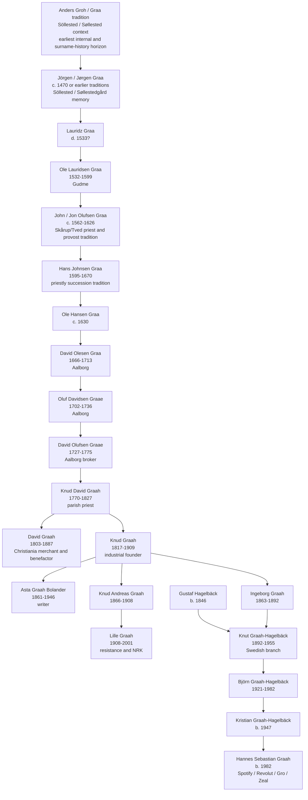

# The Graah / Graa / Graae / Groh / Graah-Hagelbäck Family  
## Authoritative Combined Genealogical and Historical Report  
### From the earliest known Graa traditions to the modern Swedish and digital-era branches

**Prepared as a combined Markdown report from the uploaded genealogy and story reports.**  
**Format:** Markdown.  
**Scope:** Earliest known and alleged roots; internal family draft lineage; documented Danish, Norwegian, Swedish and collateral surname stories; modern Graah-Hagelbäck / Graah branch; unresolved claims and evidence roadmap.  
**Important interpretive rule:** this report is deliberately comprehensive, but it does **not** treat every inherited tradition as proven. It separates the family’s *historical memory* from what the current evidence actually proves.

---

## Table of Contents

1. [Executive Summary](#executive-summary)
2. [How to Read This Report](#how-to-read-this-report)
3. [The Name: Groh, Graa, Graae, Graah and Graah-Hagelbäck](#the-name-groh-graa-graae-graah-and-graah-hagelbäck)
4. [At a Glance: The Long Arc of the Family](#at-a-glance-the-long-arc-of-the-family)
5. [Evidence Grades Used in This Report](#evidence-grades-used-in-this-report)
6. [Earliest Horizon: Noble Graa, Søllestedgård and the Family Memory of Lost Status](#earliest-horizon-noble-graa-søllestedgård-and-the-family-memory-of-lost-status)
7. [The Older Danish Line in the Internal Family Draft](#the-older-danish-line-in-the-internal-family-draft)
8. [The Skårup Priests, the Svendborg Merchants and the Problem of Origins](#the-skårup-priests-the-svendborg-merchants-and-the-problem-of-origins)
9. [The Aalborg Merchant and Broker Era](#the-aalborg-merchant-and-broker-era)
10. [Knud David Graah and the Turn Toward Norway](#knud-david-graah-and-the-turn-toward-norway)
11. [The Norwegian Migration: David Graah and Knud Graah](#the-norwegian-migration-david-graah-and-knud-graah)
12. [David Graah: Merchant, Benefactor and Animal-Welfare Founder](#david-graah-merchant-benefactor-and-animal-welfare-founder)
13. [Knud Graah and the Akerselva Textile Revolution](#knud-graah-and-the-akerselva-textile-revolution)
14. [The Christmas 1859 Fire and the Rebuilding of Vøien](#the-christmas-1859-fire-and-the-rebuilding-of-vøien)
15. [Knud Graah as Civic Leader and Conservative Banker](#knud-graah-as-civic-leader-and-conservative-banker)
16. [The Next Norwegian Generation: Asta, Knud Andreas and Lille Graah](#the-next-norwegian-generation-asta-knud-andreas-and-lille-graah)
17. [Lille Graah: Resistance, Ravensbrück, White Buses and the Voice of NRK](#lille-graah-resistance-ravensbrück-white-buses-and-the-voice-of-nrk)
18. [The Swedish Divergence: Ingeborg Graah, Gustaf Hagelbäck and the Graah-Hagelbäck Name](#the-swedish-divergence-ingeborg-graah-gustaf-hagelbäck-and-the-graah-hagelbäck-name)
19. [The Modern Swedish Professional Branch](#the-modern-swedish-professional-branch)
20. [The Contemporary Digital Branch: Hannes Graah, Open Finance and Zeal](#the-contemporary-digital-branch-hannes-graah-open-finance-and-zeal)
21. [Collateral and Surname Stories: W.A. Graah, Jutta Graae and Other Graa/Graae/Graah Bearers](#collateral-and-surname-stories-wa-graah-jutta-graae-and-other-graagraaegraah-bearers)
22. [The Shipwreck Off the English Coast](#the-shipwreck-off-the-english-coast)
23. [The Nobility Question: What Can Be Said Responsibly](#the-nobility-question-what-can-be-said-responsibly)
24. [Integrated Chronology](#integrated-chronology)
25. [Integrated Lineage Overview](#integrated-lineage-overview)
26. [Migration and Transformation Map](#migration-and-transformation-map)
27. [Evidence Matrix for Principal People and Stories](#evidence-matrix-for-principal-people-and-stories)
28. [Known Data Problems and Corrections Needed](#known-data-problems-and-corrections-needed)
29. [Archival Roadmap: Denmark, Norway and Sweden](#archival-roadmap-denmark-norway-and-sweden)
30. [How the Family Story Should Be Told Publicly](#how-the-family-story-should-be-told-publicly)
31. [Conclusion: The Real Graah Legacy](#conclusion-the-real-graah-legacy)
32. [Appendix A: Extended Draft-Lineage Table](#appendix-a-extended-draft-lineage-table)
33. [Appendix B: Major Story Register](#appendix-b-major-story-register)
34. [Appendix C: Source Notes and Bibliography](#appendix-c-source-notes-and-bibliography)

---

## Executive Summary

The history of the Graah family is best understood as a long Scandinavian story of **adaptation under changing regimes of power**. The surname appears in several forms — **Groh**, **Graa**, **Graae**, **Graah**, and later **Graah-Hagelbäck** — and the family memory reaches back toward late-medieval Denmark, noble arms, lost status, church offices, merchant life, industrial capitalism, wartime resistance, broadcasting, Swedish professional life and finally digital finance.

The combined reports do not all speak with the same level of caution. Some sections are strongly evidenced by public reference works, official or quasi-official local-history sources, printed family histories and named archival pathways. Other sections rely mainly on the internal 2012 family draft known as **Anlängd** or on family tradition. The purpose of this report is to combine everything into one coherent account while preserving those differences. The result is a single narrative, but not a single flat level of certainty.

The earliest dramatic family horizon is the story of a noble **Graa** family connected with **Søllestedgård** on **Lolland**, Denmark. Manor-history sources support a historical property sequence in which a noble Graa family held Søllestedgård in the fifteenth and early sixteenth centuries; **Anders Graa** is associated with the estate from the 1460s, **Gertrud Mogensdatter Munk** with its management after him, and **Jørgen Graa** with the estate until it passed to the Crown in **1530**. The Crown then held the estate until **1550**, when **King Christian III** sold it to **Jørgen Brahe**, uncle of the astronomer **Tycho Brahe**. This gives a real historical core to a family memory that “the king drove the family out and the Brahes took the estate.” However, the direct genealogical bridge from that noble Lolland Graa family to the later documented Graae/Graah line is **not yet proved**. Therefore the Søllestedgård story belongs in the report as a powerful ancestral tradition and surname-history episode, but it must be described with caution.

The internal family draft then gives a descending line beginning with **Anders Groh** and **Jörgen Graa** in **Söllested**, continuing through **Gudme**, **Höjrup**, **Aalborg**, **Thisted/Hassing**, **Kristiania/Oslo**, and finally into a Swedish **Graah-Hagelbäck** branch. The draft contains **81 person entries** and provides the essential scaffold for the family’s own understanding of its lineage. It also has clear data-quality problems, including an impossible date for **Johan Richter** and a malformed place/date field for **Gerda “Gurre” Hevor Elisabeth Niemeyer**. The draft should therefore be treated as a valuable working genealogy rather than a proof-standard final pedigree.

The older Danish line in the draft runs through a sequence of patriarchs: **Anders Groh**, **Jörgen Graa**, **Lauridz Graa**, **Ole Lauridsen Graa**, **John Olufsen Graa**, **Hans Johnsen Graa**, **Ole Hansen Graa**, **David Olesen Graa**, **Oluf Davidsen Graae**, **David Olufsen Graae**, and **Knud David Graah**. Some of these names overlap with serious printed family-history discussions of Graa/Graae priestly and merchant lines in Funen and Jutland. The **Skårup/Tved priest dynasty** is plausible and important: **John Olufsen Graa** obtained expectancy to the Skårup and Tved parishes in **1591** and became provost in **1622**, while **Hans Johnsen Graa** succeeded him. But the relationship between this priestly line and the later Svendborg merchant line is debated in the older family literature and should not be forced beyond the evidence.

The better-documented family story begins in earnest with the late eighteenth and early nineteenth centuries. **Knud David Graah** (1770–1827), a Danish parish priest, married **Johanne Günther** and became the father of a generation that moved into Norway. Among his children were **David Graah** (1803–1887), a Christiania merchant and benefactor, and **Knud Graah** (1817–1909), the industrial founder who became the central figure in the family’s public historical legacy. Public Norwegian sources confirm Knud’s birth in **Thisted** on **13 June 1817**, his move to **Christiania** in **1833**, his acquisition of water rights at **Nedre Vøyen** in **1844**, and the opening of **Vøiens Bomuldsspinderi** in **1846**.

**David Graah** broadened the family’s nineteenth-century legacy beyond commerce and industry. He settled in Christiania from **1826**, became a businessman and benefactor, helped found what is described as Norway’s first animal-protection society in **1859**, and established charitable funds for needy women and kindergartens. His life represents the family’s civic and philanthropic branch.

**Knud Graah** represents the family’s industrial branch. He identified a major opportunity after Britain relaxed restrictions on exporting textile machinery, traveled to Britain to study and acquire industrial technology, and brought that machinery and expertise to Norway. At Vøien along the **Akerselva**, he built one of the key institutions of Norway’s textile industrialization. The early mill used water power, British technical knowledge, local Norwegian engineering and imported expertise. The factory opened with a large number of spindles and a substantial workforce, later expanded dramatically, and became a landmark of Norwegian industrial history. The **1859 fire** — remembered as a Christmas-period catastrophe — became one of the most cinematic family episodes: the mill burned, but Graah rebuilt quickly, larger and more modern, with architect **Oluf N. Roll** involved in the new four-storey factory.

Knud Graah’s later career adds another dimension: conservative financial leadership. He joined the board of **Christiania Bank og Kreditkasse** in **1881**, later chaired it, and his cautious style was credited in the reports with helping the bank survive the **Kristiania crash of 1899**. He thus belongs not only to industrial history but also to the history of financial stability in a volatile urban economy.

The next generations include **Asta Graah Bolander** (1861–1946), a Norwegian writer; **Knud Andreas Graah** (1866–1908), tied to Vøiens Bomuldsspinderi and father of Lille; and **Anne Knudsdatter “Lille” Graah** (1908–2001). Lille Graah is one of the strongest twentieth-century stories. She joined resistance-related illegal newspaper work during the German occupation of Norway, was arrested by the Gestapo in **1942**, imprisoned at **Grini**, deported to **Ravensbrück**, returned with the **White Buses** in **1945**, and then became one of Norway’s recognizable NRK voices, especially through **Ønskekonserten**. Her life connects industrial privilege, moral courage, concentration-camp survival, public broadcasting and postwar national healing.

The Swedish branch begins through **Ingeborg Graah** (1863–1892), a female-line descendant of the Norwegian industrial branch, who married **Gustaf Hagelbäck**. Their son **Knut Graah-Hagelbäck** (1892–1955) preserved the Graah name in a hyphenated Swedish surname. This act of naming matters deeply because the family’s internal nobility anxiety is tied to patrilineal descent: if nobility is assumed to follow only the male line, a female-line Graah-to-Hagelbäck transition would be genealogically vulnerable. A 2012 family correspondence explicitly worried that publication of the lineage might invite that critique. In practical terms, the Swedish Graah-Hagelbäck branch represents both continuity and transformation: the name survives, but the strictly agnatic claim, if any existed, would be vulnerable under traditional noble rules.

The modern Swedish descendants move into military, architectural, psychological, cybersecurity, administrative and technology fields. **Björn Graah-Hagelbäck** (1921–1982) appears as a military figure connected to national defense planning. Other modern names include **Anna Graah-Hagelbäck**, **Hans Graah-Hagelbäck**, **Olof Graah-Hagelbäck**, the **Richter** connection and other affiliated families. Because many later individuals may be living, this report summarizes them carefully and marks the internal draft as the source for much of that modern branch.

The most recent chapter is the digital-era return to the shortened **Graah** name through **Hannes Sebastian Graah** (born 1982 in Lund), son of **Kristian Graah-Hagelbäck**. The combined reports frame Hannes’s career as a modern analogue to Knud Graah’s industrial infrastructure-building: from scaling operations and growth at **Spotify**, to growth leadership at **Revolut**, to founding **Gro** and **Zeal**, the family’s pattern shifts from waterwheels and textile machinery to software, self-custody, open finance and digital transaction infrastructure. The analogy is not that the technologies are the same, but that the family’s recurring pattern is the same: identify a new economic architecture, cross borders, import or build the new infrastructure, and push it into daily life.

Two major surname stories are included but carefully separated from the direct line. **Wilhelm August Graah** (1793–1863) led the **1828–1831 East Greenland expedition**, helping end the old search for a lost Norse Eastern Settlement on Greenland’s east coast and forcing a rethinking of Danish colonial assumptions. **Jutta Graae** (1906–1997), codename **Storhertuginden**, became a major figure in Danish resistance intelligence, handling money and microfilm, fleeing to Sweden in 1943, working from London with SOE, and leaving an archival legacy through Stockholmsarkivet. Both are historically important Graah/Graae bearers, but the reports do **not** prove their direct biological connection to the Knud Graah / Graah-Hagelbäck line.

The authoritative public story should therefore be told as follows: the family’s **proven public greatness** does not depend on proving medieval nobility. Its real legacy lies in repeated reinvention — noble memory, clerical office, merchant brokerage, philanthropy, industrialization, financial caution, wartime courage, broadcasting, Swedish professional life and modern open finance. The family’s most secure genealogical and historical anchor begins in the nineteenth century with **Knud David Graah**, **David Graah** and **Knud Graah**. The deeper medieval and early-modern past remains important, evocative and researchable, but must be presented as a mixture of documented surname history, family draft lineage and unresolved tradition.

---

## How to Read This Report

This report is a synthesis of several uploaded reports that overlap, expand and sometimes disagree in tone. Some source reports were conservative and stressed proof standards. Others were more narrative and treated family tradition more boldly. This final version combines them by following four principles:

1. **Include everything relevant.** The user asked for a start-to-end report and no artificial word limit. Therefore this report includes the full sweep: Søllestedgård, noble memory, priestly and merchant lines, Aalborg, Christiania, Akerselva, Lille Graah, Swedish Graah-Hagelbäck, modern digital finance and collateral surname stories.
2. **Do not flatten evidence.** A beautiful legend is still a legend. A public reference-work biography is stronger than a family note. A manor-history fact can be true even if direct descent from that manor family is unproven.
3. **Preserve the family story as story.** The family’s memory of nobility, lost arms, a lost signet, a king, Brahe takeover, and male-line anxieties are historically meaningful even when not legally or genealogically proven.
4. **Make the report useful for future research.** The report records what should be searched next in Danish, Norwegian and Swedish archives.

The most important methodological decision concerns the **Søllestedgård / Brahe story**. One report treated the royal-expulsion and Brahe-castle story as uncorroborated in the standard family books. Another report connected it to a real manor-history sequence at Søllestedgård: Graa ownership, Crown takeover, and later Brahe acquisition. These positions can be reconciled. The **property-history core** is supported. The **direct genealogical connection** to the later Graah line is not proved. The **family legend** is therefore not to be dismissed, but it should be narrated as a compressed and still-unverified memory rather than a finished legal-genealogical fact.

---

## The Name: Groh, Graa, Graae, Graah and Graah-Hagelbäck

The family appears under multiple spellings:

| Form | Context in the combined reports | Interpretation |
|---|---|---|
| **Groh** | Earliest internal draft root, **Anders Groh** | Possibly an older or variant spelling; draft-based and needing proof |
| **Graa / Grå** | Medieval and early-modern Danish/Norwegian form; noble surname traditions; priestly line | Expected Scandinavian spelling; often the oldest visible form |
| **Graae** | Danish family-history and Svendborg/Aalborg forms | Common Danish orthographic expansion; appears in printed family histories |
| **Graah** | Nineteenth-century Danish/Norwegian branch, especially David and Knud | Publicly documented form in Norwegian references |
| **Graah-Hagelbäck** | Swedish compound surname from the Ingeborg Graah / Gustaf Hagelbäck branch | A deliberate preservation of the Graah name through a Swedish maternal-line transition |
| **Graah** in modern professional use | Hannes Graah and the digital-era branch | A modern return to the shorter Graah form |

The spelling variation is not unusual. Scandinavian records, especially before modern civil registration and standardized surnames, frequently vary across parish registers, probate records, censuses, printed histories and later biographies. Search strategy should therefore always include **Groh**, **Graa**, **Grå**, **Graae**, **Graah**, **Graah-Hagelbäck**, and sometimes wildcard variants such as `Graa*`.

---

## At a Glance: The Long Arc of the Family

The family story can be summarized as a sequence of transformations:

| Era | Main place(s) | Dominant role | Central figures or traditions | Evidence status |
|---|---|---|---|---|
| Late medieval / early sixteenth century | Lolland, Søllestedgård | Noble estate-holding and provincial authority | Anders Graa, Gertrud Munk, Jørgen Graa; Crown takeover; later Brahe ownership | Manor-history core supported; direct descent unresolved |
| Sixteenth–seventeenth century | Funen: Söllested/Gudme/Höjrup/Skårup/Tved | Clerical authority and local administration | Ole Lauridsen Graa, John Olufsen Graa, Hans Johnsen Graa | Draft and printed family-history overlap; direct connection debated |
| Late seventeenth–eighteenth century | Svendborg and Aalborg | Merchants, brokers, urban bourgeoisie | Jørgen Pedersen Graae in Svendborg; David Olesen Graa; Oluf Davidsen Graae; David Olufsen Graae | Svendborg line probable in printed books; Aalborg line in draft/report needs record confirmation |
| Late eighteenth–early nineteenth century | Aalborg, Slots Bjergby, Sludstrup, Thisted/Hassing | Parish priest family and bridge to Norway | Knud David Graah and Johanne Günther | Stronger bridge; public sources confirm him as father of Knud Graah |
| Nineteenth century | Christiania/Kristiania/Oslo | Commerce, philanthropy, industry, banking | David Graah; Knud Graah; Vøiens Bomuldsspinderi; Kreditkassen | High confidence |
| Early–mid twentieth century | Norway | Resistance, concentration-camp survival, broadcasting | Lille Graah | High confidence |
| Late nineteenth–twentieth century | Malmö, Helsingborg, Stockholm, Lund, Karlskrona | Swedish professional and military branch | Ingeborg Graah; Knut Graah-Hagelbäck; Björn Graah-Hagelbäck; modern descendants | Internal draft strong; public verification needed person-by-person |
| Twentieth-century collateral surname stories | Greenland, Copenhagen, Stockholm, London | Exploration and resistance intelligence | W.A. Graah; Jutta Graae | Events certain; direct line connection not proved |
| Twenty-first century | Sweden, UK/global fintech/crypto | Digital infrastructure and open finance | Hannes Graah; Gro; Zeal | Based on modern source reports and public professional profile; living-person sensitivity applies |

---

## Evidence Grades Used in This Report

The combined reports use the following reliability categories. This final report keeps the same structure.

| Grade | Meaning | Examples in this report |
|---|---|---|
| **Certain / High confidence** | Strongly supported by official or scholarly reference works, public biographies, serious local-history sources or directly named historical sources | Knud Graah’s birth, move to Christiania, Vøiens Bomuldsspinderi; David Graah’s animal-welfare work; Lille Graah’s wartime and NRK career |
| **Probable** | Supported by serious printed family histories, local-history synthesis or coherent source comparison, but original records have not all been inspected in this pass | Svendborg merchant line from Jørgen Pedersen Graae; Ole Bondo shipwreck; Skårup priest line as a real historical line |
| **Uncertain** | A named tradition, plausible lead or internal draft relationship that needs primary-source proof | Ystad burgomaster ancestry; early draft descent through some pre-1800 generations; modern Swedish branch person-by-person linkage outside the family draft |
| **Legend / family tradition** | Meaningful family memory or antiquarian tradition without sufficient documentary support as a genealogical fact | Legal noble descent from extinct Graa arms; royal-expulsion story if stated literally; Gråmanstorp founder myth |

This framework does not make the legends unimportant. In family history, legends can be crucial evidence of identity, aspiration, memory and internal status. But the report distinguishes identity from proof.

---

## Earliest Horizon: Noble Graa, Søllestedgård and the Family Memory of Lost Status

### The story as remembered

One of the most dramatic family traditions says that the ancestors were expelled or forced out by a Danish king, after which the powerful **Brahe** family took over the family’s castle or manor. In one version, the estate is remembered as being in “western Denmark.” In the more historically grounded version, the property is **Søllestedgård** on **Lolland**, not western Denmark.

The conservative story report did not find the royal-expulsion/Brahe-castle anecdote in the standard printed family histories or official biographical/reference material it reviewed. It therefore classified the story as **legend pending a documentary lead**. The more expansive story report connected the family memory to a real sequence in manor history: Graa ownership, transfer to the Crown, and later sale to Jørgen Brahe. These are not mutually exclusive. The best synthesis is:

> The **literal family story** of expulsion and immediate Brahe takeover is not yet proved as family genealogy. But it appears to preserve a **real historical pattern**: a noble Graa family held Søllestedgård; the estate passed to the Crown in 1530; the Crown sold it to Jørgen Brahe in 1550. The family memory likely compressed those events into a simpler drama.

### The manor-history core

The supported manor-history account is broadly as follows:

- A noble family named **Graa / Grå** held **Søllestedgård** on Lolland in the fifteenth and early sixteenth centuries.
- **Anders Graa** is associated with the estate from the 1460s until about 1490.
- His widow, **Gertrud Mogensdatter Munk**, is associated with the estate after him.
- Their son **Jørgen Graa** held the estate until **1530**.
- In **1530**, Søllestedgård passed to the Danish Crown.
- The Crown held it for roughly twenty years.
- In **1550**, **King Christian III** sold it to **Jørgen Brahe**, the uncle of **Tycho Brahe**.
- The estate then continued through Brahe, Oxe, Gyldenstjerne, Steensen, Lützow, Crown, Knuth and Jørgensen ownership periods.

This is important because the family legend is not random. The names, the place and the Brahe connection all have a plausible historical anchor. The unresolved issue is not whether a Graa family and Brahe ownership existed; it is whether the later Graah family can prove direct descent from that noble estate-holding Graa line.

### Why the story changed in memory

Oral history compresses chronology. A twenty-year Crown interval between Graa possession and Brahe purchase can easily become “the king took it and the Brahes moved in.” A manor on Lolland can become “western Denmark” in a family memory transmitted across countries and centuries. A legally complex transfer can become “chased out.” A real loss of status can become a foundational myth.

This report therefore preserves the Søllestedgård story as a central family tradition but does not use it as proof of direct noble descent.

### Søllestedgård ownership sequence

| Era | Owners or controlling family | Relevance to Graah story |
|---|---|---|
| c. 1462–1530 | Graa family: Anders Graa, Gertrud Munk, Jørgen Graa | Historical core of the lost-estate memory |
| 1530–1550 | Danish Crown | Possible basis for “the king took it” in family memory |
| 1550 onward | Jørgen Brahe and later Brahe/Oxe successors | Basis for “the Brahes took over” |
| Later centuries | Gyldenstjerne, Steensen, Lützow, Crown again, Knuth, Jørgensen | Shows the estate’s continued aristocratic and economic importance |

### What remains unproved

The following cannot yet be stated as fact:

- That the later **Svendborg/Aalborg/Christiania Graah** family is directly descended from **Anders Graa** or **Jørgen Graa** of Søllestedgård.
- That the estate transfer in 1530 was a physical expulsion rather than a legal transfer, surrender, forced sale, debt settlement or political accommodation.
- That any legal noble status continued into the later Graah-Hagelbäck branch.

The responsible language is therefore: **“A noble Graa family held Søllestedgård, which passed to the Crown in 1530 and later to Jørgen Brahe. Family memory appears to preserve this as a story of royal displacement and Brahe takeover, but the direct genealogical link to the later Graah line remains unproved.”**

---

## The Older Danish Line in the Internal Family Draft

The internal 2012 family draft, **Anlängd**, gives a descending line that begins with **Anders Groh** and **Jörgen Graa** in **Söllested** and continues toward the later Aalborg and Norwegian branches. The conservative report emphasizes that this draft is a **research scaffold**, not final proof. It contains valuable names, dates, places and relationships, but lacks source citations for many early generations and contains a few clear data problems.

The draft’s older line is:

1. **Anders Groh**, born in Söllested according to the draft.
2. **Jörgen Graa**, born c. 1470 in Söllested, died 1529 according to the draft.
3. **Lauridz Graa**, died 1533? according to the draft.
4. **Ole Lauridsen Graa**, born 1532 in Gudme, died 1599.
5. **John / Jon Olufsen Graa**, born c. 1562 in Höjrup, died 1626; associated with Skårup/Tved priestly office in the wider reports.
6. **Hans Johnsen Graa**, born 1595, died 12 June 1670; reportedly succeeded his father in the clerical line.
7. **Ole Hansen Graa**, born c. 1630.
8. **David Olesen Graa**, born 29 January 1666, died 9 August 1713 in Aalborg.
9. **Oluf Davidsen Graae**, born 17 January 1702 in Aalborg, died 12 March 1736 in Aalborg.
10. **David Olufsen Graae**, born 1 September 1727 in Aalborg, died 1 September 1775 in Aalborg; later described as a licensed broker.
11. **Knud David Graah**, born 11 August 1770 in Aalborg according to the draft, died 1827 in Slots Bjergby; publicly identified as father of Knud Graah the industrialist.

The older draft lineage is internally coherent, but it must be approached generation by generation. It should not be dismissed. It is too detailed and geographically plausible to ignore. But neither should it be presented as completely proven until parish, probate, census, property and clerical records have been checked.

### The value of the draft

The draft is valuable because it provides:

- A chain of names over many generations.
- Repeated localities: Söllested, Gudme, Höjrup, Aalborg, Thisted/Hassing, Kristiania/Oslo, Malmö/Helsingborg/Stockholm/Lund/Karlskrona.
- Spelling evolution from Groh/Graa/Graae to Graah.
- A bridge from Danish parish and merchant life to Norwegian industrial life.
- The Swedish Graah-Hagelbäck branch.
- A note about the family’s nobility anxiety and male-line succession.

### The limits of the draft

The draft is limited because:

- It does not cite primary records for many early links.
- Some early generations overlap with known but debated priestly and merchant lines.
- It includes likely living people, requiring privacy sensitivity.
- It contains at least two clear data-quality issues.
- It preserves a family status concern without proving legal nobility.

The report therefore treats the draft as the **family’s internal lineage map** and uses stronger public sources to anchor the nineteenth-century Norwegian branch.

---

## The Skårup Priests, the Svendborg Merchants and the Problem of Origins

The earliest Danish family story is complicated by the existence of multiple Graa/Graae traditions in roughly the same broad region. The reports identify at least three intertwined but not fully resolved origin problems:

1. The noble **Graa** surname and arms.
2. The **Skårup/Tved priest dynasty** near Svendborg.
3. The **Svendborg merchant family Graae**, associated in printed family history with **Jørgen Pedersen Graae** and **Katrine Knudsdatter**.

### The Skårup/Tved priest dynasty

The story reports describe a real priestly line associated with **Skårup** and **Tved** in Funen. **John Olufsen Graa** obtained expectancy to the Skårup and Tved parishes in **1591**, later becoming provost in **1622**. He was succeeded by his son **Hans Johnsen Graa**, who continued the family’s clerical authority until **1670**.

In post-Reformation Denmark, a parish priest was not simply a preacher. He was part of the state’s local administrative structure. Clergymen handled or influenced record-keeping, moral discipline, schooling, poor relief, local identity, and the management of church lands. A provost had even broader authority. A family that held such positions for generations acquired education, literacy, social status and local influence.

This makes the Skårup priest line an attractive origin for later Graae merchants. It explains how a family could move from local status to urban bourgeois life. However, the older family compilers themselves hesitated to prove that the Svendborg merchants descend from this priestly line. One argument was the lack of expected continuity in inherited male given names. Therefore:

- The **Skårup priest line itself** is probable and historically significant.
- The **direct descent from that priest line to the later Svendborg/Aalborg/Christiania Graah line** remains uncertain.

### The Svendborg merchant line

The printed family-history tradition identifies **Jørgen Pedersen Graae** and **Katrine Knudsdatter** as the root of the documented **Svendborg family Graae**. Barfod’s 1882 genealogy is important here because it is cautious rather than romantic. It treats the merchant household, not a medieval knight, as the point where the family becomes more secure.

The story reports highlight a useful phrase from that older literature: after collateral possibilities are sorted, there appears to be “only one male line Graae” continuing through the Svendborg branch. That phrasing is important because it marks a shift from legend and possibility to a more documented bourgeois line.

### The Ystad burgomaster tradition

Another family tradition says the family came from Sweden/Scania and descended from a **Borgmester Niels Graae**. The 1914 family book reportedly proposes a candidate: **Niels Lauritzen / Larsen Graae of Ystad**, dead in **1664**. But the book stops short: the assumption cannot be proved.

This story should be included because it shows the family’s older memory of a Swedish/Scanian connection. It also foreshadows the later, proven Swedish branch through Graah-Hagelbäck. But it cannot be used as a proven early ancestor without more evidence.

### The Gråmanstorp founder myth

The 1914 book also rejects an older claim that a noble Graa founded **Gråmanstorp** in Scania. It explains instead that the place-name derives from **Grimme/Gryme**, not from Graa. This is worth keeping in the family report because responsible genealogy includes debunking attractive myths. A credible family history must say not only what it believes, but also what it no longer repeats.

### The lost signet and noble arms

The family memory of nobility appears in the story of a lost signet bearing arms. The older printed genealogy records a tradition that the family descended from old nobility and that a signet with the arms had been lost in a fire. It also notes impressions of a heraldic device in an old merchant ledger. But Barfod’s judgment was cautious: noble descent was not likely unless real proof appeared.

This is one of the most important identity stories. It shows a family that remembered status, preserved symbols and cared about descent, but also met a genealogist willing to distinguish tradition from proof.

---

## The Aalborg Merchant and Broker Era

The reports describe a shift from Funen/Svendborg clerical and merchant contexts toward **Aalborg**, a major Jutland port city. This is the family’s move into the urban maritime bourgeoisie.

### David Olesen Graa and Oluf Davidsen Graae

The internal draft places **David Olesen Graa** in Aalborg, born **29 January 1666** and dying **9 August 1713**. His son **Oluf Davidsen Graae** is listed as born **17 January 1702** in Aalborg and dying **12 March 1736** there. These entries mark the beginning of the family’s long Aalborg phase in the internal lineage.

### David Olufsen Graae: broker and family builder

**David Olufsen Graae** (1727–1775) is presented as the clearest representative of the Aalborg merchant-broker era. The reports state that he was baptized in **Budolfi Church** in Aalborg, entered commerce as a **købmandskarl** or merchant’s apprentice, and by **1767** obtained a royal license as a broker, **bevilling som mægler**. That made him a participant in the legal and commercial infrastructure of Aalborg trade.

The broker role mattered. A broker sat between buyers, sellers, shipowners, merchants, insurers and local authorities. In a port city, brokerage was not a minor occupation. It required trust, local standing and knowledge of goods, credit and people. Through such work the family moved away from the older land/church axis and into the expanding world of commercial capitalism.

### Three marriages and the demographic reality of the eighteenth century

David Olufsen Graae’s family life is also a vivid reminder of eighteenth-century mortality. He married three times:

1. **Margrethe Smith**, married 12 November 1755. Several children from this marriage died in infancy; Margrethe herself died and was buried in July 1760.
2. **Karen Erichsdatter Lundøe**, married 11 June 1761. She died in December 1762.
3. **Inger Christensdatter Stausgaard**, married 19 May 1763. She survived him for decades, dying in 1810 and remembered as the widow of merchant David Graae.

From these unions, especially the third, came the generation that carried the family into the nineteenth century. Among the children named in the reports are **Johanne**, **Ole**, **Christen**, **Margrethe Cathrine**, **Kirsten**, **Ane Marie**, and **Knud Graah / Knud David Graah**. Some children died young, which was typical of the era; others connected the family to other merchant and consular families.

### Why Aalborg matters

Aalborg represents a crucial transformation. If the family memory begins with land and noble status, and the early-modern line with clerical office, Aalborg shows the family learning the skills of trade, brokerage, credit and urban status. Those skills would matter enormously when the next generation moved to Christiania and entered Norwegian commercial and industrial life.

---

## Knud David Graah and the Turn Toward Norway

**Knud David Graah** (1770–1827) stands at the hinge between the older Danish world and the Norwegian industrial story. The internal draft lists him as born **11 August 1770** in Aalborg and dying in **1827** in **Slots Bjergby**. Public Norwegian sources identify the father of industrialist **Knud Graah** as **Sogneprest Knud David Graah (1770–1827)** and name his wife as **Johanne Günther**.

This is one of the most important points of alignment between the internal family draft and external public sources. The draft’s **Knud Graah** and the public-source **Knud David Graah** are likely the same person, with the public source preserving the fuller name and clerical title.

### Parish priest and father of the Norwegian branch

Knud David Graah represents a return to clerical identity after the Aalborg commercial phase. He served as a parish priest, and the reports connect him to **Slots Bjergby** and **Sludstrup**. He married **Johanne Günther** (1780–1849) in 1800.

Their children became the generation that transformed the family’s place in Scandinavian history. Several moved or married into Norway’s capital-city elite. The two most important sons for the public family story are:

- **David Graah** (1803–1887), merchant and benefactor in Christiania.
- **Knud Graah** (1817–1909), industrial founder of Vøiens Bomuldsspinderi.

The family’s move to Norway should be read against the political background of the early nineteenth century. The old Dano-Norwegian union had ended in 1814. Christiania was developing as the capital of a reconfigured Norway. It needed capital, technical knowledge, commercial networks, financial institutions and industrial infrastructure. The Graah siblings entered exactly that environment.

---

## The Norwegian Migration: David Graah and Knud Graah

The move from Denmark to Christiania is the most secure and historically important migration in the family story.

**David Graah** came to Norway in **1826** and settled as a merchant in Christiania. He created a commercial foothold for the family.

**Knud Graah** moved to Christiania in **1833**, at about sixteen years old, and first worked in commerce. He then became one of the pioneers of Norwegian textile industrialization.

Other siblings also mattered. The reports mention sisters who married into Norwegian commercial and military circles:

- **Charlotte Elisabeth Graah** (1813–1889), who married **Niels Olafsen Young**, a prominent wholesaler and later important figure in Knud Graah’s industrial beginnings.
- **Caroline Marie Graah** (1814–1879), who married into military circles after an earlier marriage.

The Norwegian branch therefore did not depend on a single person. It was a network strategy: siblings moved, married, traded, financed, built, managed and embedded themselves in Christiania’s emerging elite.

---

## David Graah: Merchant, Benefactor and Animal-Welfare Founder

**David Graah** (1803–1887) deserves a major place in the family report because he shows that the Norwegian Graahs were not only industrial capitalists. They also participated in philanthropy and civic reform.

David was born in Denmark, moved to Norway in **1826**, and settled in Christiania. Public reference sources describe him as a businessman and benefactor. In **1859**, he took the initiative for what Store norske leksikon calls Norway’s first animal-protection society, originally **Foreningen mot mishandling af dyr**. He also established funds for needy women and for kindergartens.

### Why this matters

Animal protection in the mid-nineteenth century was not a sentimental side issue. It belonged to a broader civic reform movement: urban morality, humane treatment, education, public order and charitable institutions. David’s work places the family inside a humanitarian and social-improvement tradition.

The story also balances the industrial narrative. Knud Graah built mills and helped stabilize banks. David Graah built philanthropic structures. Together, the brothers show a family strategy of urban institution-building.

### David as the beachhead

David’s move to Christiania also helped prepare the ground for Knud. When Knud arrived in 1833, his brother was already established. In family-history terms, David is the **bridgehead**: the first sibling to settle, build relationships and prove that Christiania could become the family’s new field of action.

---

## Knud Graah and the Akerselva Textile Revolution

**Knud Graah** (13 June 1817, Thisted – 27 March 1909, Kristiania) is the central public figure in the family’s documented history. He was the son of **Knud David Graah** and **Johanne Günther**, moved to Christiania in **1833**, and became one of Norway’s pioneering industrial founders.

### The opportunity: cotton, machinery and British technology

In the early 1840s, Norway relied heavily on imported cotton yarn and textiles. Britain had developed the most advanced textile machinery, but for a long period restricted the export of such technology. When those restrictions eased, a window opened for entrepreneurs from other countries to import machinery, expertise and factory designs.

Knud Graah recognized this opportunity. He traveled to Britain, especially to the industrial regions around **Lancashire** and **Manchester**, to study textile production. The reports describe this as a kind of technological arbitrage: not espionage in the modern criminal sense, but an aggressive acquisition of industrial knowledge from the global center of textile manufacturing.

### The Manchester meeting with Adam Hiorth

One story says that in Manchester, Graah encountered **Adam Hiorth**, another Norwegian entrepreneur seeking textile machinery for Christiania. Both men were pursuing the same industrial opportunity. Instead of simply duplicating each other, they returned to Norway and built separate but related industrial enterprises: Hiorth in **Nydalen**, Graah at **Vøien** along the Akerselva.

Even if the exact details of a “pub meeting” require further source confirmation, the broader fact is solid: Graah and Hiorth belong to the same first generation of Norwegian textile industrialization, both drawing on British technology.

### Water rights at Nedre Vøyen

In **1844**, Graah acquired waterfall rights at **Nedre Vøyen**. This was the key move. Before electric power, a factory needed reliable mechanical energy. The **Akerselva** river was not just scenery; it was industrial infrastructure. Waterfalls were engines.

By controlling water rights, Graah controlled the power source required to run textile machinery. That decision parallels later family themes: identify an infrastructure bottleneck, secure the critical resource, and build around it.

### Vøiens Bomuldsspinderi opens in 1846

**Vøiens Bomuldsspinderi** began operating in **1846**. The reports describe the early factory as a synthesis of:

- British machinery and technical knowledge.
- Norwegian water power.
- Local engineering, including an iron overshot waterwheel.
- Imported skilled labor and management.
- Local workers, initially around 70–80 according to the story report.
- A large spindle count for the era, later expanding dramatically.
- An early factory gasworks plant, described in the reports as the first of its kind in Christiania.

The factory therefore represented more than a private business. It was a piece of national industrial infrastructure.

### Protectionism and business model

The reports emphasize that Graah benefited from Norwegian tariff policy. Imported cotton yarn faced duties, while raw cotton could be imported without the same burden. This encouraged domestic spinning. Graah’s business model used the tariff structure to turn imported raw material into domestic industrial output.

That combination — technology, water rights, tariffs, capital, labor and management — created an economic engine.

### Buyout and expansion

In **1854**, Graah bought out his brother-in-law **Niels Olafsen Young**, consolidating ownership. He also expanded capacity. Later reports describe growth from a few thousand spindles to **12,000 spindles by 1889** and eventual vertical integration into weaving.

The industrial story is thus not a single founding moment but a long pattern of reinvestment:

- Acquire water rights.
- Import machinery.
- Build first factory.
- Scale spinning capacity.
- Buy out partners.
- House workers.
- Recover from catastrophe.
- Build larger.
- Add weaving.
- Modernize power systems.
- Convert the enterprise into a joint-stock company late in life.

### Worker housing and paternal industrialism

The reports mention worker housing around the factory. This places Graah within the nineteenth-century pattern of industrial paternalism. Factory owners needed stable labor, and in growing industrial districts housing was part of workforce strategy. Such arrangements could be paternalistic, controlling and practical all at once. They tied workers to the factory, but also created a more stable industrial community.

---

## The Christmas 1859 Fire and the Rebuilding of Vøien

The most dramatic episode in Knud Graah’s industrial life is the **1859 fire**.

The reports differ slightly in wording: some say **Christmas Eve 1859**, while one local-history summary gives a precise time around **23:00 on Tuesday 20 December 1859**. The key fact is the same: in the Christmas period of 1859, the factory burned down.

### Why the fire matters

Factory fires were catastrophic in textile production. Cotton dust, wooden structures, oil, heat, machinery, gas lighting and dense industrial space created high risk. A fire could destroy not only buildings but machinery, inventory, employment, credit and reputation.

For many entrepreneurs, such a fire would have ended the enterprise. For Graah, it became a turning point.

### Insurance and immediate rebuilding

The reports emphasize that Graah’s physical plant and inventory were insured. This matters because it reveals the other side of his personality. He was industrially bold, but financially cautious. Insurance allowed him not merely to recover but to rebuild larger.

He commissioned architect **Oluf N. Roll** and built a new **four-storey** factory, completed in **1860**. The rebuild transformed a disaster into modernization.

### The family lesson

The fire story became a family-history set piece because it contains the essence of the Graah pattern:

- Catastrophe occurs.
- Preparation matters.
- The family does not retreat.
- Capital is redeployed.
- The next structure is larger and more modern than the one that burned.

This is a better story than simple uninterrupted success. It shows resilience under pressure.

---

## Knud Graah as Civic Leader and Conservative Banker

Knud Graah’s public importance did not end at the factory gate. He also entered city governance, railways, charitable and civic organizations, and finance.

The reports identify him with:

- Christiania city council and civic administration.
- Railway boards and transport development.
- Christiania Dampkjøkken, a steam kitchen providing affordable food.
- **Christiania Bank og Kreditkasse**, where he joined the board in **1881** and later became chairman.

### The Kristiania crash of 1899

The **Kristiania crash of 1899** was a major financial crisis centered on real estate speculation and liquidity problems. The reports state that Graah’s conservative lending philosophy and insistence on reserves helped Kreditkassen survive when other institutions suffered.

This matters because it complicates the industrialist stereotype. Graah was not merely a risk-taker. He was a risk manager. He took technological and entrepreneurial risk, but he valued conservative finance. That combination — bold building, cautious banking — is one of the key character patterns in the family history.

### Late-life reorganization and legacy

In **1906**, at an advanced age, Graah reorganized the enterprise as **A/S Knud Graah & Co.** The reports describe a large share capital and a workforce of roughly **350 employees** at the end of his career. He died in **1909**.

His industrial buildings and the memory of textile production along the Akerselva remained part of Oslo’s urban landscape. The spinning mill later ceased operation, and the weaving mill continued longer, but the physical and historical imprint of the enterprise survived.

---

## The Next Norwegian Generation: Asta, Knud Andreas and Lille Graah

### Asta Graah Bolander

**Asta Graah Bolander** (1861–1946) was one of Knud Graah’s daughters and became a Norwegian writer. The draft and public sources align on her identity and birth in Kristiania. One source gives her exact birth date as **4 February 1861** and her marriage in **1889** to **Carl Gustaf Bolander**. This should be verified in primary church records, but the identity itself is high confidence.

Asta represents the cultural branch of the industrial family: the move from factory ownership and urban commerce into literature and public culture.

### Knud Andreas Graah

**Knud Andreas Graah** (1866–1908) was the father of Lille Graah. Public biographical sources identify him as associated with Vøiens Bomuldsspinderi. He died the same year Lille was born, making Lille’s life partly a story of inheritance without the presence of the father tied to that industrial legacy.

He married **Marie “Mammy” Blehr**, a nurse. Through this marriage the next generation combined industrial elite background with a more service-oriented professional identity.

### Lille Graah as a bridge figure

**Anne Knudsdatter “Lille” Graah** (1908–2001) bridges several worlds:

- The industrial legacy of Knud Graah.
- The social and political responsibility of wartime resistance.
- The suffering of Nazi imprisonment.
- The cultural rebuilding of Norway through radio.

Her story is the strongest twentieth-century direct-line story in the reports.

---

## Lille Graah: Resistance, Ravensbrück, White Buses and the Voice of NRK

### Birth and family position

**Anne Knudsdatter Graah**, known as **Lille Graah**, was born in **Kristiania** on **22 January 1908** and died in **Oslo** on **19 January 2001**. She was the daughter of **Knud Andreas Graah** and **Marie Blehr**, and the granddaughter of **Knud Graah** the industrialist.

She was born into a family with status, industrial memory and public visibility. Her later life shows that she did not merely inherit status; she risked it.

### Resistance and arrest

During the German occupation of Norway, Lille Graah became involved in illegal newspaper activity. Such work was dangerous because illegal press networks were central to resistance communication, morale and political truth. They challenged the occupiers’ control of information.

In **1942**, she was arrested by the **Gestapo**. She was sent first to **Grini**, the major detention camp near Oslo, and later deported to **Ravensbrück**, the concentration camp for women in Germany.

### Ravensbrück

Ravensbrück was a place of forced labor, starvation, disease, brutality and death. Lille’s survival placed her among the many Scandinavian political prisoners whose lives were saved near the end of the war through negotiated rescue operations.

### White Buses

In **1945**, Lille Graah was brought home with the **White Buses**, the Swedish Red Cross operation that rescued Scandinavian prisoners from German camps during the final phase of the war. This episode connects the family story to one of the best-known humanitarian rescue efforts in Scandinavian wartime memory.

### NRK and the voice of postwar Norway

After the war, Lille Graah joined **NRK**. She became one of the recognizable voices of Norwegian radio, especially through **Ønskekonserten**. The reports describe her as a long-serving radio journalist, announcer and reporter, later associated with **Østlandssendingen**.

Her postwar broadcasting career is important because it turns survival into service. After imprisonment, she became a voice of normality, culture and connection in a country rebuilding itself.

### Humanitarian work and recognition

The reports also mention her role in founding the **Norsk-Tsjekkoslovakisk Hjelpeforening** in **1948**, supporting refugees after the Czechoslovak coup. In **1977**, she received Oslo’s **St. Hallvard Medal**.

Lille Graah’s life is therefore not a side note. It is one of the family’s moral centers: privilege turned into resistance, survival turned into public service.

---

## The Swedish Divergence: Ingeborg Graah, Gustaf Hagelbäck and the Graah-Hagelbäck Name

### The female-line transition

The Swedish branch begins with **Ingeborg Graah** (1863–1892), a descendant of the Norwegian industrial branch, who married **Gustaf Hagelbäck** (born 1846 according to the reports). Their son **Knut Graah-Hagelbäck** was born in **Malmö** on **7 March 1892** and died in **1955**.

The hyphenated surname is central. It preserved the Graah name through a maternal-line transition into the Hagelbäck paternal line. This was a powerful naming choice. It kept the industrial and ancestral prestige of Graah visible in Sweden.

### Why the hyphen mattered

In ordinary family identity, a maternal-line inheritance can be just as meaningful as a paternal one. But in aristocratic law, noble status often follows strict male-line rules. That is why the family’s internal 2012 correspondence matters. The note feared that if the lineage were published, someone might argue that nobility follows only the male line and that the line would be “broken” with Knud Graah.

This anxiety reveals a tension between two kinds of continuity:

- **Social and familial continuity:** the Graah name, memory and identity clearly continued through Ingeborg and Knut Graah-Hagelbäck.
- **Legal-noble continuity:** if any noble claim depended on uninterrupted male-line descent, the Graah-Hagelbäck transition would be vulnerable.

The report therefore treats the Swedish branch as a real continuation of the family’s lived identity, but not as proof of legal noble succession.

### Knut Graah-Hagelbäck

**Knut Graah-Hagelbäck** (1892–1955) married **Ebba Larpent Svendsen** according to the reports. He established the Swedish branch, especially in **Malmö** and **Helsingborg**. His life marks the family’s move from Norwegian industrial capital into Swedish professional and administrative society.

### Björn Graah-Hagelbäck

**Björn Graah-Hagelbäck** (1921–1982) appears as a military captain and figure connected to Swedish national defense planning, including a 1960 defense committee context. He represents the branch’s integration into Swedish state structures.

---

## The Modern Swedish Professional Branch

The modern Graah-Hagelbäck descendants spread across **Helsingborg**, **Stockholm**, **Lund**, **Karlskrona**, **Kungälv**, **Enskede**, **Örby**, **Upplands Väsby** and **Vallentuna** in the internal draft.

Because the branch includes living people, this report summarizes rather than overexposes personal details. The names and dates below come from the combined source reports and should be verified before public publication.

### Primary Graah-Hagelbäck line as summarized in the reports

- **Knut Graah-Hagelbäck** (1892–1955).
- **Björn Graah-Hagelbäck** (1921–1982).
- **Jan Graah-Hagelbäck**, born 1945 in Helsingborg.
- **Kristian Graah-Hagelbäck**, born 1947 in Helsingborg.
- **Per Gustaf Graah-Hagelbäck**, born 1953 in Stockholm.
- **Ulf Graah-Hagelbäck**, born 1959 in Örby.
- **Anna Graah-Hagelbäck**, born 1967 in Helsingborg.
- **Peter Graah-Hagelbäck**, born 1970 in Helsingborg.
- **Hans Graah-Hagelbäck**, born 1975 in Stockholm.
- **Cecilia Viktoria Graah-Hagelbäck**, born 1981 in Vallentuna.
- **Fredrik Graah-Hagelbäck**, born 1987 in Upplands Väsby.
- **Madelaine Graah-Hagelbäck**, born 1992 in Upplands Väsby.
- **Gustaf Graah-Hagelbäck**, born 1992 in Karlskrona.
- **Björn Wilhelm Graah-Hagelbäck**, born 1994 in Karlskrona.
- **Saga Graah-Hagelbäck**, born 1995.
- **Vera Graah-Hagelbäck**.

### Modern professional examples

The reports identify several modern professional roles:

- **Anna Graah-Hagelbäck**: architect, connected with MER Arkitekter in Stockholm.
- **Hans Graah-Hagelbäck**: cybersecurity and information-security professional, described as COO / senior consultant at Sourcecom Svenska AB, with KTH background and security certifications.
- **Olof Graah-Hagelbäck**: psychologist, described in a student/nation context as calm and analytical.
- **Björn Graah-Hagelbäck**: military captain and defense-planning participant.

These examples show the branch’s transition from concentrated industrial wealth to modern intellectual and professional capital.

### Richter and affiliated branches

The reports also list a **Richter** connection and other affiliated families:

- **Brita Richter**, born 1917 in Helsingborg.
- **Hans Richter**, **Björn Richter**, **Claes Richter** and later Richter descendants.
- **Agnetha Kindblom**, **Eva Wiklund**, **Eleonor Börjesson**, **Erik Wiklund**, **Lars Wiklund**, **Per Wiklund**.

These branches should be treated as part of the broader family network rather than the main Graah-line narrative unless exact relationships are documented in a clean tree.

---

## The Contemporary Digital Branch: Hannes Graah, Open Finance and Zeal

The modern reports close with **Hannes Sebastian Graah**, born **18 July 1982** in **Lund**, Sweden, son of **Kristian Graah-Hagelbäck**. Professionally he uses **Hannes Graah**, dropping the Hagelbäck suffix and returning to the shorter Graah surname.

### The historical symmetry

The reports draw a strong analogy between **Knud Graah** and **Hannes Graah**:

- Knud recognized that British textile technology could transform Norway.
- Hannes recognized that digital and crypto infrastructure could transform finance.
- Knud moved knowledge and machinery across borders.
- Hannes works with software, mobile finance, self-custody and open financial protocols across borders.
- Knud built physical infrastructure at Akerselva.
- Hannes builds digital infrastructure for transactions and self-custody.

The analogy should not be overstated. A cotton mill and a self-custodial wallet are different worlds. But the family pattern is striking: recognize a new architecture of economic life and build tools that make it usable.

### Spotify, Revolut, Gro and Zeal

The reports describe Hannes’s career as including:

- Growth and operational work at **Spotify**, including international expansion leading up to the company’s IPO era.
- Growth leadership at **Revolut**, a mobile-first financial technology company.
- Founding **Gro**, a stablecoin yield protocol.
- Founding **Zeal**, a self-custodial crypto wallet.

The family’s product philosophy in the modern branch is framed around making crypto usable in daily life, with self-custody, transaction freedom and practical safety. In that sense, the modern branch ties back to a recurring family promise: build infrastructure that changes how people transact, produce, save, communicate or recover.

### From Kreditkassen to self-custody

There is also a productive tension. **Knud Graah** helped build and stabilize centralized financial institutions. **Hannes Graah** works in a field that aims to reduce dependence on intermediaries. The contrast is historically rich:

- Nineteenth-century challenge: capital-starved Norway needed stable banks and industrial finance.
- Twenty-first-century challenge: digitally networked users want direct control, interoperability and lower-friction financial tools.

The family pattern is not loyalty to a specific institution. It is loyalty to infrastructure that fits the age.

---

## Collateral and Surname Stories: W.A. Graah, Jutta Graae and Other Graa/Graae/Graah Bearers

The reports include two major Graah/Graae figures whose direct biological connection to the main Svendborg/Knud Graah line is **not established** in the reviewed material. They should be included in the family’s broader surname-history section, not presented as direct ancestors unless future research proves the link.

### Wilhelm August Graah: East Greenland expedition

**Wilhelm August Graah** (1793–1863) was a Danish naval officer and explorer. He was chosen by **Frederik VI** to lead the **1828–1831 East Greenland expedition**. The expedition’s goal was tied to a long-standing Danish and scholarly question: whether the lost Norse **Eastern Settlement** might have been on Greenland’s east coast.

Graah’s expedition is one of the most adventurous stories attached to the surname:

- He used Greenlandic travel technologies, including **umiaks** or skin boats, rather than relying only on European naval methods.
- He traveled with Greenlandic guides and companions, and with botanist **Jens Vahl** according to the expanded report.
- The expedition endured extreme cold, ice, illness and hunger.
- It wintered under severe conditions.
- It mapped parts of the East Greenland coast.
- It concluded that the Norse Eastern Settlement was not on the east coast.
- This conclusion forced a rethink of Danish assumptions about Greenland’s Norse past and colonial geography.
- Graah later published an expedition narrative and remained significant in Greenlandic and Danish geographical history.

The story is historically valuable even if not part of the direct line. It places the Graah/Graae name in Arctic exploration and intellectual correction: he did not find the mythical lost Norse colony, but by failing to find it and mapping the coast, he helped end a mistaken search.

### Jutta Graae: Storhertuginden and Danish resistance intelligence

**Jutta Regitse Pilegaard Graae** (1906–1997) is another major surname story. Her codename was **Storhertuginden**, “the Grand Duchess.” During the German occupation of Denmark, she became deeply involved in illegal intelligence work.

The reports describe her as:

- Handling money and microfilm.
- Hosting underground meetings.
- Working with resistance intelligence networks.
- Fleeing to Sweden in **1943**.
- Working in London in **1944–1945**, including contact with **SOE**.
- Continuing after the war in intelligence-related work.
- Connected to **Stockholmsarkivet**, now at Rigsarkivet.

Jutta’s story provides a Danish wartime counterpart to Lille Graah’s Norwegian wartime story. Lille’s story is direct-line and Norwegian; Jutta’s is surname/collateral and Danish. Both show resistance to totalitarian occupation.

### How to present collateral stories

The safest public phrasing is:

> “The Graah/Graae surname is also borne by several historically important figures whose direct relationship to the Knud Graah line is not yet proven. They include the Arctic explorer W.A. Graah and the Danish resistance figure Jutta Graae. They should be treated as significant surname or collateral stories until further genealogy establishes the exact biological link.”

---

## The Shipwreck Off the English Coast

The story reports also include a vivid Svendborg branch tragedy. **Gommine Kristine Graae** married the skipper **Ole Bondo** on **8 March 1836**. The following year, on **11 March 1837**, he was lost off the English coast — described in Danish as **forulykket ved den engelske kyst**.

This is a small but powerful story because it evokes the maritime world in which the Svendborg and Aalborg merchant families lived. Trade brought wealth, but the sea carried danger. A marriage could become widowhood within a year. The episode should be included as a family-history vignette, with the note that maritime and parish records should be checked for primary confirmation.

---

## The Nobility Question: What Can Be Said Responsibly

The nobility question is one of the most emotionally charged parts of the family history. It includes:

- Noble Graa arms in Danish heraldic history.
- A family tradition of noble descent.
- The lost signet story.
- Søllestedgård and the Graa estate-holding family.
- The 2012 anxiety about male-line succession.
- The Graah-Hagelbäck female-line transition.

### What is supported

The following can be said:

- There were noble or arms-bearing families named **Graa/Graae** in Danish history.
- A noble **Graa** family held **Søllestedgård** on Lolland before it passed to the Crown in 1530.
- Søllestedgård was later sold to **Jørgen Brahe** in 1550.
- The later family preserved traditions of nobility, a lost signet and a concern about male-line descent.
- The Swedish branch preserved the Graah name through **Graah-Hagelbäck**.

### What is not yet supported

The following should **not** be stated as proven:

- That the modern Graah/Graah-Hagelbäck family legally descends from the noble Søllestedgård Graa family.
- That noble status legally continued to Knud Graah or beyond.
- That the Graah-Hagelbäck branch has a legal noble claim through the Graah name.
- That the royal-expulsion story happened literally in the form remembered.

### Best narrative framing

The nobility question should be framed as a story of **memory and evidence**:

> “The family has long preserved memories of noble origin, arms, a lost signet, and a lost estate. Historical manor sources show a Graa family at Søllestedgård and a later Brahe takeover after Crown possession. But the exact genealogical bridge from that noble line to the later documented Graah family remains unproved. The family’s true historical distinction is therefore not dependent on a legal noble claim; it is visible in the documented achievements of its clerical, mercantile, industrial, philanthropic, wartime, cultural and technological descendants.”

This framing gives the family the full dignity of its tradition without overstating proof.

---

## Integrated Chronology

| Date / Period | Event | Evidence status |
|---|---|---|
| 1397 | **Iver Graa** attested on Lolland in wider noble-name tradition | Surname-history context; not direct-line proof |
| 1462–1490 | **Anders Graa** associated with Søllestedgård | Supported manor-history core |
| 1490–1506 | **Gertrud Mogensdatter Munk**, widow of Anders Graa, associated with estate | Supported manor-history core |
| 1506–1530 | **Jørgen Graa** holds Søllestedgård; remembered as provincial authority | Supported manor-history core; direct link unresolved |
| 1530 | Søllestedgård passes to the Danish Crown | Supported property-history core |
| 1550 | Crown sells Søllestedgård to **Jørgen Brahe** | Supported property-history core |
| c. 1470–1529 | Internal draft **Jörgen Graa** in Söllested | Draft-based; possible relation to broader Graa tradition uncertain |
| 1532–1599 | **Ole Lauridsen Graa** in Gudme according to draft | Draft-based; needs primary confirmation |
| 1591 | **John Olufsen Graa** obtains expectancy to Skårup/Tved | Probable in printed family-history/clerical literature |
| 1622 | John Olufsen Graa becomes provost | Probable |
| 1670 | End of known Skårup father-son priest line with Hans Johnsen Graa | Probable |
| Late 1600s | **Jørgen Pedersen Graae** anchors documented Svendborg merchant line | Probable/highly probable in printed family history |
| 1666–1713 | **David Olesen Graa** in Aalborg per internal draft | Draft-based |
| 1702–1736 | **Oluf Davidsen Graae** in Aalborg per internal draft | Draft-based |
| 1727–1775 | **David Olufsen Graae**, Aalborg broker | Probable; needs primary record consolidation |
| 1767 | David Olufsen Graae receives broker license | Reported in source report; confirm in Aalborg records |
| 1770–1827 | **Knud David Graah**, parish priest, father of David and Knud | Medium/high; public sources confirm as father of Knud Graah |
| 1803–1887 | **David Graah**, merchant and benefactor | High |
| 1817 | **Knud Graah** born in Thisted | High |
| 1826 | David Graah settles in Christiania | High |
| 1828–1831 | **W.A. Graah** leads East Greenland expedition | High for event; direct line unproved |
| 1833 | Knud Graah moves to Christiania | High |
| 1836–1837 | Gommine Kristine Graae marries Ole Bondo; Ole Bondo lost off English coast | Probable |
| 1844 | Knud Graah acquires water rights at Nedre Vøyen | High |
| 1846 | Vøiens Bomuldsspinderi begins operations | High |
| 1854 | Knud Graah buys out Niels Olafsen Young | High/probable based on local history |
| 1859 | David Graah helps found Norway’s first animal-protection society | High |
| 1859 | Vøien factory burns in Christmas period | High |
| 1860 | New four-storey factory completed | High |
| 1861–1946 | **Asta Graah Bolander**, writer | High for identity |
| 1863–1892 | **Ingeborg Graah**, link to Swedish branch | Draft/internal; needs public verification |
| 1866–1908 | **Knud Andreas Graah**, father of Lille | High through Lille biography |
| 1881 | Knud Graah joins board of Christiania Bank og Kreditkasse | High |
| 1889 | Vøien capacity reaches 12,000 spindles in reports | High/probable |
| 1892–1955 | **Knut Graah-Hagelbäck**, Swedish branch founder | Internal draft; needs civil-record verification |
| 1899 | Kreditkassen survives Kristiania crash under cautious leadership | High/probable via NBL |
| 1908–2001 | **Lille Graah** | High |
| 1942 | Lille Graah arrested by Gestapo | High |
| 1943–1945 | Lille Graah in Ravensbrück; Jutta Graae active in Sweden/London resistance networks | High for events; Jutta direct line unproved |
| 1945 | Lille returns with White Buses and joins postwar public life | High |
| 1977 | Lille receives St. Hallvard Medal | High |
| 1982 | **Hannes Sebastian Graah** born in Lund | Internal/published professional context; living person |
| 2000s–2020s | Hannes works in Spotify, Revolut, Gro, Zeal | Modern professional/source-report context |

---

## Integrated Lineage Overview

The following diagram combines the internal family draft with the best-supported public anchors. It is a **working lineage diagram**, not a proof-standard pedigree for every early generation.

### Notes on the diagram

- The line before **Knud David Graah** contains internal-draft and printed-history overlaps but must be verified generation by generation.
- The line from **Knud David Graah** to **David Graah**, **Knud Graah**, **Asta**, **Knud Andreas**, and **Lille** is the strongest public-record section.
- The Swedish **Graah-Hagelbäck** branch is internally coherent in the family draft but should be checked in Swedish church, census and probate records before public proof claims.

---

## Migration and Transformation Map

```mermaid
flowchart LR
    L[Lolland / Søllestedgård<br/>noble Graa surname history]
    S[Söllested / Gudme / Höjrup<br/>internal older Danish line]
    SK[Skårup / Tved<br/>priestly authority]
    SV[Svendborg<br/>merchant Graae line]
    A[Aalborg<br/>brokers and urban commerce]
    SB[Slots Bjergby / Sludstrup / Thisted / Hassing<br/>parish priest and family bridge]
    C[Christiania / Kristiania / Oslo<br/>commerce, philanthropy, industry, banking, broadcasting]
    SW[Malmö / Helsingborg / Stockholm / Lund / Karlskrona<br/>Graah-Hagelbäck Swedish branch]
    G[Global digital finance<br/>Spotify / Revolut / Gro / Zeal]

    L --> S --> SK --> SV --> A --> SB --> C --> SW --> G
```

This map is not a proof that every place-to-place transition is fully documented. It is a conceptual migration map showing how the family story moves from land to church to trade to industry to Sweden to digital finance.

---

## Evidence Matrix for Principal People and Stories

| Person / Story | Role in report | Evidence grade | Notes |
|---|---|---|---|
| Noble Graa at Søllestedgård | Earliest surname-history and family memory horizon | High for manor-history core; unproved for direct descent | Important but must not be overstated |
| Royal expulsion / Brahe takeover | Family legend with historical core | Legend as literal story; supported property sequence | Best told as compressed memory |
| Lost signet and noble arms | Family identity story | Legend/probable as tradition | Shows memory of status, not legal proof |
| Skårup priest dynasty | Possible ancestral bridge | Probable for priest line; uncertain as direct ancestry | John Olufsen Graa and Hans Johnsen Graa |
| Ystad burgomaster Niels Graae | Possible Swedish/Scanian origin tradition | Uncertain | 1914 book stops short of proof |
| Gråmanstorp founder myth | Rejected surname myth | Founder claim legend; debunking probable | Include as responsible correction |
| Jørgen Pedersen Graae | Svendborg merchant-line root | Probable/highly probable | Stronger printed family-history anchor |
| David Olufsen Graae | Aalborg broker | Probable; draft/report | Needs full primary-source chain |
| Knud David Graah | Parish priest, father of Norwegian branch | Medium/high | Bridge between draft and public sources |
| David Graah | Christiania merchant and benefactor | High | Animal-protection and philanthropic legacy |
| Knud Graah | Industrial founder | High | Central public figure |
| Vøien 1859 fire | Industrial catastrophe and rebuild | High | Key dramatic direct-line story |
| Kreditkassen / 1899 crash | Financial leadership | High/probable | Shows cautious banking |
| Asta Graah Bolander | Writer | High for identity | Exact details should be record-checked |
| Knud Andreas Graah | Father of Lille | High | Known through Lille biography |
| Lille Graah | Resistance, Ravensbrück, NRK | High | Strongest twentieth-century direct-line story |
| Ingeborg Graah | Female-line bridge to Swedish branch | Internal draft; needs public verification | Central to Graah-Hagelbäck naming |
| Knut Graah-Hagelbäck | Swedish branch founder | Internal draft; likely verifiable | Civil-record priority |
| Björn Graah-Hagelbäck | Military/professional Swedish branch | Medium/high depending source | Verify via Swedish records |
| Modern Graah-Hagelbäck professionals | Contemporary branch | Internal/public professional snippets | Living-person caution |
| Hannes Graah | Modern digital branch | Public/professional + internal lineage | Living-person caution |
| W.A. Graah | Arctic explorer | High for event; direct line unproved | Surname/collateral story |
| Jutta Graae | Danish resistance intelligence | High for event; direct line unproved | Surname/collateral story |
| Ole Bondo shipwreck | Svendborg maritime tragedy | Probable | Needs maritime/parish follow-up |

---

## Known Data Problems and Corrections Needed

The combined reports identify several data issues that should remain visible in the authoritative report until corrected.

| Issue | Problem | Required follow-up |
|---|---|---|
| Early Danish line | The chain from Anders Groh/Jörgen Graa through early Aalborg generations is asserted in the draft without full record citations | Danish parish, probate, clerical, property and census work |
| Noble descent | Family tradition and arms exist, but legal descent from noble Graa lines is unproved | Heraldic and genealogical proof work; compare Danmarks Adels Aarbog and primary records |
| Søllestedgård direct link | Manor-history Graa family is real, but direct link to later Graah line is unproved | Work forward from Jørgen Graa of Søllestedgård and backward from confirmed later line |
| Johan Richter date | Listed as **1976-03-33**, impossible date | Check Swedish birth/civil record or family correction |
| Gerda “Gurre” Hevor Elisabeth Niemeyer | Listed as “född 1928-07-29 i 1928” | Correct place/date field from Swedish or Danish record |
| Kristiania/Oslo naming | Both city names used | Not a conflict; use historical name appropriate to date |
| Living persons | Modern branch includes living descendants | Do not publish detailed private data without consent |
| W.A. Graah / Jutta Graae | Major historical surname bearers but direct link unproved | Treat as collateral/surname stories until genealogy proves otherwise |

---

## Archival Roadmap: Denmark, Norway and Sweden

### Denmark

Denmark is the priority for proving the pre-1800 line. Search should begin with known places and variants:

- **Søllested / Søllestedgård** on Lolland.
- **Gudme**.
- **Höjrup / Højrup**.
- **Skårup and Tved**.
- **Svendborg**.
- **Aalborg**, especially Budolfi parish and merchant/broker records.
- **Thisted** and **Hassing**.
- **Slots Bjergby** and **Sludstrup**.

Records to search:

- Parish registers.
- Probate records.
- Census records from 1787 onward.
- Clerical appointment and provost records.
- Merchant guild, broker license and burgher records.
- Property records and manor records.
- Military/muster rolls where relevant.
- Printed family histories: Barfod 1882 and Graaeske Slægtebog 1914.
- Heraldic/nobility sources for Graa/Graae arms.

### Norway

Norway is the priority for the nineteenth- and twentieth-century branch.

Places:

- Christiania / Kristiania / Oslo.
- Akerselva / Vøien / Nedre Vøyen.
- Relevant church parishes for marriage, birth and death records.

Records:

- Digitalarkivet censuses: 1801 and nineteenth/twentieth-century census years.
- Parish registers for births, marriages, deaths and migration.
- Business and company records for Vøiens Bomuldsspinderi and A/S Knud Graah & Co.
- Bank and civic records for Kreditkassen and city service.
- Probate records.
- Occupation-era records for Lille Graah: Grini, Ravensbrück, White Buses, NRK archives.

### Sweden

Sweden is the priority for the Graah-Hagelbäck branch.

Places:

- Malmö.
- Helsingborg.
- Stockholm.
- Lund.
- Karlskrona.
- Örby.
- Enskede.
- Upplands Väsby.
- Vallentuna.
- Kungälv.

Records:

- Riksarkivet church archives.
- Folkräkningar.
- SCB extracts for births, marriages and deaths, 1860–1949.
- Bouppteckningar.
- Regional birth/marriage/death indexes for Malmöhus and Kristianstad counties.
- Military records for Björn Graah-Hagelbäck.
- Public professional records only for living people, with privacy caution.

### Search variants

Use all variants:

- Groh
- Graa
- Grå
- Graae
- Graah
- Graah-Hagelbäck
- Hagelbäck
- Graa*
- Gra?h
- Graae / Graah with place filters

---

## How the Family Story Should Be Told Publicly

The best public version should avoid two mistakes:

1. **Overclaiming medieval nobility.** This would weaken credibility because the direct proof is not yet complete.
2. **Reducing the story to only what is already certain.** This would erase the family’s meaningful traditions and the research leads that make the story rich.

A strong public narrative could be:

> “The Graah family preserves traditions that reach back to the noble Graa name and the lost estate of Søllestedgård. Historical manor records show a Graa family at Søllestedgård before the estate passed to the Crown and later to Jørgen Brahe, uncle of Tycho Brahe. Whether the later Graah line descends directly from that noble house remains unresolved. The documented family story becomes much firmer in the early-modern and nineteenth-century records: priests and merchants in Denmark, then David and Knud Graah in Christiania. There the family helped shape philanthropy, animal welfare, textile industrialization, banking stability, wartime resistance, broadcasting and, in the modern era, digital finance.”

This tells the whole story while respecting evidence.

---

## Conclusion: The Real Graah Legacy

The Graah family’s real legacy does not depend on a single coat of arms, a legal noble claim or a castle story. Those traditions matter, and they should be preserved. But the strongest pattern across the centuries is broader and more interesting: **the family repeatedly moved into the infrastructure layer of whatever age it inhabited**.

In the late medieval world, status was land, arms and jurisdiction. The Graa name appears in that world through Søllestedgård and noble memory.

In the post-Reformation world, power flowed through church office, literacy and local administration. The Graa priestly traditions belong there.

In the early-modern urban world, power shifted toward merchants, brokers, shipping, credit and port cities. The Svendborg and Aalborg Graae/Graah stories belong there.

In nineteenth-century Norway, power moved into industrial machinery, water rights, labor organization and banks. **Knud Graah** mastered that world.

In civic society, power also meant philanthropy, humane reform and institution-building. **David Graah** belongs there.

In wartime, moral authority came through resistance and survival. **Lille Graah** and, in the broader surname story, **Jutta Graae**, belong there.

In postwar culture, national repair came through voices, broadcasting and shared public rituals. Lille Graah belongs there too.

In modern Sweden, status and contribution moved into the professional classes: defense, architecture, psychology, cybersecurity and administration. The Graah-Hagelbäck branch belongs there.

In the twenty-first century, infrastructure is digital, financial and borderless. **Hannes Graah** and **Zeal** belong there.

The family story is therefore not merely a genealogy. It is a five-century record of adaptation: from land to church, from church to commerce, from commerce to industry, from industry to finance, from privilege to resistance, from broadcasting to digital sovereignty. The title, if one were needed, is not “a noble family proved.” It is stronger than that:

> **A family that kept rebuilding the tools of its age.**

---

## Appendix A: Extended Draft-Lineage Table

This table consolidates the older internal-lineage sequence as presented in the reports. It should be treated as a working table pending primary-source verification.

| Generation | Name | Dates / Places from reports | Role / significance | Evidence status |
|---|---|---|---|---|
| 1 | Anders Groh | Born in Söllested according to draft | Earliest internal root | Draft only / possible link to noble Graa horizon unresolved |
| 2 | Jörgen Graa | c. 1470 Söllested; d. 1529 in draft | Early patriarch; possible relation to wider noble/surname traditions | Draft only; not identical by proof to Jørgen Graa of Søllestedgård unless verified |
| 3 | Lauridz Graa | d. 1533? | Transitional generation | Draft only |
| 4 | Ole Lauridsen Graa | b. 1532 Gudme; d. 1599 | Moves line into Gudme region | Draft only / needs parish confirmation |
| 5 | John / Jon Olufsen Graa | c. 1562 Höjrup; d. 1626 | Skårup/Tved priest and provost tradition | Probable as historical priest; direct-line role needs proof |
| 6 | Hans Johnsen Graa | b. 1595; d. 12 Jun 1670 | Succeeded father in priestly office | Probable as priest line; direct-line role needs proof |
| 7 | Ole Hansen Graa | b. c. 1630 | Transitional figure toward Jutland/Aalborg | Draft only |
| 8 | David Olesen Graa | b. 29 Jan 1666; d. 9 Aug 1713 Aalborg | Begins Aalborg phase in draft | Draft / needs record confirmation |
| 9 | Oluf Davidsen Graae | b. 17 Jan 1702 Aalborg; d. 12 Mar 1736 Aalborg | Aalborg bourgeois generation | Draft / needs record confirmation |
| 10 | David Olufsen Graae | b. 1 Sep 1727 Aalborg; d. 1 Sep 1775 Aalborg | Licensed broker; married three times | Probable in reports; primary records needed |
| 11 | Knud David Graah | b. 11 Aug 1770 Aalborg; d. 1827 Slots Bjergby | Parish priest; father of Norwegian branch | Medium/high; public sources confirm father of Knud Graah |
| 12 | David Graah | 1803–1887 | Christiania merchant and benefactor | High |
| 12 | Knud Graah | 1817–1909 | Industrial founder | High |
| 13 | Asta Graah Bolander | 1861–1946 | Writer | High for identity |
| 13 | Ingeborg Graah | 1863–1892 | Bridge to Graah-Hagelbäck branch | Draft/internal; verify |
| 13 | Knud Andreas Graah | 1866–1908 | Father of Lille | High |
| 14 | Lille Graah | 1908–2001 | Resistance, Ravensbrück, NRK | High |
| 14 | Knut Graah-Hagelbäck | 1892–1955 | Swedish branch founder | Internal/draft; verify in Sweden |
| 15 | Björn Graah-Hagelbäck | 1921–1982 | Military/professional Swedish branch | Medium/high depending record |
| 16 | Kristian Graah-Hagelbäck | b. 1947 | Swedish branch; father of Hannes | Internal/living-person caution |
| 17 | Hannes Sebastian Graah | b. 1982 | Digital finance / Zeal | Modern public/professional; living-person caution |

---

## Appendix B: Major Story Register

| Story | Main people | Date range | Why it matters | How to label publicly |
|---|---|---|---|---|
| Søllestedgård and Brahe | Anders Graa, Gertrud Munk, Jørgen Graa, Christian III, Jørgen Brahe | 1462–1550 | Real historical core behind lost-estate family memory | Supported surname/manor story; direct descent unproved |
| Lost signet and arms | Svendborg Graae family memory | Remembered in 19th c. | Shows noble identity tradition | Legend/tradition |
| Skårup priest dynasty | John Olufsen Graa, Hans Johnsen Graa | 1591–1670 | Clerical authority and possible origin | Probable line; ancestry uncertain |
| Ystad burgomaster | Niels Lauritzen/Larsen Graae | 17th c. | Swedish/Scanian origin memory | Uncertain lead |
| Gråmanstorp myth | Noble Graa surname | Medieval claim debunked in 1914 | Shows responsible correction | Debunked legend |
| Svendborg merchant root | Jørgen Pedersen Graae, Katrine Knudsdatter | Late 1600s | Documented family root in printed book | Probable/highly probable |
| Aalborg broker era | David Olufsen Graae | 1727–1775 | Urban commercial transformation | Probable; verify |
| Norwegian migration | David and Knud Graah | 1826–1833 | Family moves into Christiania | High |
| Animal protection | David Graah | 1859 | Civic philanthropy | High |
| Vøien textile revolution | Knud Graah | 1844–1846 onward | Industrialization of Norway | High |
| Factory fire and rebuild | Knud Graah, Oluf N. Roll | 1859–1860 | Catastrophe and resilience | High |
| Kristiania crash | Knud Graah, Kreditkassen | 1899 | Conservative financial leadership | High/probable |
| Ravensbrück to NRK | Lille Graah | 1942–1977 | Moral courage and cultural rebuilding | High |
| East Greenland expedition | W.A. Graah | 1828–1831 | Exploration and correction of Norse-settlement myth | High for event; line unproved |
| Danish resistance intelligence | Jutta Graae | 1940–1945 | Wartime resistance and intelligence | High for event; line unproved |
| Swedish Graah-Hagelbäck | Ingeborg, Knut, Björn, Kristian, descendants | 1892 onward | Maternal-line preservation of Graah name | Internal branch; verify records |
| Digital finance | Hannes Graah | 2000s–today | Modern infrastructure and self-custody | Modern/professional |

---

## Appendix C: Source Notes and Bibliography

### Uploaded source reports synthesized

- `deep-research-report(2).md` — conservative genealogical and historical report emphasizing source layers, 2012 Anlängd draft, evidence matrix, archive roadmap and the need to distinguish draft lineage from proof.
- `Graah Family Research and Genealogy(2).md` — broad historical and genealogical analysis from Danish antiquity to digital pioneering, including nobility discussion, early lineage table, Aalborg merchant era, Norwegian migration, Knud Graah, Swedish branch and Hannes Graah.
- `deep-research-report (1)(1).md` — family-story report emphasizing reliability labels, strongest family-page stories, the lost signet, Skårup priests, Svendborg merchants, shipwreck, David/Knud/Lille/W.A./Jutta, and the royal-expulsion/Brahe-castle caution.
- `Graae Graa Graah Family Stories for a Family History Page(1).pdf` — PDF version of the family-story report, including a comparison table and timeline image.
- `Graah Family History_ Exciting Stories(1).md` — expanded sociopolitical story report emphasizing Søllestedgård/Brahe, W.A. Graah, Knud Graah, Lille Graah, the nobility dilemma, Swedish divergence and Hannes Graah.

### Core public and archival source leads named in the reports

The following source leads appear across the uploaded reports or were used as public-source anchors for the synthesis:

- Danske Herregårde: **Søllestedgaard** — manor-history sequence for Graa, Crown and Brahe ownership.
- Historisk Atlas: **Søllestedgård** — owner sequence including Anders Graa, Gertrud Munk, Jørgen Graa, Crown and Jørgen Brahe.
- Trap Danmark / Trap 5: **Søllested sogn / Søllestedgård** — local historical context.
- Imm. Barfod, **Stamtavle over den Svenborgske Familie Graae** (1882) — printed family history, Svendborg line, lost signet/nobility caution.
- **Graaeske Slægtebog** (1914) — printed family history, priestly line, Ystad tradition, Gråmanstorp correction.
- Store norske leksikon: **David Graah** — merchant, benefactor, animal-protection society.
- Dyrebeskyttelsen Norge history — David Graah and 1859 foundation context.
- Store norske leksikon and Norsk biografisk leksikon: **Knud Graah** — industrial founder, Vøiens Bomuldsspinderi, Christiania.
- Lokalhistoriewiki: **Knud Graah (1817–1909)** — local industrial detail, Akerselva, Vøien, images and urban context.
- Norsk biografisk leksikon / Lokalhistoriewiki: **Lille Graah / Anne Knudsdatter Graah** — wartime imprisonment, Ravensbrück, White Buses, NRK career.
- Lex / Dansk Biografisk Leksikon: **W.A. Graah** — East Greenland expedition, published narrative.
- Lex / Dansk Biografisk Leksikon and Rigsarkivet-related material: **Jutta Graae** — resistance, SOE, Stockholmsarkivet.
- Rigsarkivet Denmark — parish registers, censuses, probate, property, military/muster records.
- Digitalarkivet Norway — censuses, church books, probate/court, emigration/passenger/death records.
- Riksarkivet Sweden — kyrkoarkiv, folkräkningar, SCB extracts, bouppteckningar, regional birth/marriage/death indexes.

### Recommended next source-building steps

1. Create a proof-standard tree from **Knud David Graah** forward and backward.
2. Verify Knud David’s baptism, marriage and death in Danish parish and clerical records.
3. Prove the Aalborg broker line through parish, probate and broker-license records.
4. Compare the Skårup/Tved priest line against the internal draft generation by generation.
5. Investigate whether any documentary bridge exists from the Søllestedgård noble Graa family to the later Graae/Graah line.
6. Verify the Swedish Graah-Hagelbäck branch through Riksarkivet records.
7. Treat W.A. Graah and Jutta Graae as collateral/surname stories until a direct connection is found.
8. Correct known data errors before publishing a public family tree.

---

*End of report.*
