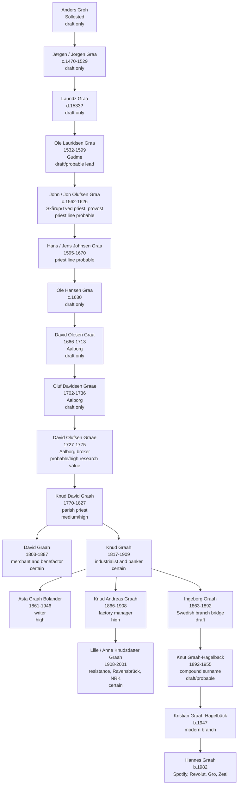

# Graae / Graa / Graah Family History: Authoritative Combined Report

**A consolidated Markdown report combining the uploaded genealogy, story, and research dossiers**  
**Prepared:** 2026-07-05  
**Scope:** From the earliest known and claimed Graa/Gro/Graah traditions through the documented Svendborg, Aalborg, Norwegian, Swedish, and contemporary digital-finance branches.

---

## Executive Summary

The history of the Graae / Graa / Graah family is best understood not as a single uninterrupted line of medieval certainty, but as a layered historical tradition. At the deepest layer are noble-name traditions, old coats of arms, the remembered loss of status, and possible links to the estate world of Søllestedgård on Lolland. At the firmer documentary layer are early modern clerical and merchant families in Svendborg, Skårup, Aalborg, and later Thisted. From the nineteenth century onward, the evidence becomes much stronger: the family emerges clearly through Knud David Graah, his children David and Knud in Christiania, the industrial world of Akerselva, the philanthropic and banking institutions of nineteenth-century Norway, and the cultural and wartime history of twentieth-century Scandinavia. In the modern era, the name continues through the Swedish Graah-Hagelbäck branch and, in a striking historical echo, through digital infrastructure and self-custodial finance.

The recurring pattern is **adaptation through infrastructure**. In one period the family’s power is remembered through estates, clerical offices, signets, and coats of arms. In the next, it appears through parish authority and merchant ledgers. Later it appears through ships, brokers, waterfalls, waterwheels, gas lighting, cotton spindles, banks, resistance networks, radio broadcasting, professional specialization, cybersecurity, architecture, and finally crypto wallets and open finance.

A source-critical approach is essential. The uploaded reports contain two different tones. One narrative report treats the Søllestedgård / Brahe story as a plausible historical anchor for family memory. The source-critical report is more cautious and states that the classic family histories do **not** corroborate the family anecdote of a king expelling the family from a western-Danish castle later taken by the Brahes. The combined conclusion here is therefore:

> There was a real old noble Graa/Grå estate context around Søllestedgård on Lolland, and the estate did pass from a Graa-associated phase to the Crown and later to Jørgen Brahe. However, a direct biological descent from that noble estate family into the later Svendborg / Aalborg / Norwegian Graah line is **not proven** in the reviewed material. The story should be preserved as a powerful family legend and possible surname-branch memory, not stated as settled direct-line fact.

The best-supported direct-line backbone, using the most conservative standard, begins with the **documented Svendborg merchant line of Jørgen Pedersen Graae and Katrine Knudsdatter** in the late seventeenth / early eighteenth century. The internal *Anlängd* draft, however, presents a longer descending line from Anders Groh and Jørgen Graa in Söllested through clergy and Aalborg merchants to Knud David Graah. That longer line is valuable as a research scaffold but should be marked as not yet proof-standard for the earliest generations.

By the nineteenth century, the family record becomes strong. **Knud Graah (1817–1909)** is the central historical figure: born in Thisted, moved to Christiania in 1833, imported British textile technology after studying Lancashire and Manchester, acquired water rights at Nedre Vøyen in 1844, opened Vøiens Bomuldsspinderie in 1846, survived the catastrophic 1859 factory fire, rebuilt immediately in 1860, expanded to 12,000 spindles by 1889, and later helped steer Christiania Bank og Kreditkasse safely through the Kristiania crash of 1899. His brother **David Graah (1803–1887)** anchors a civic-philanthropic story, especially through his role in founding Norway’s first animal-protection society and charitable funds for women and kindergartens. His granddaughter **Lille Graah (1908–2001)** anchors the twentieth-century moral story: resistance work, arrest, Grini, Ravensbrück, rescue by the White Buses, and then decades as one of the most recognizable voices of NRK.

Two historically important surname-branch figures should be included but labelled carefully: **Wilhelm August Graah (1793–1863)**, the Arctic explorer who led the East Greenland expedition of 1828–1831, and **Jutta Graae**, whose wartime alias *Storhertuginden* — “the Grand Duchess” — belongs in the history of Danish resistance intelligence. Both stories are certain as historical events, but their direct lineal tie to the Svendborg / Knud Graah line remains unproved in the reviewed material.

The Swedish branch begins with the late nineteenth-century link through **Ingeborg Graah (1863–1892)** and **Gustaf Hagelbäck**, whose son **Knut Graah-Hagelbäck (1892–1955)** preserved the Graah name through hyphenation. This branch later produced military, architectural, psychological, cybersecurity, and professional descendants in Skåne and Stockholm. The branch also preserves a revealing modern anxiety about nobility: the 2012 family correspondence notes that a critic might argue *adelskap* follows only the male line and would therefore be broken at the relevant generational bridge. This is important historically because it shows how the family continued to negotiate memory, prestige, and proof.

The contemporary conclusion is not that the family’s importance rests on proving an ancient coat of arms. The stronger conclusion is that the family’s prestige comes from a repeated capacity to recognize the dominant infrastructure of a period and move toward it: church administration, merchant brokering, industrial machinery, banking, media, professional knowledge, and now digital self-custody.

---

## Evidence Method and Reliability Labels

This report combines five uploaded sources:

1. **Graah Family History: Exciting Stories** — a narrative and sociopolitical account emphasizing dramatic episodes, including Søllestedgård, W.A. Graah, Knud Graah, Lille Graah, Swedish divergence, and Hannes Graah.
2. **Graae Graa Graah Family Stories for a Family History Page** — a source-critical dossier that distinguishes strongly verified stories from legend or unresolved leads.
3. **Graah Family Research and Genealogy** — a broad genealogical and sociopolitical synthesis using the internal *Anlängd* lineage and public references.
4. **Graah Family Genealogical and Historical Report** — a source-critical genealogical report treating the *Anlängd* as a draft, extracting a public-only tree, and identifying archival next steps.
5. **The PDF version of the family stories report** — especially useful for the timeline and reliability table visible on pages 2 and 9.

I use the following reliability labels throughout:

| Label | Meaning in this report |
|---|---|
| **Certain** | Strongly supported by modern reference works, public biographical sources, or multiple consistent reports. |
| **High confidence** | Very likely, with strong secondary-source support, though still worth confirming in primary records. |
| **Probable** | Preserved in serious family-history or local-history sources but not fully rechecked in original records here. |
| **Uncertain** | A named lead or tradition exists, but the reviewed sources explicitly stop short of proof. |
| **Legend / family tradition** | Historically meaningful and worth preserving, but not currently supported as fact. |
| **Surname branch / unproven direct link** | The person definitely existed and the event is real, but direct descent or close kinship to the main line has not been shown. |

The core principle is: **tell the exciting story, but label the evidence honestly**. That makes the report stronger, not weaker.

---

## Name Forms and Geographic Frame

The family appears under several spellings:

- **Groh**
- **Graa**
- **Grå**
- **Graae**
- **Graah**
- **Graah-Hagelbäck**

This variation is normal in Scandinavian records. Before spelling standardization, parish registers, probate records, clerical lists, and printed genealogies often varied the same surname across generations or even across documents about the same person. The shift from **Graa / Graae** to **Graah** should not automatically be read as a separate family. It should, however, be carefully tracked in archival work.

The major places in the family tradition and record are:

| Place | Role in the history |
|---|---|
| **Søllested / Søllestedgård, Lolland** | Noble-name and estate tradition; real Graa/Grå estate context, but direct descent to later line unproven. |
| **Gudme, Højrup, Skårup, Tved, Svendborg / Funen** | Clerical and merchant geography; Skårup priest line and Svendborg merchant line. |
| **Ystad and Scania** | Unresolved family tradition around a possible burgomaster Niels Graae; later Swedish connection. |
| **Gråmanstorp** | Attractive but rejected surname-place myth; the 1914 family book rejects derivation from Graa. |
| **Aalborg** | Merchant and broker phase, especially David Olufsen Graae. |
| **Thisted / Hassing / Slots Bjergby / Sludstrup** | Danish bridge into the nineteenth-century Norwegian line through Knud David Graah and his children. |
| **Christiania / Kristiania / Oslo** | The major nineteenth- and twentieth-century Norwegian center: David, Knud, Vøien, Kreditkassen, Lille Graah. |
| **Akerselva / Nedre Vøyen / Sagveien 21** | Industrial geography of Knud Graah’s textile empire. |
| **Malmö / Helsingborg / Stockholm / Lund / Karlskrona** | Swedish Graah-Hagelbäck branch and later modern descendants. |
| **Greenland** | W.A. Graah’s East Greenland expedition. |
| **Copenhagen / Stockholm / London** | Jutta Graae’s Danish resistance intelligence world. |
| **London and global digital finance** | Hannes Graah’s contemporary fintech / crypto context. |

---

## High-Level Lineage Overview

The following is the broadest combined lineage narrative. It includes the internal *Anlängd* line, but marks the earliest section as lower confidence.

### Claimed / Draft Early Line: Söllested to Aalborg

| Generation | Person | Dates / place as given in reports | Role | Evidence status |
|---:|---|---|---|---|
| 1 | **Anders Groh** | Söllested; dates unknown | Earliest named root in the internal draft | Draft only / low confidence |
| 2 | **Jørgen / Jörgen Graa** | c. 1470 Söllested; d. 1529 | Early patriarch; possible military or noble-name connections | Draft only / low confidence; possible confusion with noble Graa figures |
| 3 | **Lauridz Graa** | d. c. 1533? | Transitional figure | Draft only / low confidence |
| 4 | **Ole Lauridsen Graa** | 1532–1599; Gudme | Shift toward Funen / clerical geography | Draft only to probable, depending on clerical source confirmation |
| 5 | **John / Jon Olufsen Graa** | c. 1562–1626; Højrup / Skårup / Tved | Parish priest; expectancy to Skårup and Tved in 1591; later provost in 1622 | Probable for priest line; direct ancestry uncertain |
| 6 | **Hans / Jens Johnsen Graa** | 1595–1670 | Succeeded father as priest | Probable for priest line; direct ancestry uncertain |
| 7 | **Ole Hansen Graa** | c. 1630 | Transitional figure toward Jutland | Draft only / low confidence |
| 8 | **David Olesen Graa** | 1666–1713; Aalborg | Beginning of Aalborg mercantile phase | Draft only in this pass |
| 9 | **Oluf Davidsen Graae** | 1702–1736; Aalborg | Aalborg bourgeoisie | Draft only in this pass |
| 10 | **David Olufsen Graae** | 1727–1775; Aalborg | Merchant apprentice, later licensed broker; married three times | Probable / high research value |
| 11 | **Knud David Graah** | 1770–1827; Aalborg / Slots Bjergby | Parish priest; father of David and Knud Graah | Medium to high; aligns with public biography of Knud Graah |

### Stronger Documented Nineteenth- and Twentieth-Century Line

| Person | Dates | Role | Evidence status |
|---|---:|---|---|
| **Knud David Graah** | 1770–1827 | Parish priest in Denmark; married Johanne Günther; father of the Norwegian Graah generation | Medium to high |
| **Johanne Günther** | 1780–1849 | Wife of Knud David Graah | Medium; listed in public biographies |
| **David Graah** | 1803–1887 | Danish-born merchant and benefactor in Christiania; founder/initiator of Norway’s first animal-protection society | Certain for main biographical facts |
| **Charlotte Elisabeth Graah** | 1813–1889 | Married wholesaler Niels Olafsen Young; important capital connection | Probable / high within family reports |
| **Caroline Marie Graah** | 1814–1879 | Married Jacob Henrik Lundt, then officer Christian Wilhelm Bergh | Probable / high within family reports |
| **Knud Graah** | 1817–1909 | Industrialist; founder of Vøiens Bomuldsspinderie; banker; civic figure | Certain |
| **Asta Graah Bolander** | 1861–1946 | Daughter of Knud; writer | High |
| **Knud Andreas Graah** | 1866–1908 | Son of Knud; factory manager / disponent; father of Lille Graah | High |
| **Lille / Anne Knudsdatter Graah** | 1908–2001 | Resistance worker, Ravensbrück survivor, NRK broadcaster, St. Hallvard Medal recipient | Certain |
| **Ingeborg Graah** | 1863–1892 | Link into Swedish Graah-Hagelbäck branch through marriage to Gustaf Hagelbäck | Draft / internally coherent; requires primary confirmation |
| **Knut Graah-Hagelbäck** | 1892–1955 | Swedish compound-surname founder; preserved Graah name in Swedish branch | Draft / internally coherent |
| **Björn Graah-Hagelbäck** | 1921–1982 | Military captain and Swedish defense-committee figure | Probable / public references in reports |
| **Kristian Graah-Hagelbäck** | b. 1947 | Modern Swedish branch; sender of 2012 lineage note | Draft / family-document supported |
| **Hannes Graah** | b. 1982 | Spotify, Revolut, Gro, Zeal; contemporary digital-finance branch | Publicly documented and personally relevant |

---

## The Earliest Layer: Noble Name, Lost Signet, and Søllestedgård

### What the Family Remembers

The oldest and most emotionally charged layer of the family story concerns nobility. Several reports mention a persistent tradition that the family descended from ancient nobility, that a family signet or coat of arms once existed, and that some noble status or estate position was lost. The source-critical report emphasizes that Barfod’s 1882 genealogy recorded a living family tradition of noble descent and a signet bearing family arms that had reportedly been lost in a fire. Barfod’s judgment was cautious: noble descent was not likely unless real proof appeared.

This is one of the strongest family-history stories precisely because it is not neat. It captures a real tension between memory and proof. Families often preserve accurate emotional memories — loss, displacement, prestige, humiliation, a vanished seal — while compressing or distorting the legal and genealogical details. The lost signet should therefore be treated as a genuine family tradition and a research lead, not as proof of nobility by itself.

**Reliability:** The tradition itself is probable. The noble descent is legend or unproven.

### The Real Søllestedgård / Graa / Brahe Historical Frame

A narrative report connects the family legend to the estate of **Søllestedgård** on Lolland. It corrects the “western Denmark” element of the family folklore: the relevant estate, if this is the right historical analogue, was not in western Denmark but on the island of **Lolland**. During the fifteenth and early sixteenth centuries, a noble family named **Graa / Grå** held Søllestedgård. The report identifies **Anders Graa** as lord of the estate from 1462 to 1490, followed by his widow **Gertrud Mogensdatter Munk** until 1506, and then by their son **Jørgen Graa**, who served as **landsdommer** — provincial judge — of Lolland.

The crucial historical episode is **1530**, when Jørgen Graa is said to have surrendered Søllestedgård to the Danish Crown. The Crown then held the estate for about twenty years. In **1550**, King Christian III sold it to **Jørgen Brahe**, a major Danish nobleman and uncle of Tycho Brahe. The family memory of being “chased out by the king” and replaced by the Brahes may therefore be a compressed version of a real estate transfer: Graa to Crown, Crown to Brahe, with the intervening twenty years erased by oral memory.

The problem is not whether a Graa/Brahe/Søllestedgård sequence existed. The problem is whether **this later Graah family** descends directly from that noble Graa estate family. The source-critical report states that the standard printed family histories did not corroborate the royal-expulsion / Brahe-castle story as part of the proven Svendborg family line. Therefore the responsible wording is:

> A real noble Graa / Søllestedgård / Brahe episode exists in the wider surname and estate tradition, and it may explain the emotional shape of the family legend. But a direct descent from the Søllestedgård noble line into the later Svendborg / Aalborg / Norwegian Graah family remains unproven in the reviewed material.

**Reliability:** Real estate history: probable to high for the external surname branch. Direct ancestry: unproven. “Chased out by king” narrative: legend with a plausible historical analogue.

### Why the Nobility Question Matters

The nobility issue resurfaces centuries later in the Swedish branch. A 2012 internal correspondence from Kristian Graah-Hagelbäck to Hannes explicitly worries that someone might claim nobility follows only the male line and would be broken with Knud Graah. Whether or not any legal noble claim was valid, the correspondence proves that the family still carried an active internal consciousness of noble descent, prestige, and vulnerability to genealogical critique.

The nobility question should therefore not be erased. It should be framed as a central historical theme:

- The family remembered or believed in noble origins.
- There were old Graa/Graae noble arms in Denmark, but these lines are generally treated as extinct in the male line.
- The later Svendborg / Aalborg family cannot currently be legally or genealogically attached to those noble houses with proof-standard evidence.
- The emotional memory of lost status influenced later family identity.
- The Swedish Graah-Hagelbäck name strategy may be read partly as a preservation of that prestige.

---

## The Svendborg and Skårup Layer: Priests, Near-Misses, and the Documented Merchant Root

### The Skårup Priest Dynasty

One of the most attractive possible origins for the later Svendborg family is the **Skårup and Tved priest dynasty**. The reports describe **John / Jon Olufsen Graa** receiving expectancy to the parishes of Skårup and Tved in **1591** and becoming provost in **1622**. His son **Hans / Jens Johnsen Graa** succeeded him, keeping the clerical role in the family until **1670**.

The importance of a parish priest in post-Reformation Denmark should not be underestimated. A priest was not merely a religious figure. He was part of the state’s local administrative nervous system: keeping records, managing church lands, overseeing aspects of local welfare, and participating in the moral and bureaucratic life of the parish. A provost had even greater authority. A family holding such offices over multiple generations gained education, local standing, and access to networks that could later support mercantile ascent.

The source-critical report, however, emphasizes that Barfod did not accept the Skårup priests as proven ancestors of the Svendborg merchants. His reason was genealogical: if the merchant line descended directly from the priest line, one would expect stronger continuity in male given names. Because that pattern was not convincing to him, he treated the Skårup origin as unlikely or at least unproven.

**Reliability:** The priest dynasty itself is probable. Its direct ancestry to the Svendborg merchant line is uncertain.

### The Ystad Burgomaster Tradition

The 1914 family book preserves another tradition: that the family may have come from Sweden / Scania and that an ancestor was a **Borgmester Niels Graae**. A specific candidate is named: **Niels Lauritzen / Larsen Graae of Ystad**, who died in **1664**. The family historian pursued the clue but stopped short of proof.

This is a model of how to preserve an unresolved lead. It is too specific to ignore, but too weak to state as fact. It belongs in the report as a **named unresolved Swedish / Scanian lead**.

**Reliability:** Uncertain.

### The Gråmanstorp Myth

A particularly useful corrective concerns **Gråmanstorp** in Scania. Older writers apparently tried to connect the place-name to the noble Graa family. The 1914 family book rejects that explanation and says the place-name derives from the older personal name **Grimme / Gryme**, not Graa.

This is valuable because it shows the family history being cleaned of attractive but unsupported claims. Including debunked traditions increases the credibility of the whole report.

**Reliability:** The debunking is probable. The Graa-founder claim is legend.

### The Documented Svendborg Merchant Root

The source-critical report states that the safest classic root of the “Svendborg family Graae” is **merchant Jørgen Pedersen Graae** and his wife **Katrine Knudsdatter**, living in Svendborg in the late seventeenth / early eighteenth century. Barfod’s 1882 genealogy used church books and probate material and concluded that the flourishing Svendborg family descended from this merchant household. He also inferred that, after collateral lines were sorted out, there was only one surviving male Graae line.

This is the cleanest pivot in the whole early history:

> The proof-standard family page should begin not with a knight, but with a merchant household in Svendborg.

That does not mean the older traditions are worthless. It means the narrative has two layers: the older noble and clerical traditions as memory and leads; the Svendborg merchant household as the documented root.

**Reliability:** Probable to high.

### A Maritime Tragedy: Ole Bondo Lost off the English Coast

The Svendborg branch includes a concise but vivid maritime story. **Gommine Kristine Graae** married skipper **Ole Bondo** on **8 March 1836**. The following year, on **11 March 1837**, he was recorded as having been **“forulykket ved den engelske kyst”** — lost off the English coast.

This single line opens a whole world: the maritime economy of Danish towns, the risk of coastal shipping, young widowhood, and the sudden way the sea could reshape a family branch. It should be included as a short vignette rather than over-expanded beyond the source.

**Reliability:** Probable.

---

## Aalborg: From Clergy to Commerce

By the late seventeenth and eighteenth centuries, the family’s center of gravity moved northward toward **Aalborg**, a significant port and commercial city in Jutland. This shift matters because it marks a transition from rural clerical authority to urban commercial capital.

### David Olesen Graa and Oluf Davidsen Graae

The internal *Anlängd* and narrative reports list:

- **David Olesen Graa** — born 29 January 1666, died 9 August 1713 in Aalborg.
- **Oluf Davidsen Graae** — born 17 January 1702 in Aalborg, died 12 March 1736 in Aalborg.

These figures are part of the draft-backed Aalborg sequence. They should be retained in the lineage but marked as needing record-level confirmation.

**Reliability:** Draft-backed in this pass; low to medium until primary records are checked.

### David Olufsen Graae: Broker, Widower, and Bourgeois Survivor

**David Olufsen Graae (1727–1775)** is the clearest figure in the Aalborg mercantile phase. The reports say he was baptized in Budolfi Church in Aalborg in 1727, entered commerce as a merchant’s apprentice (*købmandskarl*), and by **1767** had secured a royal license to work as a broker (*bevilling som mægler*). That placed him in the middle of Aalborg’s maritime and terrestrial trade.

His personal life illustrates the harsh demographic reality of the eighteenth century. He married three times:

1. **Margrethe Smith**, married 1755, with children including Christen and Else, both dying in infancy; Margrethe died in 1760.
2. **Karen Erichsdatter Lundøe**, married 1761; she died in 1762.
3. **Inger Christensdatter Stausgaard**, married 1763; she survived him by decades and became the mother of the generation that carried the family toward the nineteenth century.

The repeated infant deaths and early deaths of spouses are not incidental. They are part of the family’s lived history: social ascent under conditions of constant mortality.

From the third marriage emerged **Knud David Graah (1770–1827)**, the crucial bridge to the Norwegian branch.

**Reliability:** Probable to high, but exact details should be verified in Aalborg parish and probate records.

---

## Knud David Graah and the Danish-to-Norwegian Pivot

**Knud David Graah (1770–1827)** is the bridge between the Aalborg merchant world and the Norwegian industrial story. The internal draft gives him as born **11 August 1770** in Aalborg and dying in **1827** in Slots Bjergby. Public biographical references to industrialist Knud Graah identify his father as **Sogneprest Knud David Graah (1770–1827)** and his mother as **Johanne Günther**.

Knud David returned the family to an ecclesiastical role: parish priest in **Slots Bjergby and Sludstrup**. He married **Johanne Günther (1780–1849)** in 1800. Their children became the agents of the great nineteenth-century move.

The macrohistorical context is important. After the **Treaty of Kiel in 1814**, Denmark and Norway were separated. Norway entered a new political relationship with Sweden and developed a stronger independent national identity, bureaucracy, and capital economy. Christiania became a growing but capital-hungry city. The Graah siblings entered exactly this environment.

Key children and connections include:

- **David Graah (1803–1887)** — moved to Christiania in 1826; merchant and benefactor.
- **Knud Graah (1817–1909)** — moved to Christiania in 1833; industrial founder.
- **Charlotte Elisabeth Graah (1813–1889)** — married wholesaler **Niels Olafsen Young**, linking the family to capital used in the industrial venture.
- **Caroline Marie Graah (1814–1879)** — married first **Jacob Henrik Lundt** and later officer **Christian Wilhelm Bergh**, connecting the family to military and civic elites.

This sibling generation is one of the most important turning points in the whole family history.

**Reliability:** Medium to high for Knud David; high for David and Knud’s Norwegian roles.

---

## Wilhelm August Graah: Into the Ice of East Greenland

**Wilhelm August Graah (1793–1863)** is one of the most dramatic figures carrying the surname. His direct lineal connection to the main Svendborg / Aalborg / Knud Graah line is not established in the reviewed material, so he should be labelled as a **prominent surname-branch figure** unless further genealogy proves otherwise.

Born in Copenhagen to Supreme Court judge **Peder Hersleb Graah**, W.A. Graah became a Royal Danish naval officer and Arctic explorer. In the 1820s, Denmark was still haunted by the mystery of the lost Norse settlements in Greenland. It was widely believed that descendants of medieval Norse settlers might have survived on the unmapped, ice-bound eastern coast. After earlier mapping work around Iceland and Greenland’s west coast, Graah was chosen by **Frederik VI** to lead the **1828–1831 East Greenland expedition**.

Graah’s great practical insight was that European ships would not survive the East Greenland pack ice. Instead of relying on heavy naval craft, he used indigenous Greenlandic technology: **umiaks**, or skin boats, crewed substantially by local Greenlandic guides and accompanied by botanist **Jens Vahl**. This was not merely romantic exploration; it was adaptation to Arctic conditions through local technology.

The expedition was brutal. The reports describe three years of ice, weather, illness, hunger, and winter hardship. During the winter of **1829–1830**, Graah and his party wintered at **Nukarfik** around 63°22′ N. The expedition did not find the lost Norsemen. In fact, Graah concluded that the old “Eastern Settlement” had not been on Greenland’s east coast at all. This conclusion mattered: it forced Danish colonial thinking about Greenland to change.

Graah nevertheless achieved major geographic results, mapping large sections of East Greenland and reaching approximately **65°18′ N**, where he claimed territory as **King Frederick VI’s Coast**. His **1832 expedition narrative** became an important Arctic text.

This story belongs in the combined family report because it captures a recurring family theme: when geography, technology, and state ambition meet, a Graah figure appears at the frontier.

**Reliability:** Certain for the expedition. Direct family-line connection unproven.

---

## David Graah: Merchant, Benefactor, and Animal Welfare Pioneer

**David Graah (1803–1887)**, brother of industrialist Knud Graah, broadens the family story beyond industry. Born in Denmark and settled in Christiania from **1826**, he became a businessman and benefactor. The source-critical reports identify him as the initiator of **Norway’s first animal-protection society** in **1859**, originally *Foreningen mot mishandling af dyr*. He also established charitable funds for needy women and for kindergartens.

This is an important civic story. It shows that the Norwegian Graahs were not only builders of mills and banks. They participated in the moral modernization of urban society: animal welfare, women’s assistance, and early-childhood institutions.

David also served as a beachhead for the family’s Norwegian migration. His earlier move to Christiania helped create the conditions for younger brother Knud’s later success.

**Reliability:** Certain for the main public facts.

---

## Knud Graah: The Akerselva Textile Revolution

### Early Life and Move to Christiania

**Knud Graah** was born in **Thisted, Denmark, on 13 June 1817**, son of **Knud David Graah** and **Johanne Günther**. He moved to **Christiania** in **1833**, at only sixteen years old, joining the world already opened by his older brother David. He first worked as a merchant clerk, but his ambitions quickly moved beyond ordinary trade.

By the early 1840s, Norway was importing large quantities of finished cotton yarn and textiles, especially from Britain. This created a classic industrial opportunity: replace imports with domestic production by importing machinery and expertise.

### Manchester, Lancashire, and Technological Arbitrage

Britain had long protected its textile machinery, but the early 1840s opened a window. The reports describe Knud Graah traveling to **Lancashire and Manchester**, studying British textile production, and returning to Britain in **1845** to acquire machinery and skilled labor.

One of the most colorful anecdotes has Graah encountering **Adam Hiorth** in Manchester — possibly in a pub — and discovering that both men were there to learn how to bring British textile technology back to Christiania. Rather than destroying each other through rivalry, they effectively divided the opportunity: Hiorth became associated with **Nydalens Compagnie**, while Graah pursued the Vøien / Akerselva site.

Whether every detail of the “pub meeting” is source-perfect or partly family-color, the underlying industrial story is certain: Graah and his contemporaries imported British machinery and knowledge into Norway and helped ignite modern textile production.

### Water Rights and the Founding of Vøiens Bomuldsspinderie

In **1844**, Graah and his brother-in-law **Niels Olafsen Young** acquired waterfall rights at **Nedre Vøyen** along the **Akerselva**. Waterpower was the essential energy source of the factory. In **1846**, **Vøiens Bomuldsspinderie** began operating.

The reports give vivid technical details:

- The first factory was a two-story brick building.
- It was powered by a large iron overshot waterwheel, manufactured locally by **Akers mekaniske Verksted**.
- It began with approximately **2,372 spindles**.
- It employed roughly **70–80 workers** at opening.
- It had an early dedicated gasworks plant, described as the first of its kind in Christiania, allowing artificial lighting and longer working days.
- It initially relied on imported British technical expertise, including a manager named **Morris**.

Graah’s success was supported by protectionist economic policy: imported yarn was taxed while raw cotton could be brought in more favorably. This gave domestic spinning a strong advantage.

By **1854**, Graah bought out Young for **30,000 speciedaler** and became sole owner.

### Labor, Housing, and Early Industrial Society

The reports note that Graah built worker housing around the factory, housing perhaps about half his workforce. This is an important social detail. The factory was not just a production site; it created an industrial community. The Akerselva became not merely a river but a new urban-industrial organism.

### The 1859 Fire and the 1860 Rebuild

The most cinematic moment in Knud Graah’s life came in **1859**, when the factory burned down. One report describes it as a Christmas Eve disaster; the source-critical PDF gives the more precise local-history date as around **23:00 on Tuesday 20 December 1859**, while NBL summarizes it as Christmas 1859. The exact date difference should be noted, but the event itself is certain.

The fire could have ended the enterprise. Instead, it became an opportunity. The factory and inventory were insured. Graah used the payout to rebuild immediately. Architect **Oluf N. Roll** designed a new four-story brick factory, completed in **1860**.

This episode shows the dual character of Knud Graah: cautious in finance, bold in execution. He insured properly, then rebuilt bigger.

### Expansion, Spindles, Weaving, and Turbines

The operational growth is striking:

| Year | Industrial capacity / event |
|---:|---|
| **1846** | Vøiens Bomuldsspinderie opens with about **2,372 spindles**. |
| **1854** | Graah buys out Niels O. Young and becomes sole owner. |
| **1856** | Capacity rises to about **5,544 spindles**. |
| **1859** | Factory burns. |
| **1860** | Four-story rebuilt factory opens, restoring and modernizing operations. |
| **1872** | Dedicated weaving mill added, with power looms. |
| **1889** | Capacity reaches about **12,000 spindles**; turbines replace older waterwheel technology. |
| **1906** | Business reorganized as **A/S Knud Graah & Co.** with major share capital. |
| **1925** | Spinning mill eventually closes. |
| **1955** | Weaving mill eventually closes. |

The physical legacy remains in the brick buildings at **Sagveien 21**, which stand as monuments to the family’s industrial chapter.

### Civic Power and the Kristiania Crash

Knud Graah was more than an industrialist. He served on the city council, railway boards, and other civic bodies. He managed **Christiania Dampkjøkken** from 1862 to 1874. In **1881**, he joined the board of **Christiania Bank og Kreditkasse**, later becoming chairman.

His cautious banking style became crucial during the **Kristiania crash of 1899**, when real-estate speculation collapsed and financial panic threatened institutions. The reports credit Graah’s conservatism as one reason Kreditkassen survived while others failed.

This is one of the family’s most important institutional stories. Knud Graah imported risk in the form of machinery and industry, but he managed financial risk with discipline.

### Death and Legacy

Knud Graah died in **1909** in Kristiania. He left behind a workforce of around **350 employees**, decorations including the **Order of St. Olav** and the Swedish **Order of Vasa**, and a family line that continued into literature, broadcasting, and Swedish professional life.

**Reliability:** Certain for main biographical and industrial facts.

---

## Asta Graah Bolander: Literature and the Cultural Branch

**Asta Graah Bolander (1861–1946)**, daughter of Knud Graah, is identified in the genealogical report as a Norwegian writer. The draft gives her birth as **4 February 1861 in Kristiania**, and public sources confirm her identity and lifespan. She married **Carl Gustaf Bolander** in 1889.

Asta’s presence matters because she shows another direction of elite family life after industrial consolidation: culture, literature, and public identity. She should be included in the family tree and in a cultural appendix, even if she is not as central to the “exciting stories” as Knud or Lille.

**Reliability:** High for identity and lifespan; exact dates should be confirmed in primary records.

---

## Lille Graah: Resistance, Ravensbrück, and the Voice of Norway

**Anne Knudsdatter “Lille” Graah (1908–2001)** is one of the strongest twentieth-century figures in the family story. She was born in Kristiania on **22 January 1908**, daughter of **Knud Andreas Graah (1866–1908)** and **Marie “Mammy” Blehr**, and granddaughter of industrialist Knud Graah.

### Resistance Work

During the German occupation of Norway in World War II, Lille Graah joined an illegal newspaper group. This was a dangerous form of resistance. Underground newspapers fought the occupation not with weapons but with information — countering censorship, spreading morale, and connecting networks.

In **1942**, she was arrested by the Gestapo. She was sent first to **Grini**, the notorious detention camp outside Oslo, and then deported to **Ravensbrück**, the major Nazi concentration camp for women.

### Ravensbrück and the White Buses

The reports describe her imprisonment in Ravensbrück from 1943 until rescue in 1945. She survived conditions of starvation, forced labor, disease, brutality, and constant danger. In the final phase of the war she was brought home through the Swedish Red Cross **White Buses** rescue action.

This is the emotional core of the twentieth-century family story: a woman born into the Christiania industrial elite chose resistance, endured a concentration camp, survived, and returned to serve public life.

### NRK and Ønskekonserten

After the war, Lille Graah joined **NRK** in **1945**. She became one of Norway’s recognizable radio voices, especially through **Ønskekonserten** — *The Request Concert*. She worked for over thirty years in broadcasting, later as a reporter and editorial secretary for **Østlandssendingen**.

This postwar career is not a footnote. It is part of the same story. After surviving the machinery of totalitarianism, she became a voice of national reconnection. Radio was postwar infrastructure: emotional, cultural, democratic.

### Humanitarian Work and Honors

The narrative report also credits her with founding the **Norsk-Tsjekkoslovakisk Hjelpeforening** in 1948 to assist refugees after the Czechoslovak coup. In **1977**, she received Oslo’s **St. Hallvard Medal**, the municipality’s highest civilian honor.

**Reliability:** Certain for main biographical, wartime, NRK, and St. Hallvard facts.

---

## Jutta Graae: “Storhertuginden” and Danish Resistance Intelligence

**Jutta Graae** belongs to the wider surname story. Her direct link to the main line is unproven in the reviewed material, but her historical importance is strong enough to include with a label.

During World War II, she became a key figure in Danish resistance intelligence. The reports say she handled money and microfilm, hosted underground meetings, fled to Sweden in **1943**, and later worked in London with the **SOE**. One of her codenames was **Storhertuginden** — “the Grand Duchess.” After the war, she worked in Danish intelligence, and the Stockholm archive associated with the wartime network is today at **Rigsarkivet**.

Jutta is an ideal companion story to Lille Graah. Lille represents Norwegian resistance, imprisonment, and broadcasting. Jutta represents Danish intelligence, clandestine logistics, Sweden, London, and archival afterlife.

**Reliability:** Certain for event and public biography. Direct lineal relationship to the main family unproven.

---

## The Swedish Graah-Hagelbäck Branch

### Ingeborg Graah and the Cognatic Bridge

The Swedish branch begins, in the reports, with **Ingeborg Graah (1863–1892)**, a female descendant of the Norwegian industrial branch, who married **Gustaf Hagelbäck**. Under strict patrilineal noble logic, children of this marriage would belong to the Hagelbäck male line. This is why the 2012 family note worries about *adelskap* following only the male line.

Their son, **Knut Graah-Hagelbäck**, born in Malmö in **1892**, preserved the Graah name through hyphenation. This naming choice is historically important. It suggests that the Graah name carried enough prestige to be deliberately retained.

**Reliability:** Internally coherent in the draft; primary Swedish records should be checked.

### Björn Graah-Hagelbäck and the Swedish Professional Class

The reports describe **Björn Graah-Hagelbäck (1921–1982)** as a military captain involved in Swedish defense planning, including a **1960 national defense committee**. This marks another transformation: from factory ownership to state administration, defense, and professional service.

The later Swedish branch includes figures in:

- military service,
- architecture,
- psychology,
- cybersecurity,
- information security,
- professional and administrative life.

Named examples in the reports include:

| Person | Field / role in reports | Note |
|---|---|---|
| **Björn Graah-Hagelbäck** | Military captain; defense planning | Public / historical branch figure |
| **Hans Graah-Hagelbäck** | COO / senior information security consultant; cybersecurity credentials | Public professional profile in reports |
| **Anna Graah-Hagelbäck** | Architect at MER Arkitekter | Public professional profile in reports |
| **Olof Graah-Hagelbäck** | Psychologist | Public / semi-public professional note in reports |
| **Richter branch** | Allied Stockholm / Enskede professional families | Family-draft branch |

For a public-facing version, detailed birth dates of living people should be handled carefully. The family archive can preserve them, but a published webpage should prioritize historical narrative and public professional identities over private data.

**Reliability:** Mixed. The branch is internally coherent; older deceased figures are easier to publish; living-person details should be confirmed and privacy-reviewed.

---

## Hannes Graah and the Digital Metamorphosis

The contemporary story returns to the family’s old pattern: identifying a new infrastructure before it becomes ordinary.

**Hannes Sebastian Graah**, born in Lund in **1982** according to the internal lineage, is presented as the son of **Kristian Graah-Hagelbäck**. Professionally, he uses **Hannes Graah**, dropping the compound suffix and returning to the older family name.

His career fits the family pattern in three phases:

1. **Spotify** — scaling global digital consumer infrastructure before and around the IPO era.
2. **Revolut** — growth leadership in mobile-first financial technology.
3. **Gro and Zeal** — decentralized finance, stablecoin yield, and self-custodial wallet infrastructure.

The strongest historical analogy is with Knud Graah. Knud went to Manchester to import the machinery of industrial capitalism into Norway. Hannes moved through Spotify, Revolut, Gro, and Zeal to build infrastructure for digital and self-custodial finance.

The contrast is equally interesting. Knud helped build centralized industrial and banking institutions. Hannes works on self-custody and Open Finance, aiming to reduce dependence on intermediaries. One built factories and banks; the other builds software, wallets, and payment rails. The underlying family theme, however, is similar: build the practical interface that lets a new economic system become usable in daily life.

Current public positioning of Zeal describes it as a self-custodial crypto wallet and Visa debit-card experience, combining user-controlled assets with everyday payments, savings yield, and card spending. Public fintech coverage identifies Zeal as founded by former Revolut VP Growth and Spotify executive Hannes Graah, and coverage from 2024–2025 frames the project as an attempt to make crypto useful for everyday transactions rather than only speculation.

**Reliability:** Publicly documented for professional trajectory and Zeal. Family-line connection rests on the internal draft and should be preserved in the private tree.

---

## Comprehensive Chronological Timeline

| Date / period | Event | People | Location | Evidence status |
|---|---|---|---|---|
| **1462–1490** | Anders Graa associated with Søllestedgård in the noble-name estate tradition | Anders Graa | Søllestedgård, Lolland | External surname-branch / estate tradition; direct ancestry unproven |
| **c. 1470–1529** | Internal *Anlängd* gives Jørgen Graa of Söllested as early patriarch | Jørgen Graa | Söllested | Draft only / low confidence |
| **1530** | Jørgen Graa of the estate tradition surrenders Søllestedgård to Crown | Jørgen Graa | Lolland | Real estate tradition; direct family link unproven |
| **1550** | Crown sells Søllestedgård to Jørgen Brahe | Jørgen Brahe | Lolland | Real estate tradition; direct family link unproven |
| **1591** | John Olufsen Graa gains expectancy to Skårup and Tved | John Olufsen Graa | Funen | Probable for priest line; ancestry uncertain |
| **1622** | John Olufsen Graa becomes provost | John Olufsen Graa | Skårup / Tved | Probable |
| **1670** | End of known Skårup father-son priest line | Hans / Jens Johnsen Graa | Funen | Probable |
| **late 1600s** | Documented Svendborg merchant line begins | Jørgen Pedersen Graae; Katrine Knudsdatter | Svendborg | Probable to high |
| **1666–1713** | Aalborg draft generation | David Olesen Graa | Aalborg | Draft-backed |
| **1702–1736** | Aalborg draft generation | Oluf Davidsen Graae | Aalborg | Draft-backed |
| **1727–1775** | Broker and merchant phase; multiple marriages and infant losses | David Olufsen Graae | Aalborg | Probable / high research value |
| **1767** | David Olufsen Graae receives broker license | David Olufsen Graae | Aalborg | Probable |
| **1770–1827** | Priest bridge to Norwegian branch | Knud David Graah | Aalborg / Slots Bjergby | Medium to high |
| **1803–1887** | Merchant and benefactor; animal welfare pioneer | David Graah | Christiania | Certain |
| **1813–1889** | Marriage into capital network | Charlotte Elisabeth Graah; Niels O. Young | Christiania | Probable / high |
| **1817–1909** | Central industrialist life | Knud Graah | Thisted / Christiania | Certain |
| **1826** | David Graah settles in Christiania | David Graah | Christiania | Certain |
| **1828–1831** | East Greenland expedition | W.A. Graah | East Greenland | Certain event; lineal tie unproven |
| **1833** | Knud Graah moves to Christiania | Knud Graah | Christiania | Certain |
| **1836–1837** | Marriage and shipwreck off English coast | Gommine Kristine Graae; Ole Bondo | Svendborg / English coast | Probable |
| **1844** | Water rights acquired at Nedre Vøyen | Knud Graah; Niels O. Young | Akerselva | Certain |
| **1845** | Return to Britain for machinery and skilled labor | Knud Graah | Manchester / Lancashire | Certain core; colorful meeting anecdote probable/uncertain |
| **1846** | Vøiens Bomuldsspinderie begins operation | Knud Graah | Christiania | Certain |
| **1854** | Graah buys out Young | Knud Graah; Niels O. Young | Christiania | High |
| **1859** | David initiates Norway’s first animal-protection society | David Graah | Christiania | Certain |
| **1859 / 20 Dec** | Vøien factory fire | Knud Graah | Christiania | Certain; exact date phrasing varies |
| **1860** | Four-story factory rebuild completed | Knud Graah; Oluf N. Roll | Vøien | Certain |
| **1861–1946** | Writer branch | Asta Graah Bolander | Kristiania / Norway | High |
| **1863–1892** | Swedish branch bridge | Ingeborg Graah | Norway / Sweden | Draft / needs confirmation |
| **1872** | Weaving mill / vertical integration | Knud Graah | Christiania | High |
| **1881** | Joins Kreditkassen board | Knud Graah | Christiania | Certain |
| **1889** | Mill reaches about 12,000 spindles | Knud Graah | Christiania | High |
| **1892** | Knut Graah-Hagelbäck born in Malmö | Knut Graah-Hagelbäck | Malmö | Draft / needs Swedish record confirmation |
| **1899** | Kreditkassen survives Kristiania crash under cautious leadership | Knud Graah | Christiania | Certain |
| **1908–2001** | Lille Graah life | Anne Knudsdatter Graah | Oslo / Ravensbrück | Certain |
| **1942–1945** | Lille imprisoned, deported, rescued by White Buses | Lille Graah | Grini / Ravensbrück / Norway | Certain |
| **1940–1945** | Danish resistance intelligence | Jutta Graae | Copenhagen / Stockholm / London | Certain event; lineal tie unproven |
| **1945 onward** | Lille joins NRK; becomes national radio voice | Lille Graah | Norway | Certain |
| **1977** | Lille receives St. Hallvard Medal | Lille Graah | Oslo | Certain |
| **2020s** | Digital-finance / self-custodial wallet chapter | Hannes Graah; Zeal | London / global | Publicly documented; family link draft-backed |

---

## Mermaid Timeline

```mermaid
timeline
    title Graae / Graa / Graah Family Timeline
    1462-1490 : Anders Graa associated with Søllestedgård in noble-name tradition
    1530 : Søllestedgård surrendered to the Crown in the estate tradition
    1550 : Crown sells Søllestedgård to Jørgen Brahe
    1591 : John Olufsen Graa gains expectancy to Skårup and Tved
    1622 : John Olufsen Graa becomes provost
    1670 : Known Skårup priest father-son line ends
    late 1600s : Merchant Jørgen Pedersen Graae anchors documented Svendborg line
    1727-1775 : David Olufsen Graae, Aalborg broker and merchant
    1770-1827 : Knud David Graah, priest and bridge to Norwegian branch
    1826 : David Graah settles in Christiania
    1828-1831 : W.A. Graah leads East Greenland expedition
    1833 : Knud Graah moves to Christiania
    1836-1837 : Gommine Kristine Graae marries Ole Bondo; Bondo lost off English coast
    1844-1846 : Knud Graah acquires Akerselva water rights and opens Vøiens Bomuldsspinderie
    1859 : David Graah initiates Norway's first animal-protection society
    1859-1860 : Vøien factory burns and is rebuilt
    1881-1899 : Knud Graah leads Kreditkassen cautiously through crisis era
    1892 : Knut Graah-Hagelbäck born in Malmö, preserving the compound surname
    1942-1945 : Lille Graah imprisoned, deported to Ravensbrück, rescued by White Buses
    1943-1945 : Jutta Graae works in resistance intelligence from Sweden and London
    1977 : Lille Graah receives Oslo's St. Hallvard Medal
    2020s : Hannes Graah and Zeal continue the infrastructure theme in self-custodial finance
```



---

## Mermaid Family Backbone

This diagram is intentionally evidence-aware. Early generations are marked as draft / unproven; nineteenth-century Norwegian figures are much stronger.



---

## Story Dossier: The Most Important Family Episodes

### 1. The Lost Signet and Disputed Noble Descent

**Core story:** The family remembered noble descent and a heraldic signet, reportedly lost in a fire.  
**Why it matters:** It shows how identity and proof diverged.  
**Best use:** Opening legend / memory section.  
**Reliability:** Tradition probable; noble descent unproven.

### 2. Søllestedgård and the Brahe Takeover

**Core story:** A noble Graa family held Søllestedgård; the estate passed to the Crown in 1530 and to Jørgen Brahe in 1550. Family memory compressed this into expulsion by a king and Brahe takeover.  
**Why it matters:** It is the most dramatic old-estate story.  
**Best use:** “The legend and the historical analogue.”  
**Reliability:** Estate sequence plausible/high in wider surname history; direct descent unproven.

### 3. The Skårup Priest Dynasty

**Core story:** Graa priests served Skårup and Tved from 1591 to 1670; John Olufsen Graa became provost.  
**Why it matters:** It explains how authority may have shifted from noble landholding to clerical administration.  
**Best use:** Early modern authority section.  
**Reliability:** Priest line probable; direct ancestry uncertain.

### 4. The Ystad Burgomaster Lead

**Core story:** Family tradition points to a Scanian / Swedish origin and a burgomaster Niels Graae of Ystad.  
**Why it matters:** It preserves a specific unresolved clue.  
**Best use:** Research-leads appendix.  
**Reliability:** Uncertain.

### 5. Gråmanstorp Debunked

**Core story:** A Graa-origin explanation for Gråmanstorp is rejected; the name derives from Grimme / Gryme.  
**Why it matters:** Shows critical discipline.  
**Best use:** “What not to claim” section.  
**Reliability:** Debunking probable.

### 6. Jørgen Pedersen Graae: Merchant, Not Knight

**Core story:** The documented Svendborg family descends from merchant Jørgen Pedersen Graae and Katrine Knudsdatter.  
**Why it matters:** This is the proof-standard root.  
**Best use:** Main lineage backbone.  
**Reliability:** Probable to high.

### 7. Ole Bondo Lost off the English Coast

**Core story:** Gommine Kristine Graae’s husband, skipper Ole Bondo, was lost off the English coast in 1837.  
**Why it matters:** A compact maritime tragedy.  
**Best use:** Sidebar / vignette.  
**Reliability:** Probable.

### 8. David Olufsen Graae’s Three Marriages

**Core story:** The Aalborg broker married three times, lost wives and children, and still established the line that led to Knud David Graah.  
**Why it matters:** It humanizes the eighteenth-century bourgeois world.  
**Best use:** Aalborg chapter.  
**Reliability:** Probable / high research value.

### 9. W.A. Graah in East Greenland

**Core story:** W.A. Graah used skin boats and Greenlandic expertise to explore East Greenland, survived starvation and ice, and helped end the belief that the Norse Eastern Settlement was on the east coast.  
**Why it matters:** Arctic endurance and intellectual consequence.  
**Best use:** Surname-branch adventure chapter.  
**Reliability:** Certain event; lineal tie unproven.

### 10. David Graah and Animal Welfare

**Core story:** David Graah helped found Norway’s first animal-protection society and created charitable funds.  
**Why it matters:** Adds philanthropy and civic ethics to the family profile.  
**Best use:** Norwegian migration chapter.  
**Reliability:** Certain.

### 11. Knud Graah and the Manchester Technology Transfer

**Core story:** Knud Graah studied Lancashire / Manchester textile industry, imported machinery and skilled labor, and built Vøiens Bomuldsspinderie.  
**Why it matters:** This is the family’s central industrial epic.  
**Best use:** Main nineteenth-century chapter.  
**Reliability:** Certain core; pub-meeting detail more colorful/probable.

### 12. The 1859 Fire and 1860 Rebuild

**Core story:** Vøien burned in 1859; Graah used insurance and rebuilt larger by 1860.  
**Why it matters:** The best set-piece of resilience and ambition.  
**Best use:** Industrial chapter.  
**Reliability:** Certain.

### 13. Kreditkassen and the Kristiania Crash

**Core story:** Knud Graah’s conservative banking leadership helped Kreditkassen survive the 1899 crash.  
**Why it matters:** Shows institutional steadiness after industrial daring.  
**Best use:** Character portrait of Knud.  
**Reliability:** Certain.

### 14. Lille Graah: Ravensbrück to NRK

**Core story:** Lille Graah joined resistance work, survived Grini and Ravensbrück, returned with the White Buses, and became a beloved NRK voice.  
**Why it matters:** The strongest emotional twentieth-century family story.  
**Best use:** Dedicated chapter.  
**Reliability:** Certain.

### 15. Jutta Graae: Storhertuginden

**Core story:** Jutta Graae handled money, microfilm, intelligence, Sweden, London, and SOE connections under the codename “The Grand Duchess.”  
**Why it matters:** Danish resistance counterpart to Lille’s Norwegian story.  
**Best use:** Surname-branch wartime chapter.  
**Reliability:** Certain event; lineal tie unproven.

### 16. Graah-Hagelbäck and the Nobility Anxiety

**Core story:** Ingeborg Graah married Gustaf Hagelbäck; the compound surname preserved Graah, while the family worried about male-line nobility claims.  
**Why it matters:** Shows how memory, name, and proof continued into modernity.  
**Best use:** Swedish branch chapter.  
**Reliability:** Draft / internally coherent; needs primary Swedish confirmation.

### 17. Hannes Graah and Open Finance

**Core story:** Hannes Graah moves the family infrastructure theme into digital finance through Spotify, Revolut, Gro, and Zeal.  
**Why it matters:** Powerful modern mirror of Knud Graah’s industrial technology transfer.  
**Best use:** Contemporary conclusion.  
**Reliability:** Publicly documented for career and companies; family-line placement from internal lineage.

---

## Evidence Conflicts and How This Report Resolves Them

### Conflict 1: Was the family expelled from a castle by a Danish king?

**Narrative version:** A king forced the family from its estate, and the Brahes took over.  
**Source-critical version:** Standard printed family histories reviewed did not corroborate this anecdote.  
**Resolution:** Preserve as legend. Explain that Søllestedgård provides a plausible historical analogue: Graa → Crown in 1530, Crown → Brahe in 1550, but direct descent is unproven.

### Conflict 2: Does the line begin with medieval nobles or Svendborg merchants?

**Narrative / *Anlängd* version:** The line extends from Anders Groh / Jørgen Graa in Söllested.  
**Source-critical version:** The strongest documented root is Jørgen Pedersen Graae, merchant in Svendborg.  
**Resolution:** Use a two-layer model: “claimed / draft early line” and “documented merchant line.”

### Conflict 3: Is the Skårup priest line the direct origin?

**Attractive theory:** It fits geography and chronology.  
**Barfod’s caution:** Male-name continuity is not convincing.  
**Resolution:** Include the priest dynasty as probable and important, but direct ancestry uncertain.

### Conflict 4: Are W.A. Graah and Jutta Graae family members?

**Historical facts:** Their stories are strong and real.  
**Genealogical issue:** Direct biological link to the main line not established.  
**Resolution:** Include as prominent surname-branch / collateral candidates unless further proof appears.

### Conflict 5: Is the Swedish branch proof-standard?

**Draft:** Gives a coherent Graah-Hagelbäck branch.  
**Genealogical report:** Not yet externally traced person-by-person.  
**Resolution:** Include the branch, but mark as internally coherent pending Swedish primary confirmation.

---

## Archive Roadmap for a Proof-Standard Family History

The next stage is not more storytelling; it is record proof. The reports identify the relevant archival systems.

### Denmark

Target records:

- parish registers,
- censuses,
- probate records,
- muster rolls,
- property records,
- clerical appointment records,
- Aalborg merchant / broker records,
- Søllestedgård estate records if pursuing the noble-branch question.

Priority places:

- Søllested / Lolland,
- Gudme,
- Højrup,
- Skårup,
- Tved,
- Svendborg,
- Aalborg,
- Thisted,
- Hassing,
- Slots Bjergby,
- Sludstrup.

Priority tasks:

1. Prove **Knud David Graah (1770–1827)** in Danish church and clerical records.
2. Prove his marriage to **Johanne Günther**.
3. Confirm all children, especially David and Knud.
4. Work backward through **David Olufsen Graae**, **Oluf Davidsen Graae**, and **David Olesen Graa** in Aalborg records.
5. Separately investigate whether any primary record connects the Aalborg / Svendborg family to the Søllestedgård noble Graa line.

### Norway

Target records:

- Digitalarkivet censuses,
- parish registers,
- probate,
- court records,
- business records,
- city directories,
- industrial histories,
- bank records,
- NRK and war records for Lille Graah.

Priority people:

- David Graah,
- Knud Graah,
- Helene Marie Conradi,
- Asta Graah Bolander,
- Knud Andreas Graah,
- Marie Blehr,
- Lille Graah.

Priority tasks:

1. Prove Knud Graah’s move and marriage records.
2. Document Vøien factory ownership, insurance, and rebuild records.
3. Verify worker housing and labor data.
4. Document Kreditkassen role and 1899 crisis references.
5. Collect wartime records for Lille Graah: arrest, Grini, Ravensbrück, White Buses, NRK employment, St. Hallvard Medal.

### Sweden

Target records:

- Riksarkivet church archives,
- SCB births, marriages, deaths 1860–1949,
- censuses,
- probate records,
- Malmöhus / Kristianstad county registers,
- Stockholm registers,
- military and parliamentary records for Björn Graah-Hagelbäck.

Priority people:

- Ingeborg Graah,
- Gustaf Hagelbäck,
- Knut Graah-Hagelbäck,
- Björn Graah-Hagelbäck,
- Kristian Graah-Hagelbäck,
- later living descendants only with privacy controls.

Priority tasks:

1. Prove the marriage of Ingeborg Graah and Gustaf Hagelbäck.
2. Prove Knut Graah-Hagelbäck’s birth in Malmö in 1892.
3. Confirm the Graah-Hagelbäck descendants through Swedish church and civil records.
4. Treat nobility research separately from biological genealogy.

---

## Publishing Guidance for a Family History Page

A strong public page should not present every private date of living descendants. It should tell the story in layers:

1. **The Legend:** lost signet, noble memory, Søllestedgård / Brahe analogue.
2. **The Proof:** Svendborg merchant root and church / probate evidence.
3. **The Shift:** clergy to Aalborg commerce.
4. **The Leap:** Danish siblings into Christiania.
5. **The Titan:** Knud Graah and Akerselva industry.
6. **The Civic Soul:** David Graah’s philanthropy.
7. **The Crisis Test:** fire, rebuild, and banking crash.
8. **The Moral Century:** Lille Graah and Jutta Graae in resistance.
9. **The Name Preserved:** Graah-Hagelbäck and Swedish professional life.
10. **The Future:** Hannes Graah and self-custodial finance.

Use these labels visibly:

- **Proven direct line**
- **Probable direct line**
- **Unproven but plausible lead**
- **Surname branch**
- **Family legend**

This will make the page both exciting and credible.

---

## Final Interpretation

The Graah family history is not a simple aristocratic descent story. It is better than that. It is a story of repeated reinvention under changing conditions.

When land and noble privilege mattered, the family remembered estates, arms, and lost status. When clerical office became the local machinery of the post-Reformation state, Graa priests appear in Skårup and Tved. When commerce became the engine of urban power, the family appears in Svendborg and Aalborg merchant life. When Norway opened as a new industrial field, the Graah siblings moved to Christiania. When British textile machinery became available, Knud Graah crossed the North Sea and built one of Norway’s industrial foundations along the Akerselva. When fire destroyed the factory, he rebuilt larger. When financial speculation broke Kristiania in 1899, he survived by conservatism. When Europe fell into occupation and terror, Lille Graah and Jutta Graae resisted. When industrial capital gave way to professional and administrative capital, the Swedish branch entered military, architectural, psychological, and technological fields. When finance began moving into software and self-custody, Hannes Graah entered that frontier.

The unifying family trait is not merely status. It is **the instinct to move toward the infrastructure of the next age**.

The true family motto, distilled from the record, could be:

> From signet to spindle, from resistance paper to radio waves, from bank ledgers to self-custodial wallets: the family survives by learning the system of the age, then building inside it.

---

## Source Notes

### Uploaded reports synthesized

- *Graah Family History: Exciting Stories* — narrative account emphasizing Søllestedgård, W.A. Graah, Knud Graah, Lille Graah, Swedish divergence, and contemporary digital finance.
- *Graae Graa Graah Family Stories for a Family History Page* — source-critical story dossier, reliability table, and timeline.
- *Graah Family Research and Genealogy* — genealogical and sociopolitical synthesis using the internal *Anlängd* lineage.
- *Graah Family Genealogical and Historical Report* — source-critical genealogical report treating the *Anlängd* as a draft, with evidence matrix and archival roadmap.
- *Graae Graa Graah Family Stories for a Family History Page.pdf* — PDF version of the story dossier, including the visual comparison table on page 2 and timeline on page 9.

### Key external source categories cited within the uploaded reports

The uploaded reports cite or rely on:

- Imm. Barfod, **1882 _Stamtavle over den Svenborgske Familie Graae_**.
- **1914 _Graaeske Slægtebog_**.
- **Dansk Biografisk Leksikon / Lex** entries for W.A. Graah and Jutta Graae.
- **Store norske leksikon** entries for David Graah, Knud Graah, Asta Graah Bolander, and related Norwegian figures.
- **Norsk biografisk leksikon** entries for Knud Graah and Lille Graah.
- **lokalhistoriewiki.no** for Knud Graah, Vøiens Bomuldsspinderie, and local industrial context.
- **Rigsarkivet**, **Digitalarkivet**, and **Riksarkivet** as archival roadmaps for Denmark, Norway, and Sweden.
- Current public Zeal / fintech sources for Hannes Graah and Zeal’s contemporary self-custodial wallet / Visa debit-card positioning.


---

## Appendix A: Detailed Søllestedgård Context

The Søllestedgård material should be included because it explains one of the family’s most powerful legends, but it must be placed in a clearly marked evidence category. The estate history belongs to the **wider Graa / Grå noble-name tradition**. Its direct attachment to the later Svendborg / Aalborg / Norwegian Graah family is still unproven.

| Era | Owners / figures | Historical meaning for the family report | Evidence treatment |
|---|---|---|---|
| **1462–1490** | **Anders Graa** | Earliest named lord of Søllestedgård in the narrative report. | Wider noble-name history; not proven direct ancestor. |
| **1490–1506** | **Gertrud Mogensdatter Munk**, widow of Anders Graa | Shows estate continuity through a noblewoman, not only male succession. | Wider noble-name history. |
| **early 1500s–1530** | **Jørgen Graa**, associated with Søllestedgård and office of landsdommer on Lolland | Provides the closest historical analogue to the family’s “lost estate” memory. | Wider noble-name history; direct line unproven. |
| **1530–1550** | **Danish Crown** | The estate is said to have been surrendered to the Crown. This is the point that may have become “the king chased us out” in oral tradition. | Treat as historical analogue, not direct proof. |
| **1550 onward** | **Jørgen Brahe** and later Brahe/Oxe-linked ownership | Explains the Brahe portion of the family story: Graa estate memory followed by Brahe takeover. | Real estate succession in the wider story; direct descent unproven. |
| **Later centuries** | Gyldenstjerne, Rosenkrantz, Urne, Steensen, von Lützow, Crown, Knuth, Jørgensen and others in the narrative report | Demonstrates that Søllestedgård remained an important estate after the Graa phase. | Background context only. |

The most accurate public phrasing is:

> The family preserves a story of a lost estate and a Brahe takeover. A real historical analogue exists at Søllestedgård on Lolland, where a noble Graa family held the estate before it passed to the Crown and later to Jørgen Brahe. However, the reviewed material does not prove that the later Svendborg / Aalborg / Norwegian Graah family descends directly from that noble estate line.

---

## Appendix B: Noble Status, Heraldry, and the Male-Line Problem

The reports repeatedly return to *adelskap* — nobility — because it is both emotionally important and genealogically fragile.

### Terms

| Term | Meaning | Relevance |
|---|---|---|
| **Uradel** | Ancient nobility, generally predating formal patent-based ennoblement. | The noble Graa / Grå estate tradition is framed in these terms. |
| **Brevadel** | Letter nobility, ennobled through explicit royal patent. | Distinguishes later formal ennoblement from older noble families. |
| **Frälse** | Literally “free neck”; Scandinavian noble status originally tied to tax exemption and mounted military service. | Helps explain the old social meaning of nobility in Denmark and Sweden. |
| **Agnatic succession** | Male-line descent. | Central to the family’s anxiety that any noble claim would break when transmitted through a woman. |
| **Cognatic descent** | Descent through female as well as male lines. | The Swedish Graah-Hagelbäck branch preserves the name through Ingeborg Graah, but not a strict male line. |

### What the Reports Say

The genealogy report says the Danish nobility lexicon historically recorded several coats of arms belonging to families named Graae / Graa, but the recognized noble lines are treated as extinct in the male line. The same report states that the established “Svenborgske Familie Graae” cannot be definitively linked to those ancient noble houses.

The 2012 correspondence from Kristian Graah-Hagelbäck to Hannes is especially revealing because it shows the family itself was aware of the vulnerability:

> Someone could claim that nobility follows only the male line, in which case it would be broken with Knud Graah.

This is not proof of nobility. It is proof of a living family consciousness around nobility.

### Report Conclusion

The family should not build its public identity on a legal claim to nobility unless new primary evidence appears. The stronger and more defensible identity is:

- a family with old noble-name traditions,
- a remembered signet and heraldic consciousness,
- possible but unproven links to ancient Graa / Grå nobility,
- proven later achievement in clergy, commerce, industry, philanthropy, broadcasting, professional life, and digital finance.

---

## Appendix C: Detailed Early-Line Research Scaffold

This table combines the internal *Anlängd* and the broader genealogical reports. It is not a proof-standard pedigree. It is a working scaffold for archival research.

| Generation | Name | Dates | Place(s) | Reported role | Research priority |
|---:|---|---|---|---|---|
| 1 | **Anders Groh** | Unknown | Söllested | Foundational ancestor in draft | Find any original record or determine if this is a constructed root. |
| 2 | **Jørgen / Jörgen Graa** | c. 1470–1529 | Söllested | Early patriarch; possible military or noble associations | Separate from Jørgen Graa of Søllestedgård if necessary; verify identity. |
| 3 | **Lauridz Graa** | d. c. 1533? | Unknown | Transitional figure | Verify existence and parentage. |
| 4 | **Ole Lauridsen Graa** | 1532–1599 | Gudme | Moves family toward Gudme / Funen | Check parish and clerical references. |
| 5 | **John / Jon Olufsen Graa** | c. 1562–1626 | Højrup, Skårup, Tved | Priest; provost | Strong target: clerical appointment and visitats records. |
| 6 | **Hans / Jens Johnsen Graa** | 1595–1670 | Skårup / Tved | Priest, successor to father | Strong target: clerical records and burial. |
| 7 | **Ole Hansen Graa** | c. 1630 | Unknown / Jutland transition | Transitional | Needs proof of link from priest line to Aalborg. |
| 8 | **David Olesen Graa** | 1666–1713 | Aalborg | Merchant-era ancestor | Check Aalborg parish and probate. |
| 9 | **Oluf Davidsen Graae** | 1702–1736 | Aalborg | Aalborg bourgeoisie | Check baptism, marriage, probate. |
| 10 | **David Olufsen Graae** | 1727–1775 | Aalborg | Licensed broker; married three times | High-value Aalborg record search. |
| 11 | **Knud David Graah** | 1770–1827 | Aalborg, Slots Bjergby, Sludstrup | Parish priest; father of Norwegian generation | Bridge figure: prove fully. |

---

## Appendix D: Detailed Knud Graah Industrial Profile

| Category | Detail |
|---|---|
| Full name | **Knud Graah** |
| Born | **13 June 1817**, Thisted, Denmark |
| Died | **27 March 1909**, Kristiania |
| Parents | **Knud David Graah** and **Johanne Günther** |
| Move to Norway | **1833**, to Christiania |
| Early employment | Clerk at H. Gulbranson according to reports |
| Strategic insight | Norway imported finished cotton yarn and textiles; domestic production could substitute imports if British technology was acquired. |
| British study | Lancashire / Manchester, early 1840s; machinery and skilled labor secured in 1845. |
| Capital partner | **Niels Olafsen Young**, brother-in-law through Charlotte Elisabeth Graah. |
| Site | **Nedre Vøyen**, Akerselva, Christiania. |
| Water rights | Purchased in **1844**. |
| Factory opening | **1846**, Vøiens Bomuldsspinderie. |
| Initial workforce | About **70–80 workers**. |
| Initial machinery | About **2,372 spindles**. |
| Power source | Large overshot iron waterwheel, later hydraulic turbines. |
| Lighting | Early dedicated gasworks plant, described as first of its kind in Christiania. |
| Sole ownership | Bought out Young in **1854** for **30,000 speciedaler**. |
| Fire | **1859**, catastrophic factory fire. |
| Rebuild | **1860**, four-story brick building designed by **Oluf N. Roll**. |
| Expansion | **5,544 spindles** by 1856 / restored after rebuild; **12,000 spindles** by 1889. |
| Vertical integration | Cotton weaving, including dedicated weaving mill and power looms. |
| Civic roles | City council, poverty commission, railway boards, Christiania Dampkjøkken. |
| Banking | Board and later chair of **Christiania Bank og Kreditkasse**. |
| 1899 crash | Conservative leadership credited with helping Kreditkassen survive. |
| Later company form | **A/S Knud Graah & Co.**, share capital reported as **800,000 NOK** in 1906. |
| Honors | Commander of the Order of St. Olav; Knight of the Swedish Order of Vasa. |
| Physical legacy | Sagveien 21 industrial buildings. |

---

## Appendix E: Swedish Graah-Hagelbäck Branch — Private Research Table

This branch should be handled carefully in public because it includes living people. The family archive may preserve full names and dates, but a public version should use only deceased figures and public professional profiles unless permission is given.

| Branch figure | Reported dates / places | Role in story | Evidence status |
|---|---|---|---|
| **Ingeborg Graah** | 1863–1892 | Female-line bridge from Norwegian Graah branch to Hagelbäck family | Draft / needs record confirmation |
| **Gustaf Hagelbäck** | b. 1846 | Husband of Ingeborg | Draft / needs record confirmation |
| **Knut Graah-Hagelbäck** | 1892–1955; born Malmö | Preserves Graah name in compound surname | Draft / probable; verify in Malmö records |
| **Ebba Larpent Svendsen** | — | Wife of Knut | Draft / verify |
| **Björn Graah-Hagelbäck** | 1921–1982 | Military captain; defense planning | Probable / public references |
| **Jan Graah-Hagelbäck** | b. 1945, Helsingborg | Later Swedish branch | Living-person privacy |
| **Kristian Graah-Hagelbäck** | b. 1947, Helsingborg | Sender of 2012 lineage note; father of Hannes in draft | Living-person privacy |
| **Per Gustaf Graah-Hagelbäck** | b. 1953, Stockholm | Later Swedish branch | Living-person privacy |
| **Ulf Graah-Hagelbäck** | b. 1959, Örby | Later Swedish branch | Living-person privacy |
| **Anna Graah-Hagelbäck** | b. 1967, Helsingborg | Architect in reports | Public professional profile; living-person privacy |
| **Hans Graah-Hagelbäck** | b. 1975, Stockholm | Cybersecurity / information security | Public professional profile; living-person privacy |
| **Hannes Sebastian Graah** | b. 1982, Lund | Contemporary digital-finance branch | Public professional profile; living-person privacy |

---

## Appendix F: Recommended Public-Page Structure

For a website or family-history page, the best structure would be:

```text
1. The Family Name: Graa, Graae, Graah, Groh
2. The Old Legend: Nobility, the Lost Signet, and Søllestedgård
3. What Can Be Proven: The Svendborg Merchant Family
4. Priests and Provosts: Skårup and Tved
5. Aalborg Brokers: Commerce, Mortality, and the Road to Norway
6. The Move to Christiania: David, Charlotte, Caroline, and Knud
7. The Industrial Titan: Knud Graah and Akerselva
8. Fire and Rebuild: Vøien 1859–1860
9. Banking Through Crisis: Kreditkassen and 1899
10. Philanthropy: David Graah and Animal Welfare
11. Ice and Maps: W.A. Graah in Greenland (surname branch)
12. War and Resistance: Lille Graah and Jutta Graae
13. The Swedish Branch: Graah-Hagelbäck
14. From Spindles to Software: Hannes Graah and Zeal
15. Sources, Evidence Labels, and Unresolved Leads
```

